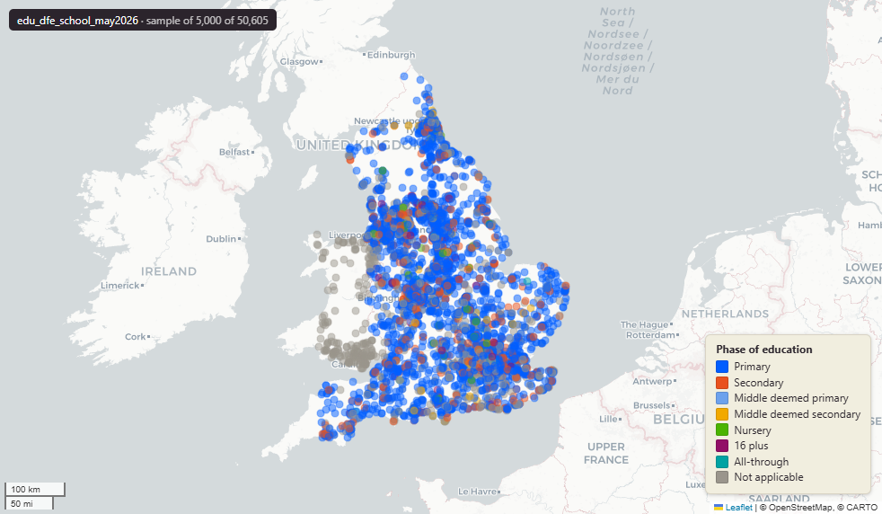

# Department for Education (DfE) register of educational establishments in England, May 2026

`edu_dfe_school_may2026`

<a href="http://localhost:7800/?layer=uk_baseline.edu_dfe_school_may2026" target="_blank" rel="noopener">Open in the Dashboard &#8599;</a> (start your local Dashboard first)

**SOURCE**

- Department for Education (DfE), Get Information About Schools — the canonical UK national register of schools, academies, colleges, and other educational establishments. May 2026 download / extract.
- Ofsted, Management Information — state-funded schools — latest inspections as at 28 Feb 2026. Source of the two enriched columns ofsted_overall_rate_code and ofsted_overall_rate (see ENRICHMENT). Loaded into uk.edu_ofsted_state_funded_mis_feb2026 and joined to DfE GIAS on URN.

**DOCUMENTATION**

- DfE schools service         : https://get-information-schools.service.gov.uk/
- DfE schools gov.uk guidance : https://www.gov.uk/guidance/get-information-about-schools
- DfE schools field glossary  : https://www.get-information-schools.service.gov.uk/glossary
- Ofsted inspection outcomes  : https://www.gov.uk/government/statistical-data-sets/monthly-management-information-ofsteds-school-inspections-outcomes

**DEFINITIONS**

- Phase of education values observed in this dataset: Nursery, Primary, Middle deemed primary, Secondary, Middle deemed secondary, All-through, 16 plus, Not applicable.
- Establishment status values observed in this dataset: Open, Closed, Open but proposed to close, Proposed to open.

**SCOPE**

- England only. Scotland, Wales and Northern Ireland have separate registers.
- 50,605 rows = 50,605 distinct URNs.
- Breakdown by establishment_status_name: Open 26,572; Closed 23,974; Open, but proposed to close 36; Proposed to open 23.
- Breakdown by phase_of_education_name: Primary 30,120; Not applicable 11,579; Secondary 6,664; Middle deemed secondary 619; Nursery 612; 16 plus 580; Middle deemed primary 228; All-through 203.

**CRS**

- EPSG:27700 (OSGB 1936 / British National Grid). Geometry type MultiPoint (one point per URN).

**LICENCE**

- Open Government Licence v3.0 (covers both DfE GIAS and Ofsted MI).

**DATA QUALITY CAVEATS**

- Includes historic closed schools (~24k of 50k). For most analytical use, filter to Open status (optionally also 'Open, but proposed to close'). The pre-built edu_dfe_primary_school_may2026 and edu_dfe_secondary_school_may2026 subsets already apply that filter.
- Date columns (open_date, close_date, census_date, last_changed_date, date_of_last_inspection_visit, next_inspection_visit, accreditation_expiry_date) are stored as text, not typed dates.
- Name fields (head_first_name, head_last_name, head_title_name, telephone_num) carry personal data — handle in line with DfE's data protection guidance even though it is published openly.
- Geometry is MultiPoint (one-point Multi). Each URN's easting / northing produces a single point; the MultiPoint typmod is a Postgres convention, not an indication of multiple points.
- Some establishments have no published location (privacy / pre-opening); these may carry NULL geom or 0/0 coordinates — inspect before mapping.
- ofsted_overall_rate / _code are NULL where no clean graded inspection or qualifying ungraded-reaffirm outcome maps to the URN. Do not treat NULL as "Inadequate".

**ENRICHMENT**

- ofsted_overall_rate_code, ofsted_overall_rate — headline Ofsted grade (1-4 code + text: Outstanding / Good / Requires Improvement / Inadequate) merged in from the Ofsted Establishment Inspection File via uk.edu_ofsted_state_funded_mis_feb2026 (28 Feb 2026 snapshot). Joined on URN. NULL when no clean grade is available. Includes "Fallback option B" — for URNs whose OEIF graded inspection was NULL, the rate is filled from the latest ungraded reaffirm outcome where it maps unambiguously ("School remains Outstanding" / "School remains Good" -> respective grade). Applied 14 May 2026. See column comments for the full rule.
- lad25cd, lad25nm — joined at load from ONS LAD 2025 lookup.
- rgn22cd, rgn22nm — joined at load from ONS Region 2022 lookup.
- sds_boundary — internal Spatial Development Strategy area flag.

**LOADED INTO uk_baseline**

- Loaded by PNC, May 2026.

## Columns

| Column | Type | Description / unit |
|---|---|---|
| `urn` | `integer` | Source field "URN"; Unique Reference Number — DfE's primary identifier for the establishment. Sequential, unique across England, never reused. |
| `la_code` | `text` | Source field "LA (code)"; 3-digit DfE Local Authority code (legacy DfE numeric LA code, not ONS GSS). |
| `la_name` | `text` | Source field "LA (name)"; Local Authority name. |
| `establishment_number` | `integer` | Source field "EstablishmentNumber"; 4-digit DfE establishment number, unique within Local Authority. Combined with la_code forms the 7-digit DfE number. |
| `establishment_name` | `text` | Source field "EstablishmentName"; school's official name as published. |
| `type_of_establishment_code` | `text` | Source field "TypeOfEstablishment (code)"; DfE code for type of establishment. |
| `type_of_establishment_name` | `text` | Source field "TypeOfEstablishment (name)"; human-readable type of establishment (e.g. "Community school", "Voluntary aided school", "Academy converter", "Special school"). |
| `establishment_type_group_code` | `text` | Source field "EstablishmentTypeGroup (code)"; DfE code for the high-level establishment-type grouping. |
| `establishment_type_group_name` | `text` | Source field "EstablishmentTypeGroup (name)"; high-level grouping of type_of_establishment (e.g. "Local authority maintained schools", "Academies", "Special schools"). |
| `establishment_status_code` | `text` | Source field "EstablishmentStatus (code)"; DfE code for establishment status. |
| `establishment_status_name` | `text` | Source field "EstablishmentStatus (name)"; one of: Open / Closed / Open, but proposed to close / Proposed to open. |
| `reason_establishment_opened_code` | `text` | Source field "ReasonEstablishmentOpened (code)"; DfE code for reason the establishment opened. |
| `reason_establishment_opened_name` | `text` | Source field "ReasonEstablishmentOpened (name)"; human-readable reason for opening (e.g. "Not applicable", "New Provision", "Result of Amalgamation"). |
| `open_date` | `text` | Source field "OpenDate"; date the establishment opened. Stored as text, not a typed date. |
| `reason_establishment_closed_code` | `text` | Source field "ReasonEstablishmentClosed (code)"; DfE code for reason the establishment closed. NULL for open schools. |
| `reason_establishment_closed_name` | `text` | Source field "ReasonEstablishmentClosed (name)"; human-readable reason for closure. NULL for open schools. |
| `close_date` | `text` | Source field "CloseDate"; date the establishment closed (NULL for open establishments). Stored as text. |
| `phase_of_education_code` | `text` | Source field "PhaseOfEducation (code)"; DfE code for the phase of education. |
| `phase_of_education_name` | `text` | Source field "PhaseOfEducation (name)"; one of: Nursery / Primary / Middle deemed primary / Secondary / Middle deemed secondary / All-through / 16 plus / Not applicable. |
| `statutory_low_age` | `integer` | Source field "StatutoryLowAge"; lowest statutory age the establishment is registered to admit. Unit: "years". |
| `statutory_high_age` | `integer` | Source field "StatutoryHighAge"; highest statutory age the establishment is registered to admit. Unit: "years". |
| `boarders_code` | `text` | Source field "Boarders (code)"; DfE code for boarders provision flag. |
| `boarders_name` | `text` | Source field "Boarders (name)"; boarders provision flag (e.g. "Boarders", "No boarders"). |
| `nursery_provision_name` | `text` | Source field "NurseryProvision (name)"; whether the establishment provides nursery places (e.g. "Has Nursery Classes", "No Nursery Classes"). |
| `official_sixth_form_code` | `text` | Source field "OfficialSixthForm (code)"; DfE code for official sixth-form indicator. |
| `official_sixth_form_name` | `text` | Source field "OfficialSixthForm (name)"; official sixth-form indicator. |
| `gender_code` | `text` | Source field "Gender (code)"; DfE code for pupil intake gender classification. |
| `gender_name` | `text` | Source field "Gender (name)"; pupil intake gender classification (Mixed / Boys / Girls). |
| `religious_character_code` | `text` | Source field "ReligiousCharacter (code)"; DfE code for religious character. |
| `religious_character_name` | `text` | Source field "ReligiousCharacter (name)"; religious character (e.g. "None", "Church of England", "Roman Catholic", "Muslim"). |
| `religious_ethos_name` | `text` | Source field "ReligiousEthos (name)"; religious ethos (used where religious_character is "None" but the school operates with a faith ethos). |
| `diocese_code` | `text` | Source field "Diocese (code)"; DfE diocese code (for Church of England / Roman Catholic schools). |
| `diocese_name` | `text` | Source field "Diocese (name)"; human-readable diocese name. |
| `admissions_policy_code` | `text` | Source field "AdmissionsPolicy (code)"; DfE code for admissions policy. |
| `admissions_policy_name` | `text` | Source field "AdmissionsPolicy (name)"; admissions policy (e.g. "Comprehensive (secondary)", "Non-selective", "Selective"). |
| `school_capacity` | `integer` | Source field "SchoolCapacity"; DfE-reported maximum pupil capacity. Unit: "pupils". |
| `special_classes_code` | `text` | Source field "SpecialClasses (code)"; DfE flag for presence of special classes. |
| `special_classes_name` | `text` | Source field "SpecialClasses (name)"; human-readable special-classes flag. |
| `census_date` | `text` | Source field "CensusDate"; reference date for the pupil-count census fields (number_of_pupils, number_of_boys, number_of_girls). Stored as text. |
| `number_of_pupils` | `integer` | Source field "NumberOfPupils"; total pupils on roll at the census_date. Unit: "pupils". |
| `number_of_boys` | `integer` | Source field "NumberOfBoys"; boys on roll at the census_date. Unit: "pupils". |
| `number_of_girls` | `integer` | Source field "NumberOfGirls"; girls on roll at the census_date. Unit: "pupils". |
| `percentage_fsm` | `numeric` | Source field "PercentageFSM"; percentage of pupils eligible for and claiming free school meals at the census_date. Unit: "percent (0 to 100)". |
| `trust_school_flag_code` | `text` | Source field "TrustSchoolFlag (code)"; DfE Trust school flag code. |
| `trust_school_flag_name` | `text` | Source field "TrustSchoolFlag (name)"; Trust school flag (human-readable). |
| `trusts_code` | `text` | Source field "Trusts (code)"; DfE Trust identifier (where the school is part of a Multi-Academy Trust). |
| `trusts_name` | `text` | Source field "Trusts (name)"; Trust name. |
| `school_sponsor_flag_name` | `text` | Source field "SchoolSponsorFlag (name)"; whether the school has a sponsor (typical for sponsored academies). |
| `school_sponsors_name` | `text` | Source field "SchoolSponsors (name)"; sponsor organisation name(s). |
| `federation_flag_name` | `text` | Source field "FederationFlag (name)"; whether the school is part of a federation. |
| `federations_code` | `text` | Source field "Federations (code)"; DfE federation identifier. |
| `federations_name` | `text` | Source field "Federations (name)"; federation name. |
| `ukprn` | `text` | Source field "UKPRN"; UK Provider Reference Number — 8-digit identifier used by UK Register of Learning Providers (UKRLP). Populated where the establishment is a registered learning provider. |
| `fehe_identifier` | `text` | Source field "FEHEIdentifier"; Further/Higher Education identifier. Populated for FE / HE establishments. |
| `further_education_type_name` | `text` | Source field "FurtherEducationType (name)"; type of further education provision (e.g. "Sixth Form Centres", "General Further Education college"). |
| `last_changed_date` | `text` | Source field "LastChangedDate"; date the record was last edited. Stored as text. |
| `street` | `text` | Source field "Street"; street address line. |
| `locality` | `text` | Source field "Locality"; locality. |
| `address3` | `text` | Source field "Address3"; third address line (additional area / settlement). |
| `town` | `text` | Source field "Town"; town. |
| `county_name` | `text` | Source field "County (name)"; county name. |
| `postcode` | `text` | Source field "Postcode"; postcode. |
| `school_website` | `text` | Source field "SchoolWebsite"; school's website URL. |
| `telephone_num` | `text` | Source field "TelephoneNum"; school's published contact phone number. |
| `head_title_name` | `text` | Source field "HeadTitle (name)"; head teacher's title (Mr / Mrs / Dr / etc.). |
| `head_first_name` | `text` | Source field "HeadFirstName"; head teacher's first name. |
| `head_last_name` | `text` | Source field "HeadLastName"; head teacher's last name. |
| `head_preferred_job_title` | `text` | Source field "HeadPreferredJobTitle"; head teacher's preferred job title (Headteacher / Principal / Executive Headteacher / etc.). |
| `bso_inspectorate_name` | `text` | Source field "BSOInspectorate (name)"; British Schools Overseas inspectorate name (for BSO-accredited establishments). |
| `inspectorate_report` | `text` | Source field "InspectorateReport"; URL of the latest inspection report. |
| `date_of_last_inspection_visit` | `text` | Source field "DateOfLastInspectionVisit"; date of last Ofsted (or other inspectorate) visit. Stored as text. |
| `next_inspection_visit` | `text` | Source field "NextInspectionVisit"; scheduled date of next inspection visit. Stored as text. |
| `teen_moth_name` | `text` | Source field "TeenMoth (name)"; teenage mothers' unit flag. |
| `teen_moth_places` | `integer` | Source field "TeenMothPlaces"; teenage mothers' unit place count. Unit: "places". |
| `ccf_name` | `text` | Source field "CCF (name)"; Childcare Funding flag. |
| `senpru_name` | `text` | Source field "SENPRU (name)"; SEN Pupil Referral Unit flag. |
| `ebd_name` | `text` | Source field "EBD (name)"; Emotional and Behavioural Difficulties unit flag. |
| `places_pru` | `integer` | Source field "PlacesPRU"; Pupil Referral Unit place count. Unit: "places". |
| `ftprov_name` | `text` | Source field "FTProv (name)"; Full-Time Provision flag. |
| `ed_by_other_name` | `text` | Source field "EdByOther (name)"; "Educated by Other" flag (for pupils educated outside mainstream provision). |
| `section41_approved_name` | `text` | Source field "Section41Approved (name)"; Section 41-approved special school flag. |
| `sen1_name` | `text` | Source field "SEN1 (name)"; SEN need category 1 flag — populated with the name of the need where the school is registered to provide for it, NULL otherwise. See DfE schools glossary for the canonical 13-need list. |
| `sen2_name` | `text` | Source field "SEN2 (name)"; SEN need category 2 flag — populated with the name of the need where the school is registered to provide for it, NULL otherwise. |
| `sen3_name` | `text` | Source field "SEN3 (name)"; SEN need category 3 flag — populated with the name of the need where the school is registered to provide for it, NULL otherwise. |
| `sen4_name` | `text` | Source field "SEN4 (name)"; SEN need category 4 flag — populated with the name of the need where the school is registered to provide for it, NULL otherwise. |
| `sen5_name` | `text` | Source field "SEN5 (name)"; SEN need category 5 flag — populated with the name of the need where the school is registered to provide for it, NULL otherwise. |
| `sen6_name` | `text` | Source field "SEN6 (name)"; SEN need category 6 flag — populated with the name of the need where the school is registered to provide for it, NULL otherwise. |
| `sen7_name` | `text` | Source field "SEN7 (name)"; SEN need category 7 flag — populated with the name of the need where the school is registered to provide for it, NULL otherwise. |
| `sen8_name` | `text` | Source field "SEN8 (name)"; SEN need category 8 flag — populated with the name of the need where the school is registered to provide for it, NULL otherwise. |
| `sen9_name` | `text` | Source field "SEN9 (name)"; SEN need category 9 flag — populated with the name of the need where the school is registered to provide for it, NULL otherwise. |
| `sen10_name` | `text` | Source field "SEN10 (name)"; SEN need category 10 flag — populated with the name of the need where the school is registered to provide for it, NULL otherwise. |
| `sen11_name` | `text` | Source field "SEN11 (name)"; SEN need category 11 flag — populated with the name of the need where the school is registered to provide for it, NULL otherwise. |
| `sen12_name` | `text` | Source field "SEN12 (name)"; SEN need category 12 flag — populated with the name of the need where the school is registered to provide for it, NULL otherwise. |
| `sen13_name` | `text` | Source field "SEN13 (name)"; SEN need category 13 flag — populated with the name of the need where the school is registered to provide for it, NULL otherwise. |
| `type_of_resourced_provision_name` | `text` | Source field "TypeOfResourcedProvision (name)"; type of resourced provision for SEN. |
| `resourced_provision_on_roll` | `integer` | Source field "ResourcedProvisionOnRoll"; pupils on roll in the resourced provision. Unit: "pupils". |
| `resourced_provision_capacity` | `integer` | Source field "ResourcedProvisionCapacity"; capacity of the resourced provision. Unit: "places". |
| `sen_unit_on_roll` | `integer` | Source field "SENUnitOnRoll"; pupils on roll in the SEN unit. Unit: "pupils". |
| `sen_unit_capacity` | `integer` | Source field "SENUnitCapacity"; capacity of the SEN unit. Unit: "places". |
| `gor_code` | `text` | Source field "GOR (code)"; DfE-published Government Office Region code (legacy DfE region classification). |
| `gor_name` | `text` | Source field "GOR (name)"; Government Office Region name. |
| `district_administrative_code` | `text` | Source field "DistrictAdministrative (code)"; DfE-published Local Authority District code (may differ from current ONS LAD25). |
| `district_administrative_name` | `text` | Source field "DistrictAdministrative (name)"; Local Authority District name (DfE-published edition). |
| `administrative_ward_code` | `text` | Source field "AdministrativeWard (code)"; DfE-published Electoral Ward code. |
| `administrative_ward_name` | `text` | Source field "AdministrativeWard (name)"; Electoral Ward name (DfE-published edition). |
| `parliamentary_constituency_code` | `text` | Source field "ParliamentaryConstituency (code)"; DfE-published Parliamentary constituency code. |
| `parliamentary_constituency_name` | `text` | Source field "ParliamentaryConstituency (name)"; Parliamentary constituency name (DfE-published edition). |
| `urban_rural_code` | `text` | Source field "UrbanRural (code)"; ONS urban/rural classification code. |
| `urban_rural_name` | `text` | Source field "UrbanRural (name)"; ONS urban/rural classification name. |
| `gss_la_code` | `text` | Source field "GSSLACode (code)"; ONS GSS 9-character Local Authority code (e.g. "E08000019"). |
| `easting` | `integer` | Source field "Easting"; school location easting. Unit: "metres" (EPSG:27700). |
| `northing` | `integer` | Source field "Northing"; school location northing. Unit: "metres" (EPSG:27700). |
| `msoa_code` | `text` | Source field "MSOA (code)"; Middle-layer Super Output Area (MSOA) code. |
| `msoa_name` | `text` | Source field "MSOA (name)"; MSOA name. |
| `lsoa_code` | `text` | Source field "LSOA (code)"; Lower-layer Super Output Area (LSOA) code. |
| `lsoa_name` | `text` | Source field "LSOA (name)"; LSOA name. |
| `inspectorate_name` | `text` | Source field "Inspectorate (name)"; inspectorate body for the establishment (Ofsted for state schools; ISI / other for independent). |
| `sen_stat` | `integer` | Source field "SenStat"; count of pupils with a statutory Education, Health and Care (EHC) plan. Unit: "pupils". |
| `sen_no_stat` | `integer` | Source field "SenNoStat"; count of pupils with SEN support but no EHC plan. Unit: "pupils". |
| `boarding_establishment_name` | `text` | Source field "BoardingEstablishment (name)"; whether the school operates as a boarding establishment. |
| `props_name` | `text` | Source field "Props (name)"; proprietor / proprietorship name (for independent schools). |
| `previous_la_code` | `text` | Source field "PreviousLA (code)"; previous DfE Local Authority code (for schools that have transferred between LAs). |
| `previous_la_name` | `text` | Source field "PreviousLA (name)"; previous Local Authority name. |
| `previous_establishment_number` | `integer` | Source field "PreviousEstablishmentNumber"; previous establishment_number (for re-numbered establishments). |
| `country_name` | `text` | Source field "Country (name)"; country (always "England" in this dataset). |
| `uprn` | `text` | Source field "UPRN"; Unique Property Reference Number — GeoPlace's identifier for the building/site. |
| `site_name` | `text` | Source field "SiteName"; school site name (where the establishment occupies a named site). |
| `qab_name_code` | `text` | Source field "QABName (code)"; Quality Assurance Body code (for accredited independent schools). |
| `qab_name` | `text` | Source field "QABName (name)"; Quality Assurance Body name. |
| `establishment_accredited_code` | `text` | Source field "EstablishmentAccredited (code)"; DfE accredited-status code (for accredited independent schools). |
| `establishment_accredited_name` | `text` | Source field "EstablishmentAccredited (name)"; human-readable accredited status. |
| `qab_report` | `text` | Source field "QABReport"; URL of the latest QAB report. |
| `ch_number` | `text` | Source field "CHNumber"; Children's Home registration number (for residential special schools). |
| `fsm` | `integer` | Source field "FSM"; absolute count of pupils eligible for and claiming free school meals at the census_date. Unit: "pupils". |
| `accreditation_expiry_date` | `text` | Source field "AccreditationExpiryDate"; date the establishment's accreditation expires (for accredited independent schools). Stored as text. |
| `fid_original` | `integer` | ArcGIS source identifier preserved at load; row identifier from the originating file. |
| `lad25cd` | `character varying(9)` | Joined at load from ONS LAD25 lookup; 2025 LAD GSS code. |
| `lad25nm` | `character varying(100)` | Joined at load from ONS LAD25 lookup; 2025 LAD name. |
| `rgn22cd` | `character varying` | Joined at load from ONS LAD->Region lookup; 2022 Region GSS code. |
| `rgn22nm` | `character varying` | Joined at load from ONS LAD->Region lookup; 2022 Region name. |
| `sds_boundary` | `character varying` | Internal categorisation: Spatial Development Strategy (SDS) area where the school point falls. Blank or NULL where outside any SDS area. |
| `geom` | `geometry(MultiPoint,27700)` | MultiPoint in EPSG:27700. School location point (one point per URN; MultiPoint typmod is a Postgres convention). |
| `fid` | `bigint` |  |
| `ofsted_overall_rate_code` | `smallint` | Headline Ofsted grade code 1-4 (1=Outstanding, 2=Good, 3=Requires Improvement, 4=Inadequate). NULL when no clean grade is available (includes 'Not Judged' and ambiguous ungraded outcomes). Sourced from OEIF + extended ungraded-reaffirm fallback. Fallback option B applied 14 May 2026. |
| `ofsted_overall_rate` | `text` | Headline Ofsted rating text (Title Case). Sourced from OEIF graded inspection (col 67); for rows where OEIF was NULL, filled from the latest ungraded reaffirm outcome: 'School remains Outstanding' and 'School remains Outstanding (Concerns) - S5 Next' -> 'Outstanding'; 'School remains Good', 'School remains Good (Concerns) - S5 Next' and 'School remains Good (Improving) - S5 Next' -> 'Good'. Other ungraded outcomes (Standards maintained, Improved significantly, Some aspects not as strong) intentionally left NULL. Fallback option B applied 14 May 2026. |
