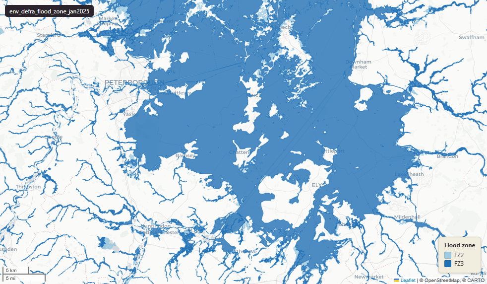

# Defra - Department for Environment, Food and Rural Affairs — Environment Agency Flood Map for Planning, Flood Zones 2 and 3, January 2025

Flood Zone

`env_defra_flood_zone_jan2025`

**SOURCE**

- Environment Agency (EA), part of the Department for Environment, Food and Rural Affairs (Defra). Flood Map for Planning product. Distributed via data.gov.uk.

**DOCUMENTATION**

- EA Flood Map for Planning landing : https://environment.data.gov.uk/dataset/bed63fc1-dd26-4685-b143-2941088923b3
- EA Flood Map guidance             : https://www.gov.uk/guidance/flood-map-for-planning
- gov.uk Flood Map for Planning     : https://flood-map-for-planning.service.gov.uk/

**DEFINITIONS**

- "The Flood Map for Planning shows river and sea flooding data for England. It does not include other sources of flooding." (gov.uk Flood Map guidance)
- Flood Zone 2: "Land assessed as having between a 1 in 100 and 1 in 1,000 annual probability of river flooding (1% – 0.1%), or between a 1 in 200 and 1 in 1,000 annual probability of sea flooding (0.5% – 0.1%) in any year." (EA Flood Map guidance)
- Flood Zone 3: "Land assessed as having a 1 in 100 or greater annual probability of river flooding (>1%), or a 1 in 200 or greater annual probability of sea flooding (>0.5%) in any year." (EA Flood Map guidance)

**SCOPE**

- England. 12,247,889 rows.

**CRS**

- EPSG:27700 (OSGB 1936 / British National Grid).

**LICENCE**

- Open Government Licence v3.0. © Environment Agency copyright and database right.

**LOADED INTO uk_baseline**

- Loaded January 2025.

MSOA SPLIT (added 3 July 2026)

- Geometry split to one row per (source feature x MSOA 2021). Each row carries that MSOA's msoa21cd / msoa21nm / msoa21hclnm and best-fit lad22 / lad25. The source feature's original primary key is preserved as `source_fid`; `gid` is a fresh surrogate primary key. Features with no MSOA overlap (offshore or outside England & Wales) are kept whole with NULL geography columns.

## Columns

| Column | Type | Description / unit |
|---|---|---|
| `source_fid` | `bigint` | Primary key of the source feature in the pre-split layer uk.env_defra_flood_zone_jan2025__preswap_jul03 (non-unique here: a feature spanning N MSOAs has N rows). |
| `objectid` | `numeric` |  |
| `origin` | `character varying(64)` |  |
| `flood_zone` | `character varying(3)` |  |
| `flood_sour` | `character varying(32)` |  |
| `shape_leng` | `numeric` |  |
| `shape_area` | `numeric` |  |
| `id_original` | `integer` |  |
| `wd21nm` | `character varying` |  |
| `wd21cd` | `character varying` |  |
| `area_ha` | `double precision` |  |
| `fid` | `bigint` |  |
| `msoa21cd` | `character varying` | Middle Layer Super Output Area (MSOA) 2021 code of this piece. Open Government Licence v3.0. |
| `msoa21nm` | `character varying` | Official ONS MSOA 2021 name of this piece. Open Government Licence v3.0. |
| `msoa21hclnm` | `text` | House of Commons Library readable MSOA name of this piece. Open Parliament Licence. |
| `lad22cd` | `text` | Local Authority District 2022 code (2021 LAD geography, anchored to the MSOA 2021 name scoping), best-fit from this piece's msoa21cd. Open Government Licence v3.0. |
| `lad22nm` | `text` | Local Authority District 2022 name (2021 LAD geography), best-fit from this piece's msoa21cd. Open Government Licence v3.0. |
| `lad25cd` | `text` | Local Authority District 2025 code (current administering authority), best-fit from this piece's msoa21cd. Open Government Licence v3.0. |
| `lad25nm` | `text` | Local Authority District 2025 name (current administering authority), best-fit from this piece's msoa21cd. Open Government Licence v3.0. |
| `geom` | `geometry(MultiPolygon,27700)` |  |
| `gid` | `bigint` |  |
