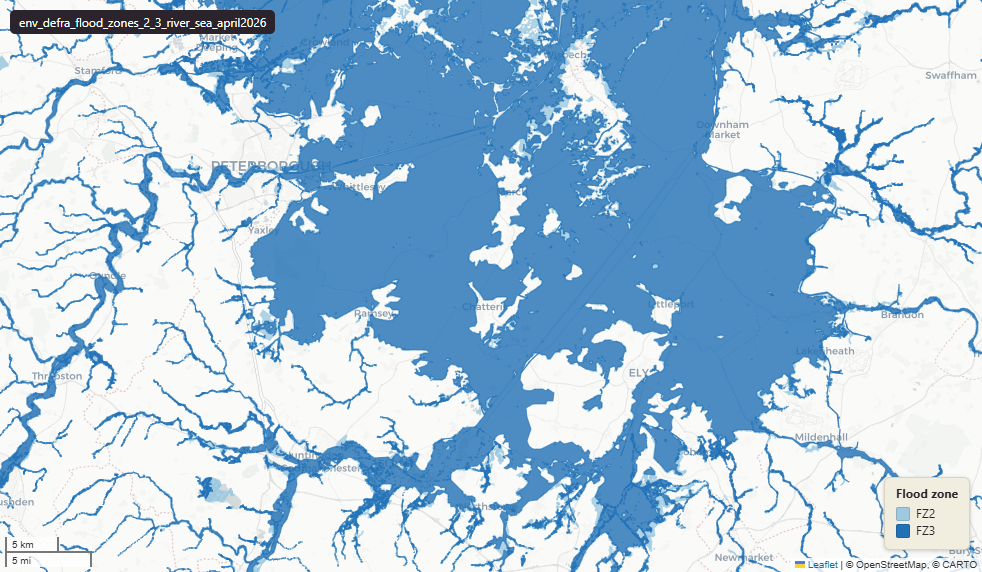

# Defra - Department for Environment, Food and Rural Affairs — Environment Agency Flood Map for Planning, Flood Zones 2 and 3 (river and sea), April 2026

Flood Zones 2 and 3 - River and Sea

`env_defra_flood_zones_2_3_river_sea_april2026`

**SOURCE**

- Environment Agency (EA), part of the Department for Environment, Food and Rural Affairs (Defra). Flood Map for Planning product.

**DOCUMENTATION**

- EA Flood Map for Planning : https://environment.data.gov.uk/dataset/bed63fc1-dd26-4685-b143-2941088923b3
- EA Flood Map guidance     : https://www.gov.uk/guidance/flood-map-for-planning

**DEFINITIONS**

- "The Flood Map for Planning shows river and sea flooding data for England." (gov.uk Flood Map guidance)
- Flood Zone 2 — medium probability (EA Flood Map guidance). Chance of flooding in any year:
    - from rivers: between 1 in 100 (1%) and 1 in 1,000 (0.1%);
    - from the sea: between 1 in 200 (0.5%) and 1 in 1,000 (0.1%).
- Flood Zone 3 — high probability (EA Flood Map guidance). Chance of flooding in any year:
    - from rivers: 1 in 100 (1%) or greater;
    - from the sea: 1 in 200 (0.5%) or greater.

**SCOPE**

- England. 3,728,128 rows.

**CRS**

- EPSG:27700 (OSGB 1936 / British National Grid).

**LICENCE**

- Open Government Licence v3.0. © Environment Agency.

**ENRICHMENT**

- Geometry split to one row per source feature per MSOA (2021).
- Each row carries that MSOA's `msoa21cd`, `msoa21nm`, `msoa21hclnm`, `lad22cd`, `lad22nm`, `lad25cd`, `lad25nm`.
- The source feature's original primary key is preserved as `source_fid`; `gid` is a fresh surrogate primary key.
- Features with no MSOA overlap (offshore or outside England & Wales) are kept whole, with NULL geography columns.

**LOADED INTO uk_baseline**

- Loaded by PNC, May 2026.

## Columns

| Column | Type | Description / unit |
|---|---|---|
| `source_fid` | `bigint` | Primary key of the source feature in the pre-split layer uk.env_defra_flood_zones_2_3_river_sea_april2026__preswap_jul03 (non-unique here: a feature spanning N MSOAs has N rows). |
| `id` | `integer` | Source feature identifier, repeated across a feature's per-MSOA split rows (matches `fid_original`). Not a unique key here — use `gid`. |
| `fid_original` | `bigint` | Original source feature identifier, preserved at load (matches `id`). |
| `origin` | `character varying(64)` | Source field `origin`; basis of the mapped flood zone extent. Values are combinations of "modelled", "direct rainfall model", "recorded" and "local evidence". |
| `flood_zone` | `character varying(3)` | Source field `flood_zone`; Environment Agency flood zone designation — "FZ2" (Flood Zone 2) or "FZ3" (Flood Zone 3). |
| `flood_source` | `character varying(32)` | Source field `flood_source`; source of flooding — mainly "river", "sea" or "river and sea"; also "river / undefined", "unknown", "undefined". NULL for a small number of features. |
| `shape_length` | `double precision` | ESRI shapefile perimeter-length field; not populated in this layer (all NULL). |
| `shape_area` | `double precision` | ESRI shapefile area field; not populated in this layer (all NULL). Area is in `area_ha`. |
| `area_ha` | `double precision` | Area of this row's geometry in hectares. |
| `rgn22cd` | `text` | Region 2022 GSS code (nine English regions), assigned via the ONS Region lookup. Open Government Licence v3.0. |
| `rgn22nm` | `text` | Region 2022 name, assigned via the ONS Region lookup. Open Government Licence v3.0. |
| `sds_boundary` | `text` | Spatial Development Strategy (SDS) area the feature falls in (e.g. "Devon and Torbay", "Somerset"). NULL outside any SDS area. |
| `msoa21cd` | `character varying` | Middle Layer Super Output Area (MSOA) 2021 code of this piece. Open Government Licence v3.0. |
| `msoa21nm` | `character varying` | Official ONS MSOA 2021 name of this piece. Open Government Licence v3.0. |
| `msoa21hclnm` | `text` | House of Commons Library readable MSOA name of this piece. Open Parliament Licence. |
| `lad22cd` | `text` | Local Authority District 2022 code (2021 LAD geography, anchored to the MSOA 2021 name scoping), best-fit from this piece's msoa21cd. Open Government Licence v3.0. |
| `lad22nm` | `text` | Local Authority District 2022 name (2021 LAD geography), best-fit from this piece's msoa21cd. Open Government Licence v3.0. |
| `lad25cd` | `text` | Local Authority District 2025 code (current administering authority), best-fit from this piece's msoa21cd. Open Government Licence v3.0. |
| `lad25nm` | `text` | Local Authority District 2025 name (current administering authority), best-fit from this piece's msoa21cd. Open Government Licence v3.0. |
| `geom` | `geometry(MultiPolygon,27700)` | Flood zone polygon geometry in EPSG:27700 (British National Grid); one part per MSOA (2021) after the split. |
| `gid` | `bigint` | Surrogate primary key, added at the MSOA split (see ENRICHMENT). |
