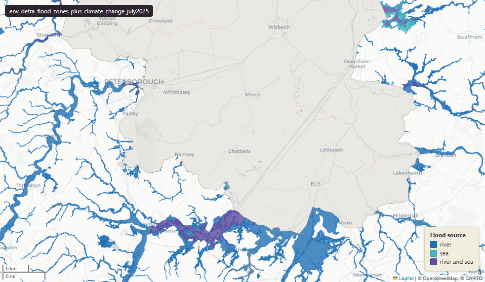

# Defra - Department for Environment, Food and Rural Affairs — Environment Agency Flood Map for Planning, Flood Zones with climate-change allowance, July 2025

Flood Zones plus Climate Change

`env_defra_flood_zones_plus_climate_change_july2025`

**SOURCE**

- Environment Agency (EA), part of the Department for Environment, Food and Rural Affairs (Defra). Flood Map for Planning — climate-change extent dataset.

**DOCUMENTATION**

- EA Flood Map for Planning  : https://environment.data.gov.uk/dataset/bed63fc1-dd26-4685-b143-2941088923b3
- EA climate-change guidance : https://www.gov.uk/guidance/flood-risk-assessments-climate-change-allowances

**DEFINITIONS**

- "Climate change allowances are predictions of anticipated change for: peak river flow, peak rainfall intensity, sea level rise, offshore wind speed and extreme wave height." (gov.uk "What climate change allowances are")

**SCOPE**

- England. 672,790 rows.

**CRS**

- EPSG:27700 (OSGB 1936 / British National Grid).

**LICENCE**

- Open Government Licence v3.0. © Environment Agency.

**LOADED INTO uk_baseline**

- Loaded by PNC, May 2026.

MSOA SPLIT (added 3 July 2026)

- Geometry split to one row per (source feature x MSOA 2021). Each row carries that MSOA's msoa21cd / msoa21nm / msoa21hclnm and best-fit lad22 / lad25. The source feature's original primary key is preserved as `source_fid`; `gid` is a fresh surrogate primary key. Features with no MSOA overlap (offshore or outside England & Wales) are kept whole with NULL geography columns.

## Columns

| Column | Type | Description / unit |
|---|---|---|
| `source_fid` | `bigint` | Primary key of the source feature in the pre-split layer uk.env_defra_flood_zones_plus_climate_change_july2025__preswap_jul (non-unique here: a feature spanning N MSOAs has N rows). |
| `id` | `integer` |  |
| `fid_original` | `bigint` |  |
| `flood_source` | `character varying(32)` |  |
| `name` | `character varying(32)` |  |
| `shape_length` | `double precision` |  |
| `shape_area` | `double precision` |  |
| `area_ha` | `double precision` |  |
| `rgn22cd` | `text` |  |
| `rgn22nm` | `text` |  |
| `sds_boundary` | `text` |  |
| `msoa21cd` | `character varying` | Middle Layer Super Output Area (MSOA) 2021 code of this piece. Open Government Licence v3.0. |
| `msoa21nm` | `character varying` | Official ONS MSOA 2021 name of this piece. Open Government Licence v3.0. |
| `msoa21hclnm` | `text` | House of Commons Library readable MSOA name of this piece. Open Parliament Licence. |
| `lad22cd` | `text` | Local Authority District 2022 code (2021 LAD geography, anchored to the MSOA 2021 name scoping), best-fit from this piece's msoa21cd. Open Government Licence v3.0. |
| `lad22nm` | `text` | Local Authority District 2022 name (2021 LAD geography), best-fit from this piece's msoa21cd. Open Government Licence v3.0. |
| `lad25cd` | `text` | Local Authority District 2025 code (current administering authority), best-fit from this piece's msoa21cd. Open Government Licence v3.0. |
| `lad25nm` | `text` | Local Authority District 2025 name (current administering authority), best-fit from this piece's msoa21cd. Open Government Licence v3.0. |
| `geom` | `geometry(MultiPolygon,27700)` |  |
| `gid` | `bigint` |  |
