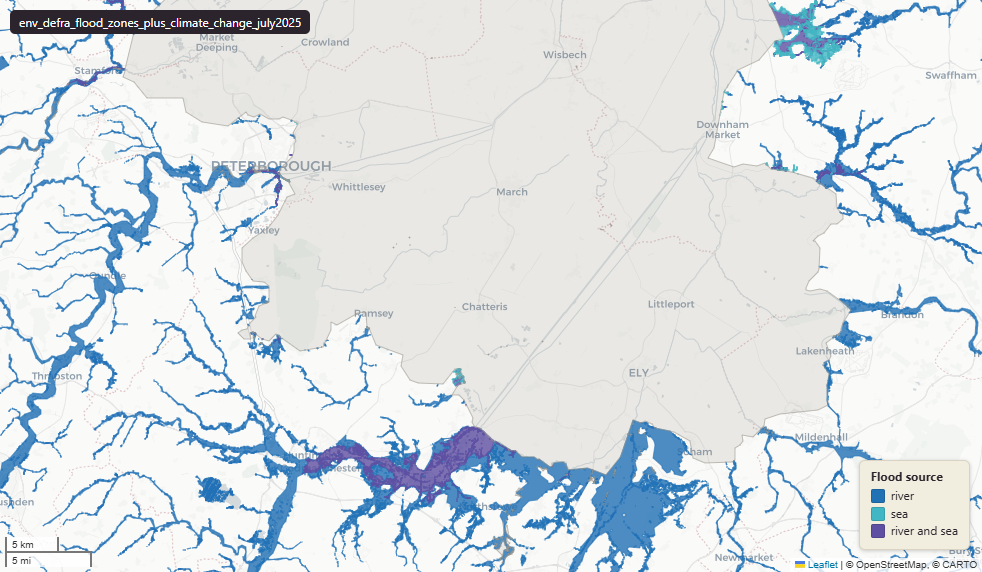

# Defra - Department for Environment, Food and Rural Affairs — Environment Agency Flood Map for Planning, Flood Zones with Climate Change Allowance, July 2025

Flood Zones - Climate Change Allowance

`env_defra_flood_zones_plus_climate_change_july2025`

**SOURCE**

- Environment Agency (EA), part of the Department for Environment, Food and Rural Affairs (Defra). Flood Map for Planning — climate-change extent dataset.

**DOCUMENTATION**

- EA Flood Map for Planning  : https://environment.data.gov.uk/dataset/bed63fc1-dd26-4685-b143-2941088923b3
- EA climate-change guidance : https://www.gov.uk/guidance/flood-risk-assessments-climate-change-allowances

**DEFINITIONS**

- "Climate change allowances are predictions of anticipated change for: peak river flow, peak rainfall intensity, sea level rise, offshore wind speed and extreme wave height." (gov.uk "What climate change allowances are")

**SCOPE**

- England. 789,039 rows.

**CRS**

- EPSG:27700 (OSGB 1936 / British National Grid).

**LICENCE**

- Open Government Licence v3.0. © Environment Agency.

**DATA QUALITY CAVEATS**

- The row count counts split pieces, not source features: this layer was split by Middle Layer Super Output Area, so it holds one row per feature per MSOA piece, plus whole and remainder rows to keep 100% of the source geometry. 789,039 rows represent 672,790 source features, measured 28 July 2026. `source_fid` identifies the originating feature.
- Geography keys are NULL on 58 of 789,039 rows, measured 28 July 2026: 55 are in Scotland or Northern Ireland, outside the England and Wales lookup; 3 fall outside every district — offshore, inter-tidal, or beyond Great Britain.
- County and Spatial Development Strategy columns are England and Wales only; rows elsewhere carry no county or SDS. Wales and the Isles of Scilly carry a county but no SDS. Rows with no Local Authority District code are NULL in all four columns.
- 25,816 rows carry a district but no Middle Layer Super Output Area: they lie outside every 2021 MSOA but inside a district, so the district was assigned from the feature's representative point while the MSOA columns stay NULL.

**ENRICHMENT**

- `sds_name` / `sds_group` — Spatial Development Strategy area and devolution status, a Prior + Partners categorisation over Ministry of Housing, Communities and Local Government (MHCLG) English devolution policy, joined at load on the row's Local Authority District 2025 code via uk.ref_lad25_ctyua25_sds_lu_jul2026.
- Geometry split to one row per source feature per MSOA (2021).
- Each row carries that MSOA's `msoa21cd`, `msoa21nm`, `msoa21hclnm`, `lad22cd`, `lad22nm`, `lad25cd`, `lad25nm`.
- The source feature's original primary key is preserved as `source_fid`; `gid` is a fresh surrogate primary key.
- Features with no MSOA overlap (offshore or outside England & Wales) are kept whole, with NULL geography columns.

**LOADED INTO uk_baseline**

- Loaded by PNC, May 2026.

## Columns

| Column | Type | Description / unit |
|---|---|---|
| `source_fid` | `bigint` | Primary key of the source feature in the pre-split layer uk.env_defra_flood_zones_plus_climate_change_july2025__preswap_jul (non-unique here: a feature spanning N MSOAs has N rows). |
| `id` | `integer` | Source feature identifier, repeated across a feature's per-MSOA split rows. Not a unique key here — use `gid`. |
| `fid_original` | `bigint` | Original source feature identifier, preserved at load. |
| `flood_source` | `character varying(32)` | Source field `flood_source`; source of flooding — "river", "sea", "river and sea" or "unknown". NULL for a small number of features. |
| `name` | `character varying(32)` | Source field `name`; flood zone layer name — "Flood Zones plus climate change" (or "Unavailable"). |
| `shape_length` | `double precision` | ESRI shapefile perimeter-length field; not populated in this layer (all NULL). |
| `shape_area` | `double precision` | ESRI shapefile area field; not populated in this layer (all NULL). Area is in `area_ha`. |
| `area_ha` | `double precision` | Area of this row's geometry in hectares. |
| `rgn22cd` | `text` | Region 2022 GSS code (nine English regions), assigned via the ONS Region lookup. Open Government Licence v3.0. |
| `rgn22nm` | `text` | Region 2022 name, assigned via the ONS Region lookup. Open Government Licence v3.0. |
| `msoa21cd` | `character varying` | Middle Layer Super Output Area (MSOA) 2021 code of this piece. Open Government Licence v3.0. |
| `msoa21nm` | `character varying` | Official ONS MSOA 2021 name of this piece. Open Government Licence v3.0. |
| `msoa21hclnm` | `text` | House of Commons Library readable MSOA name of this piece. Open Parliament Licence. |
| `lad22cd` | `text` | Local Authority District 2022 code (2021 LAD geography, anchored to the MSOA 2021 name scoping), best-fit from this piece's msoa21cd. Open Government Licence v3.0. |
| `lad22nm` | `text` | Local Authority District 2022 name (2021 LAD geography), best-fit from this piece's msoa21cd. Open Government Licence v3.0. |
| `lad25cd` | `text` | Local Authority District 2025 code (current administering authority), best-fit from this piece's msoa21cd. Open Government Licence v3.0. Rows lying outside every 2021 MSOA were assigned at load from the feature's representative point located in uk_baseline.adm_ons_lad_boundary_may2025. |
| `lad25nm` | `text` | Local Authority District 2025 name (current administering authority), best-fit from this piece's msoa21cd. Open Government Licence v3.0. Rows lying outside every 2021 MSOA were assigned at load from the feature's representative point located in uk_baseline.adm_ons_lad_boundary_may2025. |
| `geom` | `geometry(MultiPolygon,27700)` | Flood zone (with climate-change allowance) polygon geometry in EPSG:27700 (British National Grid); one part per MSOA (2021) after the split. |
| `gid` | `bigint` | Surrogate primary key, added at the MSOA split (see ENRICHMENT). |
| `ctyua25cd` | `text` | County or unitary authority code at 1 April 2025. Joined at load via uk.ref_lad25_ctyua25_sds_lu_jul2026 on the row's Local Authority District 2025 code. Open Government Licence v3.0. |
| `ctyua25nm` | `text` | County or unitary authority name at 1 April 2025. Joined at load via uk.ref_lad25_ctyua25_sds_lu_jul2026 on the row's Local Authority District 2025 code. Open Government Licence v3.0. |
| `sds_name` | `text` | Spatial Development Strategy (SDS) area, a Prior + Partners categorisation over Ministry of Housing, Communities and Local Government (MHCLG) English devolution policy. Joined at load via uk.ref_lad25_ctyua25_sds_lu_jul2026 on the row's Local Authority District 2025 code. Open Government Licence v3.0. |
| `sds_group` | `text` | Devolution status of the Spatial Development Strategy area: Existing Devolution Footprints, Devolution Priority Programme, Other Proposed Geographies or Remaining Areas. Joined at load via uk.ref_lad25_ctyua25_sds_lu_jul2026 on the row's Local Authority District 2025 code. Open Government Licence v3.0. |
