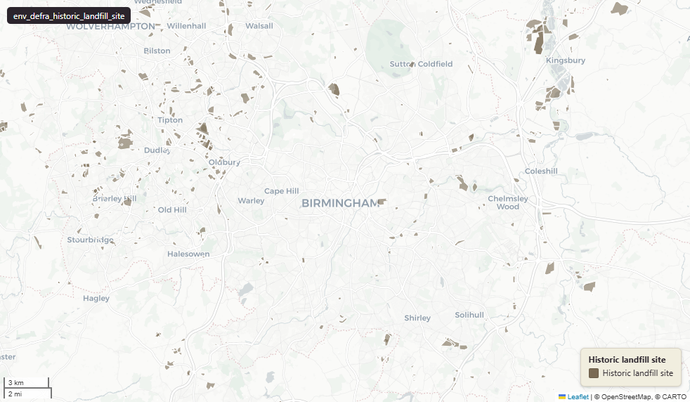

# Defra - Department for Environment, Food and Rural Affairs — Environment Agency Historic Landfill Sites for England

Historic Landfill Site

`env_defra_historic_landfill_site`

**SOURCE**

- Environment Agency (EA), part of the Department for Environment, Food and Rural Affairs (Defra). Historic Landfill dataset.

**DOCUMENTATION**

- EA Historic Landfill dataset (data.gov.uk) : https://www.data.gov.uk/dataset/17edf94f-6de3-4034-b66b-004ebd0dd010/historic-landfill-sites
- EA dataset record (env data portal)        : https://environment.data.gov.uk/dataset/17edf94f-6de3-4034-b66b-004ebd0dd010

**DEFINITIONS**

- "This data is a national historic landfill dataset that defines the location of and provides specific attributes for known historic landfill sites." (data.gov.uk Summary)
- "An historic landfill is a site where there is no environmental permit in force." (data.gov.uk Summary)

**SCOPE**

- England. 25,187 rows.

**CRS**

- EPSG:27700 (OSGB 1936 / British National Grid).

**LICENCE**

- Open Government Licence v3.0. © Environment Agency.

## Columns

| Column | Type | Description / unit |
|---|---|---|
| `hld_ref` | `character varying` | Source field "hld_ref"; Historic Landfill reference number (EA primary identifier for the site). |
| `site_name` | `character varying` | Source field "site_name"; site name. |
| `site_add` | `character varying` | Source field "site_add"; site address. |
| `ea_wmlr` | `integer` | Source field "ea_wmlr"; integer reference. WMLR = Waste Management Licensing Regulations. |
| `regis_no` | `character varying` | Source field "regis_no"; registration number reference. |
| `wrc_ref` | `character varying` | Source field "wrc_ref"; reference number. |
| `bgs_num` | `character varying` | Source field "bgs_num"; reference number. BGS = British Geological Survey. |
| `site_ref` | `character varying` | Source field "site_ref"; internal site reference. |
| `lic_hold` | `character varying` | Source field "lic_hold"; licence holder name. |
| `licholdadd` | `character varying` | Source field "licholdadd"; licence holder address. |
| `siteopname` | `character varying` | Source field "siteopname"; site operator name. |
| `siteopadd` | `character varying` | Source field "siteopadd"; site operator address. |
| `os_prefix` | `character varying` | Source field "os_prefix"; 2-letter Ordnance Survey National Grid letter prefix. |
| `easting` | `integer` | Source field "easting"; site easting. Unit: "metres" (EPSG:27700). |
| `northing` | `integer` | Source field "northing"; site northing. Unit: "metres" (EPSG:27700). |
| `ea_region` | `character varying` | Source field "ea_region"; Environment Agency region code. |
| `ea_area` | `character varying` | Source field "ea_area"; Environment Agency area code. |
| `lic_issue` | `timestamp without time zone` | Source field "lic_issue"; licence issue date. Typed timestamp. |
| `lic_surren` | `timestamp without time zone` | Source field "lic_surren"; licence surrender date. Typed timestamp. |
| `firstinput` | `timestamp without time zone` | Source field "firstinput"; date the record was first entered. Typed timestamp. |
| `lastinput` | `timestamp without time zone` | Source field "lastinput"; date the record was last edited. Typed timestamp. |
| `inert` | `character varying` | Source field "inert"; flag. |
| `industrial` | `character varying` | Source field "industrial"; flag. |
| `commercial` | `character varying` | Source field "commercial"; flag. |
| `household` | `character varying` | Source field "household"; flag. |
| `special` | `character varying` | Source field "special"; flag. |
| `liqsludge` | `character varying` | Source field "liqsludge"; flag. |
| `wasteunk` | `character varying` | Source field "wasteunk"; flag. |
| `gascontrol` | `character varying` | Source field "gascontrol"; flag. |
| `leachatcnt` | `character varying` | Source field "leachatcnt"; flag. |
| `exempt` | `character varying` | Source field "exempt"; flag. |
| `licenced` | `character varying` | Source field "licenced"; flag. |
| `nolicreq` | `character varying` | Source field "nolicreq"; flag. |
| `buff_point` | `character varying` | Source field "buff_point"; flag. |
| `gdb_geomattr_data` | `character varying` | Source field "gdb_geomattr_data"; ArcGIS geodatabase legacy geometry-attribute storage. |
| `id_original` | `character varying` | Original feature id preserved at load. |
| `lad22nm` | `character varying` | Joined at load from ONS LSOA->LAD 2022 lookup; 2022 LAD name. |
| `lad22cd` | `character varying` | Joined at load from ONS LSOA->LAD 2022 lookup; 2022 LAD GSS code. |
| `wd21nm` | `character varying` | Joined at load from ONS Ward 2021 lookup; 2021 Ward name. |
| `wd21cd` | `character varying` | Joined at load from ONS Ward 2021 lookup; 2021 Ward GSS code. |
| `area_ha` | `double precision` | Area in hectares, computed at load from the geometry. Stale if the geometry is later edited. |
| `fid` | `bigint` |  |
| `geom` | `geometry(Polygon,27700)` | Polygon in EPSG:27700. Historic landfill site geometry. |
| `gid` | `bigint` |  |
