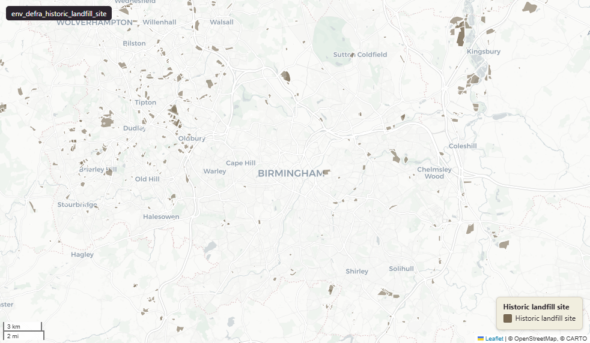

# Defra - Department for Environment, Food and Rural Affairs — Environment Agency Historic Landfill Sites for England

Historic Landfill Site

`env_defra_historic_landfill_site`

**SOURCE**

- Environment Agency (EA), part of the Department for Environment, Food and Rural Affairs (Defra). Historic Landfill dataset.

**DOCUMENTATION**

- EA Historic Landfill dataset (data.gov.uk) : https://www.data.gov.uk/dataset/17edf94f-6de3-4034-b66b-004ebd0dd010/historic-landfill-sites
- EA dataset record (env data portal)        : https://environment.data.gov.uk/dataset/17edf94f-6de3-4034-b66b-004ebd0dd010

**DEFINITIONS**

- "An historic landfill is a site where there is no environmental permit in force." (data.gov.uk Summary)
- "This data is a national historic landfill dataset that defines the location of and provides specific attributes for known historic landfill sites." (data.gov.uk Summary)

**SCOPE**

- England. 28,707 rows.

**CRS**

- EPSG:27700 (OSGB 1936 / British National Grid).

**LICENCE**

- Open Government Licence v3.0. © Environment Agency.

**DATA QUALITY CAVEATS**

- The row count counts split pieces, not source features: this layer was split by Middle Layer Super Output Area, so it holds one row per feature per MSOA piece, plus whole and remainder rows to keep 100% of the source geometry. 28,707 rows represent 25,187 source features, measured 28 July 2026. `source_fid` identifies the originating feature.
- Geography keys are NULL on 97 of 28,707 rows, measured 28 July 2026: 67 fall inside an England or Wales district and could carry one, so their keys are a gap rather than an absence; 30 are residual fragments left by the MSOA split, each under 100 sqm or 10 m.
- County and Spatial Development Strategy columns are England and Wales only; rows elsewhere carry no county or SDS. Wales and the Isles of Scilly carry a county but no SDS. Rows with no Local Authority District code are NULL in all four columns.

**ENRICHMENT**

- `sds_name` / `sds_group` — Spatial Development Strategy area and devolution status, a Prior + Partners categorisation over Ministry of Housing, Communities and Local Government (MHCLG) English devolution policy, joined at load on the row's Local Authority District 2025 code via uk.ref_lad25_ctyua25_sds_lu_jul2026.
- Geometry split to one row per source feature per MSOA (2021); features within a single MSOA are kept whole.
- Each row carries that MSOA's `msoa21cd`, `msoa21nm`, `msoa21hclnm`, `lad22cd`, `lad22nm`, `lad25cd`, `lad25nm`.
- The source feature's original primary key is preserved as `source_fid`; `gid` is a fresh surrogate primary key.
- Geometry outside every MSOA (offshore, estuarine, or beyond the coastline) is kept as rows with NULL geography columns, so the layer holds the complete source geometry.

## Columns

| Column | Type | Description / unit |
|---|---|---|
| `hld_ref` | `character varying` | Source field `hld_ref`; Environment Agency Historic Landfill reference (e.g. "EAHLD00575"). |
| `site_name` | `character varying` | Source field `site_name`; site name. |
| `site_add` | `character varying` | Source field `site_add`; site address. |
| `ea_wmlr` | `integer` | Source field `ea_wmlr`; EA Waste Management Licensing Regulations indicator. |
| `regis_no` | `character varying` | Source field `regis_no`; registration number (populated for a minority of sites). |
| `wrc_ref` | `character varying` | Source field `wrc_ref`; WRC reference number. |
| `bgs_num` | `character varying` | Source field `bgs_num`; British Geological Survey site number. |
| `site_ref` | `character varying` | Source field `site_ref`; site reference used by the waste regulation authority. |
| `lic_hold` | `character varying` | Source field `lic_hold`; licence holder name. |
| `licholdadd` | `character varying` | Source field `licholdadd`; licence holder address. |
| `siteopname` | `character varying` | Source field `siteopname`; site operator name. |
| `siteopadd` | `character varying` | Source field `siteopadd`; site operator address. |
| `os_prefix` | `character varying` | Source field `os_prefix`; Ordnance Survey National Grid 100 km square letters (e.g. "TQ", "SE"). |
| `easting` | `integer` | Source field `easting`; site location easting. Unit: metres (British National Grid). |
| `northing` | `integer` | Source field `northing`; site location northing. Unit: metres (British National Grid). |
| `ea_region` | `character varying` | Source field `ea_region`; Environment Agency region code (e.g. "MI", "NE", "NW", "TH", "AN", "SW", "SO"). |
| `ea_area` | `character varying` | Source field `ea_area`; Environment Agency area name (e.g. "Ridings NE", "South NW"). |
| `lic_issue` | `timestamp without time zone` | Source field `lic_issue`; date the waste management licence was issued. |
| `lic_surren` | `timestamp without time zone` | Source field `lic_surren`; date the licence was surrendered. |
| `firstinput` | `timestamp without time zone` | Source field `firstinput`; date waste was first deposited. |
| `lastinput` | `timestamp without time zone` | Source field `lastinput`; date waste was last deposited. |
| `inert` | `character varying` | Source field `inert`; "Yes" where the site received inert waste; NULL otherwise. |
| `industrial` | `character varying` | Source field `industrial`; "Yes" where the site received industrial waste; NULL otherwise. |
| `commercial` | `character varying` | Source field `commercial`; "Yes" where the site received commercial waste; NULL otherwise. |
| `household` | `character varying` | Source field `household`; "Yes" where the site received household waste; NULL otherwise. |
| `special` | `character varying` | Source field `special`; "Yes" where the site received special (hazardous) waste; NULL otherwise. |
| `liqsludge` | `character varying` | Source field `liqsludge`; "Yes" where the site received liquids or sludge; NULL otherwise. |
| `wasteunk` | `character varying` | Source field `wasteunk`; "Yes" where the waste type is unknown; NULL otherwise. |
| `gascontrol` | `character varying` | Source field `gascontrol`; "Yes" where landfill-gas control is present; NULL otherwise. |
| `leachatcnt` | `character varying` | Source field `leachatcnt`; "Yes" where leachate containment is present; NULL otherwise. |
| `exempt` | `character varying` | Source field `exempt`; "Yes" where the site was exempt from licensing; NULL otherwise. |
| `licenced` | `character varying` | Source field `licenced`; "Yes" where the site held a waste management licence; NULL otherwise. |
| `nolicreq` | `character varying` | Source field `nolicreq`; "Yes" where no licence was required; NULL otherwise. |
| `buff_point` | `character varying` | Source field `buff_point`; buffered-point indicator ("Yes"); NULL otherwise. |
| `gdb_geomattr_data` | `character varying` | Esri geodatabase internal geometry-attribute field; not populated (all NULL). |
| `id_original` | `character varying` | Original source feature identifier (e.g. "Historic_Landfill_Sites.487"), preserved at load. |
| `wd21nm` | `character varying` | Electoral Ward 2021 name assigned to the feature. |
| `wd21cd` | `character varying` | Electoral Ward 2021 code assigned to the feature. |
| `area_ha` | `double precision` | Area of this row's geometry in hectares. |
| `fid` | `bigint` | Loader surrogate row identifier. Not a stable key — use `gid`. |
| `msoa21cd` | `text` | Middle Layer Super Output Area (MSOA) 2021 code of this piece. Open Government Licence v3.0. |
| `msoa21nm` | `text` | Official ONS MSOA 2021 name of this piece. Open Government Licence v3.0. |
| `msoa21hclnm` | `text` | House of Commons Library readable MSOA name of this piece. Open Parliament Licence. |
| `lad22cd` | `character varying` | Local Authority District 2022 code (2021 LAD geography, anchored to the MSOA 2021 name scoping), best-fit from this piece's msoa21cd. Open Government Licence v3.0. |
| `lad22nm` | `character varying` | Local Authority District 2022 name (2021 LAD geography), best-fit from this piece's msoa21cd. Open Government Licence v3.0. |
| `lad25cd` | `text` | Local Authority District 2025 code (current administering authority), best-fit from this piece's msoa21cd. Open Government Licence v3.0. |
| `lad25nm` | `text` | Local Authority District 2025 name (current administering authority), best-fit from this piece's msoa21cd. Open Government Licence v3.0. |
| `geom` | `geometry(MultiPolygon,27700)` | Historic landfill polygon geometry in EPSG:27700 (British National Grid); one part per MSOA (2021) after the split. |
| `source_fid` | `bigint` | Primary key of the source feature in the pre-split layer uk.env_defra_historic_landfill_site__preswap_jun30 (non-unique here: a feature spanning N MSOAs has N rows). |
| `gid` | `bigint` | Surrogate primary key, added at the MSOA split (see ENRICHMENT). |
| `ctyua25cd` | `text` | County or unitary authority code at 1 April 2025. Joined at load via uk.ref_lad25_ctyua25_sds_lu_jul2026 on the row's Local Authority District 2025 code. Open Government Licence v3.0. |
| `ctyua25nm` | `text` | County or unitary authority name at 1 April 2025. Joined at load via uk.ref_lad25_ctyua25_sds_lu_jul2026 on the row's Local Authority District 2025 code. Open Government Licence v3.0. |
| `sds_name` | `text` | Spatial Development Strategy (SDS) area, a Prior + Partners categorisation over Ministry of Housing, Communities and Local Government (MHCLG) English devolution policy. Joined at load via uk.ref_lad25_ctyua25_sds_lu_jul2026 on the row's Local Authority District 2025 code. Open Government Licence v3.0. |
| `sds_group` | `text` | Devolution status of the Spatial Development Strategy area: Existing Devolution Footprints, Devolution Priority Programme, Other Proposed Geographies or Remaining Areas. Joined at load via uk.ref_lad25_ctyua25_sds_lu_jul2026 on the row's Local Authority District 2025 code. Open Government Licence v3.0. |
