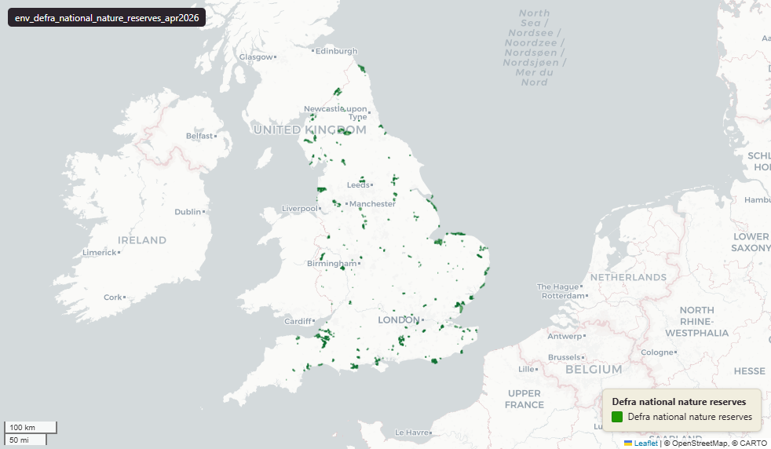

# Defra - Department for Environment, Food and Rural Affairs — Environment Agency National Nature Reserves (NNRs) in England, April 2026

National Nature Reserves

`env_defra_national_nature_reserves_apr2026`

**SOURCE**

- Natural England (designating body), distributed under the Department for Environment, Food and Rural Affairs (Defra) family. Source dataset on the Natural England Open Data Hub.

**DOCUMENTATION**

- NE Open Data Hub : https://naturalengland-defra.opendata.arcgis.com/
- NE NNR landing   : https://www.gov.uk/government/publications/national-nature-reserves-in-england
- About NNRs       : https://www.gov.uk/government/publications/national-nature-reserves-in-england/national-nature-reserves-in-england

**DEFINITIONS**

- "National Nature Reserves (NNRs) are places where wildlife comes first. They were established to protect the most significant areas of habitat and of geological formations and to provide outdoor laboratories for research." (gov.uk NNR landing page)

**SCOPE**

- England. 739 rows.

**CRS**

- EPSG:27700 (OSGB 1936 / British National Grid).

**LICENCE**

- Open Government Licence v3.0. © Natural England.

**ENRICHMENT**

- Geometry split to one row per source feature per MSOA (2021).
- Each row carries that MSOA's `msoa21cd`, `msoa21nm`, `msoa21hclnm`, `lad22cd`, `lad22nm`, `lad25cd`, `lad25nm`.
- The source feature's original primary key is preserved as `source_fid`; `gid` is a fresh surrogate primary key.
- Coastal or offshore geometry beyond MSOA coverage (roughly Mean High Water) is kept as rows with NULL geography columns, so the layer holds the complete source geometry.

**LOADED INTO uk_baseline**

- Loaded by PNC, May 2026.

## Columns

| Column | Type | Description / unit |
|---|---|---|
| `source_fid` | `bigint` | Primary key of the source feature in the pre-split layer uk.env_defra_national_nature_reserves_apr2026__preswap_jul03 (non-unique here: a feature spanning N MSOAs has N rows). |
| `fid_original` | `integer` | Original source feature identifier, preserved at load. |
| `hyperlink` | `character varying` | Source field `hyperlink`; URL to the reserve's web page (often blank). |
| `ref_code` | `character varying` | Source field `ref_code`; Natural England NNR reference code (e.g. "1006003"). |
| `name` | `character varying` | Source field `name`; National Nature Reserve name (upper case). |
| `measure` | `double precision` | Source field `measure`; reserve area as published. Unit: hectares. |
| `label` | `character varying` | Source field `label`; display label (e.g. "Aqualate Mere (NNR)"). |
| `globalid` | `character varying` | Source field `GlobalID`; Esri global identifier of the source feature. |
| `area_ha` | `double precision` | Area of this row's geometry in hectares. |
| `rgn22cd` | `text` | Region 2022 GSS code (nine English regions), assigned via the ONS Region lookup. Open Government Licence v3.0. |
| `rgn22nm` | `text` | Region 2022 name, assigned via the ONS Region lookup. Open Government Licence v3.0. |
| `sds_boundary` | `text` | Spatial Development Strategy (SDS) area the feature falls in (e.g. "Norfolk and Suffolk", "Cumbria"). NULL outside any SDS area. |
| `msoa21cd` | `character varying` | Middle Layer Super Output Area (MSOA) 2021 code of this piece. Open Government Licence v3.0. |
| `msoa21nm` | `character varying` | Official ONS MSOA 2021 name of this piece. Open Government Licence v3.0. |
| `msoa21hclnm` | `text` | House of Commons Library readable MSOA name of this piece. Open Parliament Licence. |
| `lad22cd` | `text` | Local Authority District 2022 code (2021 LAD geography, anchored to the MSOA 2021 name scoping), best-fit from this piece's msoa21cd. Open Government Licence v3.0. |
| `lad22nm` | `text` | Local Authority District 2022 name (2021 LAD geography), best-fit from this piece's msoa21cd. Open Government Licence v3.0. |
| `lad25cd` | `text` | Local Authority District 2025 code (current administering authority), best-fit from this piece's msoa21cd. Open Government Licence v3.0. |
| `lad25nm` | `text` | Local Authority District 2025 name (current administering authority), best-fit from this piece's msoa21cd. Open Government Licence v3.0. |
| `geom` | `geometry(MultiPolygon,27700)` | National Nature Reserve polygon geometry in EPSG:27700 (British National Grid); one part per MSOA (2021) after the split. |
| `gid` | `bigint` | Surrogate primary key, added at the MSOA split (see ENRICHMENT). |
