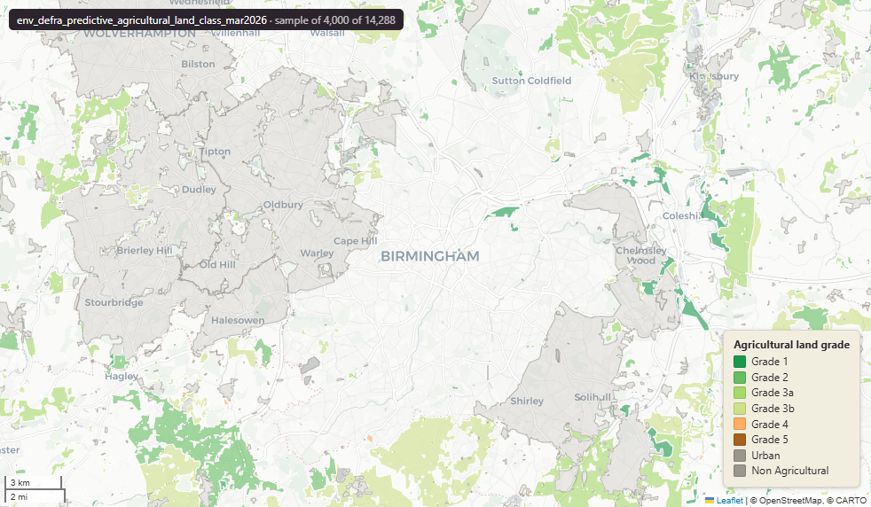

# Defra - Department for Environment, Food and Rural Affairs Predictive Agricultural Land Classification (ALC) for England, March 2026

Predictive Agricultural Land

`env_defra_predictive_agricultural_land_class_mar2026`

**SOURCE**

- Department for Environment, Food and Rural Affairs (Defra). Predictive ALC product.

**DOCUMENTATION**

- ALC concept guidance : https://www.gov.uk/government/publications/agricultural-land-classification-of-england-and-wales/agricultural-land-classification-of-england-and-wales

**DEFINITIONS**

- "Agricultural Land Classification (ALC) provides a method for assessing the quality of farmland to enable informed choices to be made about its future use within the planning system." (Defra ALC guidance)

**SCOPE**

- England. 1,103,217 rows.

**CRS**

- EPSG:27700 (OSGB 1936 / British National Grid).

**LICENCE**

- Open Government Licence v3.0. © Defra.

**DATA QUALITY CAVEATS**

- Predictive / modelled: every grade (1, 2, 3a, 3b, 4, 5, NA, U) is a prediction of likely ALC, not a field survey. Use for screening; confirm with a site survey for planning decisions.
- RELATED: for the authoritative surveyed classification (Natural England, grades 1–5), see uk_baseline.env_naturalengland_agricultural_land_class_nov2024.

**ENRICHMENT**

- Geometry split to one row per source feature per MSOA (2021).
- Each row carries that MSOA's `msoa21cd`, `msoa21nm`, `msoa21hclnm`, `lad22cd`, `lad22nm`, `lad25cd`, `lad25nm`.
- The source feature's original primary key is preserved as `source_fid`; `gid` is a fresh surrogate primary key.
- Features with no MSOA overlap (offshore or outside England & Wales) are kept whole, with NULL geography columns.

**LOADED INTO uk_baseline**

- Loaded by PNC, May 2026.

## Columns

| Column | Type | Description / unit |
|---|---|---|
| `source_fid` | `bigint` | Primary key of the source feature in the pre-split layer uk.env_defra_predictive_agricultural_land_class_mar2026__preswap_j (non-unique here: a feature spanning N MSOAs has N rows). |
| `id` | `integer` | Source feature identifier, repeated across a feature's per-MSOA split rows. Not a unique key here — use `gid`. |
| `fid_original` | `bigint` | Original source feature identifier, preserved at load. |
| `alcgrade` | `bigint` | Numeric code for the predictive ALC grade (1-8): 1=Grade 1, 2=Grade 2, 3=Grade 3a, 4=Grade 3b, 5=Grade 4, 6=Grade 5, 7=non-agricultural, 8=urban. Corresponds to `alc`. |
| `alc` | `character varying(2)` | Predictive ALC grade — "1", "2", "3a", "3b", "4", "5", "NA" (non-agricultural) or "U" (urban). |
| `area_ha` | `double precision` | Area of this row's geometry in hectares. |
| `rgn22cd` | `text` | Region 2022 GSS code (nine English regions), assigned via the ONS Region lookup. Open Government Licence v3.0. |
| `rgn22nm` | `text` | Region 2022 name, assigned via the ONS Region lookup. Open Government Licence v3.0. |
| `sds_boundary` | `text` | Spatial Development Strategy (SDS) area the feature falls in (e.g. "Devon and Torbay", "Cornwall"). NULL outside any SDS area. |
| `msoa21cd` | `character varying` | Middle Layer Super Output Area (MSOA) 2021 code of this piece. Open Government Licence v3.0. |
| `msoa21nm` | `character varying` | Official ONS MSOA 2021 name of this piece. Open Government Licence v3.0. |
| `msoa21hclnm` | `text` | House of Commons Library readable MSOA name of this piece. Open Parliament Licence. |
| `lad22cd` | `text` | Local Authority District 2022 code (2021 LAD geography, anchored to the MSOA 2021 name scoping), best-fit from this piece's msoa21cd. Open Government Licence v3.0. |
| `lad22nm` | `text` | Local Authority District 2022 name (2021 LAD geography), best-fit from this piece's msoa21cd. Open Government Licence v3.0. |
| `lad25cd` | `text` | Local Authority District 2025 code (current administering authority), best-fit from this piece's msoa21cd. Open Government Licence v3.0. |
| `lad25nm` | `text` | Local Authority District 2025 name (current administering authority), best-fit from this piece's msoa21cd. Open Government Licence v3.0. |
| `geom` | `geometry(MultiPolygon,27700)` | Predictive ALC polygon geometry in EPSG:27700 (British National Grid); one part per MSOA (2021) after the split. |
| `gid` | `bigint` | Surrogate primary key, added at the MSOA split (see ENRICHMENT). |
