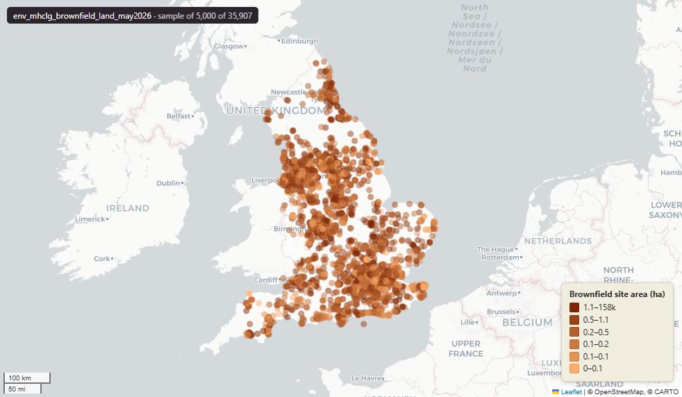

# Ministry of Housing, Communities and Local Government (MHCLG) Brownfield Land register for England, May 2026

Brownfield land

`env_mhclg_brownfield_land_may2026`

**SOURCE**

- Ministry of Housing, Communities and Local Government (MHCLG), via planning.data.gov.uk (digital-land). Each row carries the publishing Local Planning Authority's own site reference.

**DOCUMENTATION**

- planning.data.gov.uk brownfield-land          : https://www.planning.data.gov.uk/dataset/brownfield-land
- gov.uk Brownfield Land Register data standard : https://www.gov.uk/government/publications/brownfield-land-registers-data-standard

**DEFINITIONS**

- Brownfield land is previously developed land: land which is or was occupied by a permanent structure and its curtilage, together with any associated fixed surface infrastructure. It excludes agricultural and forestry land; minerals and landfill sites with restoration provision; residential gardens, parks and allotments; and land where former structures have blended into the landscape. (National Planning Policy Framework, previously developed land)

**SCOPE**

- England. 35,907 rows.

**CRS**

- EPSG:27700 (OSGB 1936 / British National Grid). Geometry type MultiPoint.

**LICENCE**

- Open Government Licence v3.0.

**LOADED INTO uk_baseline**

- Loaded by PNC, May 2026.

## Columns

| Column | Type | Description / unit |
|---|---|---|
| `fid_original` | `integer` | Original feature id preserved at load. |
| `dataset` | `character varying` | Source field "dataset"; digital-land dataset slug. Observed value: "brownfield-land". |
| `end_date` | `character varying` | Source field "end-date"; entity end date (blank where current). Stored as text. |
| `entity` | `character varying` | Source field "entity"; digital-land national entity identifier. |
| `entry_date` | `character varying` | Source field "entry-date"; date the record entered the digital-land collection. Stored as text. |
| `name` | `character varying` | Source field "name"; site name. |
| `organisation_entity` | `character varying` | Source field "organisation-entity"; digital-land entity id of the publishing organisation (the Local Planning Authority). |
| `prefix` | `character varying` | Source field "prefix"; digital-land dataset prefix. Observed value: "brownfield-land". |
| `quality` | `character varying` | Source field "quality"; digital-land data-quality field. |
| `reference` | `character varying` | Source field "reference"; the publishing Local Planning Authority's own site reference. |
| `start_date` | `character varying` | Source field "start-date"; entity start date. Stored as text. |
| `typology` | `character varying` | Source field "typology"; digital-land typology. Observed value: "geography". |
| `deliverable` | `character varying` | Source field "deliverable"; value as published by the LPA. |
| `planning_permission_date` | `date` | Source field "planning-permission-date"; date planning permission granted. Typed date. |
| `planning_permission_history` | `character varying` | Source field "planning-permission-history"; free-text planning-permission history. |
| `planning_permission_status` | `character varying` | Source field "planning-permission-status". Observed values: "permissioned", "not-permissioned", "non-permissioned", "pending-decision", "completed". See planning_permission_status_clean. |
| `hazardous_substances` | `character varying` | Source field "hazardous-substances". |
| `hectares` | `character varying` | Source field "hectares"; site area as published by the LPA. Stored as text. Unit: "hectares". |
| `site_plan_url` | `character varying` | Source field "site-plan-url"; URL to the LPA site plan. |
| `notes` | `character varying` | Source field "notes"; free-text notes from the LPA. |
| `site_address` | `character varying` | Source field "site-address"; site address. |
| `minimum_net_dwellings` | `character varying` | Source field "minimum-net-dwellings"; LPA estimate. Stored as text. |
| `ownership_status` | `character varying` | Source field "ownership-status". Observed values: "not-owned-by-a-public-authority", "owned-by-a-public-authority", "mixed-ownership", "unknown-ownership", "Unknown". |
| `maximum_net_dwellings` | `character varying` | Source field "maximum-net-dwellings"; LPA estimate. Stored as text. |
| `planning_permission_type` | `character varying` | Source field "planning-permission-type". |
| `lad25cd` | `character varying(9)` | Local Authority District 2025 code (current administering authority). Assigned at load by point-in-polygon location against uk_baseline.adm_ons_lad_boundary_may2025. Open Government Licence v3.0. |
| `lad25nm` | `character varying(100)` | Local Authority District 2025 name (current administering authority). Assigned at load by point-in-polygon location against uk_baseline.adm_ons_lad_boundary_may2025. Open Government Licence v3.0. |
| `rgn22cd` | `character varying` | Joined at load from ONS LAD->Region lookup; 2022 Region GSS code. |
| `rgn22nm` | `character varying` | Joined at load from ONS LAD->Region lookup; 2022 Region name. |
| `sds_boundary` | `character varying` | Internal categorisation: SDS area where the point falls. Blank or NULL where outside any SDS area. |
| `geom` | `geometry(MultiPoint,27700)` | MultiPoint in EPSG:27700. Brownfield site point. |
| `fid` | `bigint` | Loader surrogate row identifier. |
| `planning_permission_status_clean` | `text` | Canonical Title Case value derived from planning_permission_status via uk_baseline.lut_planning_permission_status. 'No Data' = source was NULL OR was an unmappable/ambiguous value (REC, bare numeric codes, 'Mixed ownership', 'Finally Disposed Of', explicit 'Unknown'). 'Unknown' merged into 'No Data' on 13 May 2026. |
| `msoa21cd` | `text` | Middle Layer Super Output Area (MSOA) 2021 code. Assigned at load by point-in-polygon location against uk_baseline.adm_ons_msoa_boundary_2021. Open Government Licence v3.0. |
| `msoa21nm` | `text` | Official ONS Middle Layer Super Output Area 2021 name. Assigned at load via the point's 2021 MSOA (point-in-polygon against uk_baseline.adm_ons_msoa_boundary_2021). Open Government Licence v3.0. |
| `msoa21hclnm` | `text` | House of Commons Library readable MSOA name. Assigned at load via the point's 2021 MSOA (point-in-polygon against uk_baseline.adm_ons_msoa_boundary_2021, which carries the House of Commons Library name). Open Parliament Licence. |
| `lad22cd` | `text` | Local Authority District 2022 code (2021 LAD geography, anchored to the MSOA 2021 name scoping). Assigned at load by point-in-polygon location against uk_baseline.adm_ons_lad_boundary_may2022. Open Government Licence v3.0. |
| `lad22nm` | `text` | Local Authority District 2022 name (2021 LAD geography). Assigned at load by point-in-polygon location against uk_baseline.adm_ons_lad_boundary_may2022. Open Government Licence v3.0. |
