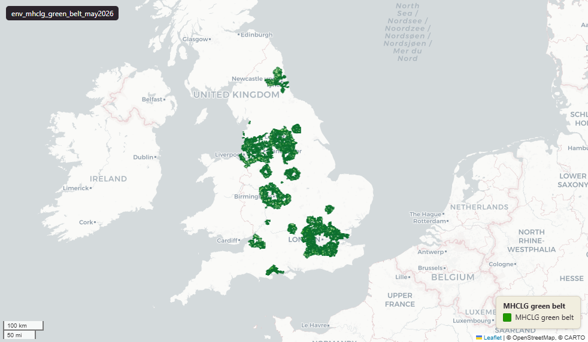

# Ministry of Housing, Communities and Local Government (MHCLG) Green Belt boundaries for England, May 2026

Green Belt

`env_mhclg_green_belt_may2026`

Published via planning.data.gov.uk (digital-land).

**SOURCE**

- Ministry of Housing, Communities and Local Government (MHCLG), via planning.data.gov.uk (digital-land).

**DOCUMENTATION**

- planning.data.gov.uk green-belt : https://www.planning.data.gov.uk/dataset/green-belt

**DEFINITIONS**

- "This dataset contains boundaries for land designated by a local planning authority as being green belt, grouped using the greenbelt core category." (planning.data.gov.uk, "About this dataset")

**SCOPE**

- England. 4,402 rows.

**CRS**

- EPSG:27700 (OSGB 1936 / British National Grid). Geometry type MultiPolygon.

**LICENCE**

- Open Government Licence v3.0.

**LOADED INTO uk_baseline**

- Loaded by PNC, May 2026.

MSOA SPLIT (added 3 July 2026)

- Geometry split to one row per (source feature x MSOA 2021). Each row carries that MSOA's msoa21cd / msoa21nm / msoa21hclnm and best-fit lad22 / lad25. The source feature's original primary key is preserved as `source_fid`; `gid` is a fresh surrogate primary key. Features with no MSOA overlap (offshore or outside England & Wales) are kept whole with NULL geography columns.
- Keep-everything (3 July 2026): geometry outside every MSOA — offshore, estuarine, or beyond the generalised coastline — is retained as rows with NULL geography columns (source_fid links the parts), so the layer holds the complete source geometry.

## Columns

| Column | Type | Description / unit |
|---|---|---|
| `source_fid` | `bigint` | Primary key of the source feature in the pre-split layer uk.env_mhclg_green_belt_may2026__preswap_jul03 (non-unique here: a feature spanning N MSOAs has N rows). |
| `fid_original` | `integer` |  |
| `dataset` | `character varying` |  |
| `end_date` | `character varying` |  |
| `entity` | `character varying` |  |
| `entry_date` | `date` |  |
| `name` | `character varying` |  |
| `organisation_entity` | `character varying` |  |
| `prefix` | `character varying` |  |
| `quality` | `character varying` |  |
| `reference` | `character varying` |  |
| `start_date` | `character varying` |  |
| `typology` | `character varying` |  |
| `local_authority_district` | `character varying` |  |
| `green_belt_core` | `character varying` |  |
| `wd25cd` | `character varying` |  |
| `wd25nm` | `character varying` |  |
| `rgn22cd` | `text` |  |
| `rgn22nm` | `text` |  |
| `sds_boundary` | `text` |  |
| `area_ha` | `double precision` |  |
| `msoa21cd` | `character varying` | Middle Layer Super Output Area (MSOA) 2021 code of this piece. Open Government Licence v3.0. |
| `msoa21nm` | `character varying` | Official ONS MSOA 2021 name of this piece. Open Government Licence v3.0. |
| `msoa21hclnm` | `text` | House of Commons Library readable MSOA name of this piece. Open Parliament Licence. |
| `lad22cd` | `text` | Local Authority District 2022 code (2021 LAD geography, anchored to the MSOA 2021 name scoping), best-fit from this piece's msoa21cd. Open Government Licence v3.0. |
| `lad22nm` | `text` | Local Authority District 2022 name (2021 LAD geography), best-fit from this piece's msoa21cd. Open Government Licence v3.0. |
| `lad25cd` | `text` | Local Authority District 2025 code (current administering authority), best-fit from this piece's msoa21cd. Open Government Licence v3.0. |
| `lad25nm` | `text` | Local Authority District 2025 name (current administering authority), best-fit from this piece's msoa21cd. Open Government Licence v3.0. |
| `geom` | `geometry(MultiPolygon,27700)` |  |
| `gid` | `bigint` |  |
