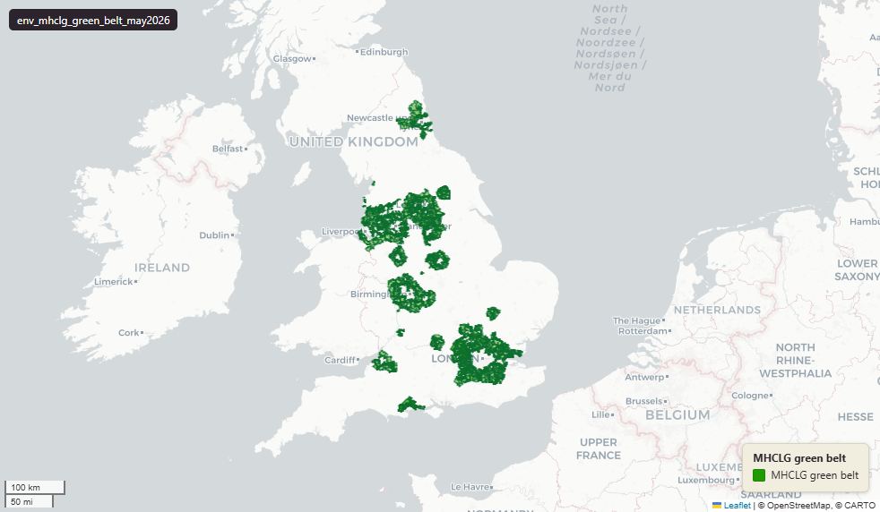

# Ministry of Housing, Communities and Local Government (MHCLG) Green Belt boundaries for England, May 2026

Green Belt

`env_mhclg_green_belt_may2026`

**SOURCE**

- Ministry of Housing, Communities and Local Government (MHCLG), via planning.data.gov.uk (digital-land).

**DOCUMENTATION**

- planning.data.gov.uk green-belt : https://www.planning.data.gov.uk/dataset/green-belt

**DEFINITIONS**

- Green Belt is land kept permanently open around larger built-up areas; its fundamental aim is to prevent urban sprawl. (National Planning Policy Framework, Green Belt)
- The five purposes of Green Belt (NPPF):
    - check the unrestricted sprawl of large built-up areas;
    - prevent neighbouring towns merging into one another;
    - safeguard the countryside from encroachment;
    - preserve the setting and special character of historic towns;
    - assist urban regeneration by encouraging the recycling of derelict and other urban land.

**SCOPE**

- England. 17,591 rows.

**CRS**

- EPSG:27700 (OSGB 1936 / British National Grid). Geometry type MultiPolygon.

**LICENCE**

- Open Government Licence v3.0.

**DATA QUALITY CAVEATS**

- Geography keys are NULL on 31 of 17,591 rows, measured 28 July 2026: 3 fall inside an England or Wales district and could carry one, so their keys are a gap rather than an absence; 27 are residual fragments left by the MSOA split, each under 100 sqm or 10 m; 1 fall outside every district — offshore, inter-tidal, or beyond Great Britain.
- County and Spatial Development Strategy columns are England and Wales only; rows elsewhere carry no county or SDS. Wales and the Isles of Scilly carry a county but no SDS. Rows with no Local Authority District code are NULL in all four columns.

**ENRICHMENT**

- `sds_name` / `sds_group` — Spatial Development Strategy area and devolution status, a Prior + Partners categorisation over Ministry of Housing, Communities and Local Government (MHCLG) English devolution policy, joined at load on the row's Local Authority District 2025 code via uk.ref_lad25_ctyua25_sds_lu_jul2026.
- Geometry split to one row per source feature per MSOA (2021).
- Each row carries that MSOA's `msoa21cd`, `msoa21nm`, `msoa21hclnm`, `lad22cd`, `lad22nm`, `lad25cd`, `lad25nm`.
- The source feature's original primary key is preserved as `source_fid`; `gid` is a fresh surrogate primary key.
- Geometry outside every MSOA (offshore, estuarine, or beyond the coastline) is kept as rows with NULL geography columns, so the layer holds the complete source geometry.

**LOADED INTO uk_baseline**

- Loaded by PNC, May 2026.

## Columns

| Column | Type | Description / unit |
|---|---|---|
| `source_fid` | `bigint` | Primary key of the source feature in the pre-split layer uk.env_mhclg_green_belt_may2026__preswap_jul03 (non-unique here: a feature spanning N MSOAs has N rows). |
| `fid_original` | `integer` | Original feature id preserved at load. |
| `dataset` | `character varying` | Source field "dataset"; digital-land dataset slug. Observed value: "green-belt". |
| `end_date` | `character varying` | Source field "end-date"; entity end date (blank where current). Stored as text. |
| `entity` | `character varying` | Source field "entity"; digital-land national entity identifier. |
| `entry_date` | `date` | Source field "entry-date"; date the record entered the digital-land collection. Typed date. |
| `name` | `character varying` | Source field "name"; green belt designation name (e.g. "Halton"). |
| `organisation_entity` | `character varying` | Source field "organisation-entity"; digital-land entity id of the publishing organisation (the Local Planning Authority). |
| `prefix` | `character varying` | Source field "prefix"; digital-land dataset prefix. Observed value: "green-belt". |
| `quality` | `character varying` | Source field "quality"; digital-land data-quality field. |
| `reference` | `character varying` | Source field "reference"; the publishing Local Planning Authority's own reference. |
| `start_date` | `character varying` | Source field "start-date"; entity start date. Stored as text. |
| `typology` | `character varying` | Source field "typology"; digital-land typology. Observed value: "geography". |
| `local_authority_district` | `character varying` | Source field "local-authority-district"; GSS code of the local planning authority (e.g. "E06000006"). |
| `green_belt_core` | `character varying` | Source field "green-belt-core"; named green belt grouping (e.g. "London", "Merseyside and Greater Manchester"). |
| `wd25cd` | `character varying` | Electoral Ward 2025 code assigned to the feature. |
| `wd25nm` | `character varying` | Electoral Ward 2025 name assigned to the feature. |
| `rgn22cd` | `text` | Region 2022 GSS code (nine English regions), assigned via the ONS Region lookup. Open Government Licence v3.0. |
| `rgn22nm` | `text` | Region 2022 name, assigned via the ONS Region lookup. Open Government Licence v3.0. |
| `area_ha` | `double precision` | Area in hectares. |
| `msoa21cd` | `character varying` | Middle Layer Super Output Area (MSOA) 2021 code of this piece. Open Government Licence v3.0. |
| `msoa21nm` | `character varying` | Official ONS MSOA 2021 name of this piece. Open Government Licence v3.0. |
| `msoa21hclnm` | `text` | House of Commons Library readable MSOA name of this piece. Open Parliament Licence. |
| `lad22cd` | `text` | Local Authority District 2022 code (2021 LAD geography, anchored to the MSOA 2021 name scoping), best-fit from this piece's msoa21cd. Open Government Licence v3.0. |
| `lad22nm` | `text` | Local Authority District 2022 name (2021 LAD geography), best-fit from this piece's msoa21cd. Open Government Licence v3.0. |
| `lad25cd` | `text` | Local Authority District 2025 code (current administering authority), best-fit from this piece's msoa21cd. Open Government Licence v3.0. |
| `lad25nm` | `text` | Local Authority District 2025 name (current administering authority), best-fit from this piece's msoa21cd. Open Government Licence v3.0. |
| `geom` | `geometry(MultiPolygon,27700)` | Green belt polygon geometry in EPSG:27700 (British National Grid); one part per MSOA (2021) after the split. |
| `gid` | `bigint` | Surrogate primary key, added at the MSOA split (see ENRICHMENT). |
| `ctyua25cd` | `text` | County or unitary authority code at 1 April 2025. Joined at load via uk.ref_lad25_ctyua25_sds_lu_jul2026 on the row's Local Authority District 2025 code. Open Government Licence v3.0. |
| `ctyua25nm` | `text` | County or unitary authority name at 1 April 2025. Joined at load via uk.ref_lad25_ctyua25_sds_lu_jul2026 on the row's Local Authority District 2025 code. Open Government Licence v3.0. |
| `sds_name` | `text` | Spatial Development Strategy (SDS) area, a Prior + Partners categorisation over Ministry of Housing, Communities and Local Government (MHCLG) English devolution policy. Joined at load via uk.ref_lad25_ctyua25_sds_lu_jul2026 on the row's Local Authority District 2025 code. Open Government Licence v3.0. |
| `sds_group` | `text` | Devolution status of the Spatial Development Strategy area: Existing Devolution Footprints, Devolution Priority Programme, Other Proposed Geographies or Remaining Areas. Joined at load via uk.ref_lad25_ctyua25_sds_lu_jul2026 on the row's Local Authority District 2025 code. Open Government Licence v3.0. |
