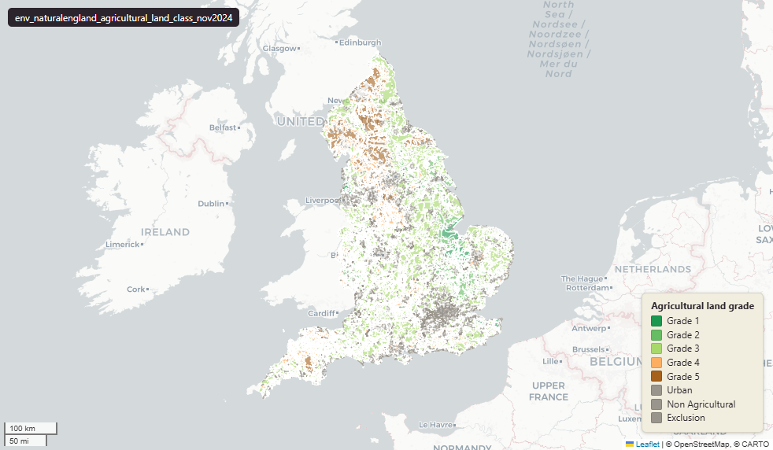

# Natural England Agricultural Land Classification (ALC) survey for England, November 2024

`env_naturalengland_agricultural_land_class_nov2024`

**SOURCE**

- Natural England, via the NE Open Data Hub. Agricultural Land Classification (post-war survey) dataset.

**DOCUMENTATION**

- NE Open Data Hub : https://naturalengland-defra.opendata.arcgis.com/
- ALC guidance     : https://www.gov.uk/government/publications/agricultural-land-assess-proposals-for-development/guide-to-assessing-development-proposals-on-agricultural-land

**DEFINITIONS**

- "ALC uses a grading system to enable you to assess and compare the quality of agricultural land in England and Wales." (gov.uk, Guide to assessing development proposals on agricultural land)
- "A combination of climate, topography and soil characteristics and their unique interaction determines the limitation and grade of the land." (gov.uk, Guide to assessing development proposals on agricultural land)

**SCOPE**

- England. 5,926 rows.

**CRS**

- EPSG:27700 (OSGB 1936 / British National Grid). Geometry type MultiPolygon.

**LICENCE**

- Open Government Licence v3.0. © Natural England.

**DATA QUALITY CAVEATS**

- Surveyed layer — this is the original, field-surveyed Agricultural Land Classification (not a model or prediction).
- RELATED: for a modelled national prediction that splits grade 3 into 3a/3b, see uk_baseline.env_defra_predictive_agricultural_land_class_mar2026 — that layer is a prediction, not a survey.

**LOADED INTO uk_baseline**

- Loaded by PNC, May 2026.

MSOA SPLIT (added 3 July 2026)

- Geometry split to one row per (source feature x MSOA 2021). Each row carries that MSOA's msoa21cd / msoa21nm / msoa21hclnm and best-fit lad22 / lad25. The source feature's original primary key is preserved as `source_fid`; `gid` is a fresh surrogate primary key. Features with no MSOA overlap (offshore or outside England & Wales) are kept whole with NULL geography columns.

## Columns

| Column | Type | Description / unit |
|---|---|---|
| `source_fid` | `bigint` | Primary key of the source feature in the pre-split layer uk.env_naturalengland_agricultural_land_class_nov2024__preswap_jul (non-unique here: a feature spanning N MSOAs has N rows). |
| `fid_original` | `integer` |  |
| `geogext` | `character varying` |  |
| `area` | `double precision` |  |
| `alc_grade` | `character varying` |  |
| `perimeter` | `double precision` |  |
| `area_ha` | `double precision` |  |
| `rgn22cd` | `text` |  |
| `rgn22nm` | `text` |  |
| `sds_boundary` | `text` |  |
| `msoa21cd` | `character varying` | Middle Layer Super Output Area (MSOA) 2021 code of this piece. Open Government Licence v3.0. |
| `msoa21nm` | `character varying` | Official ONS MSOA 2021 name of this piece. Open Government Licence v3.0. |
| `msoa21hclnm` | `text` | House of Commons Library readable MSOA name of this piece. Open Parliament Licence. |
| `lad22cd` | `text` | Local Authority District 2022 code (2021 LAD geography, anchored to the MSOA 2021 name scoping), best-fit from this piece's msoa21cd. Open Government Licence v3.0. |
| `lad22nm` | `text` | Local Authority District 2022 name (2021 LAD geography), best-fit from this piece's msoa21cd. Open Government Licence v3.0. |
| `lad25cd` | `text` | Local Authority District 2025 code (current administering authority), best-fit from this piece's msoa21cd. Open Government Licence v3.0. |
| `lad25nm` | `text` | Local Authority District 2025 name (current administering authority), best-fit from this piece's msoa21cd. Open Government Licence v3.0. |
| `geom` | `geometry(MultiPolygon,27700)` |  |
| `gid` | `bigint` |  |
