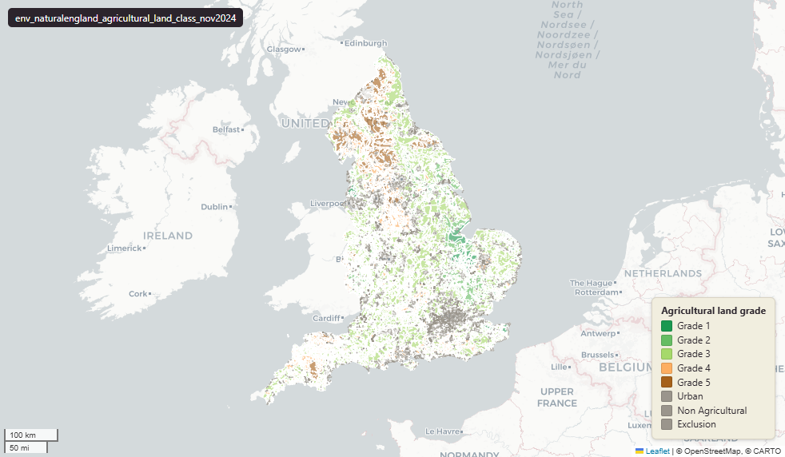

# Natural England Agricultural Land Classification (ALC) survey for England, November 2024

Agricultural Land Classification - Survey

`env_naturalengland_agricultural_land_class_nov2024`

**SOURCE**

- Natural England, via the NE Open Data Hub. Agricultural Land Classification (post-war survey) dataset.

**DOCUMENTATION**

- NE Open Data Hub : https://naturalengland-defra.opendata.arcgis.com/
- ALC guidance     : https://www.gov.uk/government/publications/agricultural-land-assess-proposals-for-development/guide-to-assessing-development-proposals-on-agricultural-land

**DEFINITIONS**

- Agricultural Land Classification (ALC) grades agricultural land by quality — the extent to which soil, site and climate limit its use — from Grade 1 (best) to Grade 5 (poorest), to inform land-use planning. (Natural England / Defra ALC guidance)
- Grades in this survey (grade 3 is not subdivided into 3a/3b):
    - Grade 1 — excellent quality: no or very minor limitations to agricultural use;
    - Grade 2 — very good quality: minor limitations;
    - Grade 3 — good to moderate quality;
    - Grade 4 — poor quality: severe limitations;
    - Grade 5 — very poor quality: very severe limitations;
    - Non Agricultural — land not in agricultural use;
    - Urban — built-up land;
    - Exclusion — land excluded from the classification.

**SCOPE**

- England. 44,489 rows.

**CRS**

- EPSG:27700 (OSGB 1936 / British National Grid). Geometry type MultiPolygon.

**LICENCE**

- Open Government Licence v3.0. © Natural England.

**DATA QUALITY CAVEATS**

- Geography keys are NULL on 916 of 44,489 rows, measured 28 July 2026: 800 fall inside an England or Wales district and could carry one, so their keys are a gap rather than an absence; 103 are residual fragments left by the MSOA split, each under 100 sqm or 10 m; 13 are in Scotland or Northern Ireland, outside the England and Wales lookup.
- County and Spatial Development Strategy columns are England and Wales only; rows elsewhere carry no county or SDS. Wales and the Isles of Scilly carry a county but no SDS. Rows with no Local Authority District code are NULL in all four columns.
- Surveyed layer — this is the original, field-surveyed Agricultural Land Classification (not a model or prediction).
- RELATED: for a modelled national prediction of agricultural land, please see Agricultural Land Classification - Predictive (uk_baseline.env_defra_predictive_agricultural_land_class_mar2026).

**ENRICHMENT**

- `sds_name` / `sds_group` — Spatial Development Strategy area and devolution status, a Prior + Partners categorisation over Ministry of Housing, Communities and Local Government (MHCLG) English devolution policy, joined at load on the row's Local Authority District 2025 code via uk.ref_lad25_ctyua25_sds_lu_jul2026.
- Geometry split to one row per source feature per MSOA (2021).
- Each row carries that MSOA's `msoa21cd`, `msoa21nm`, `msoa21hclnm`, `lad22cd`, `lad22nm`, `lad25cd`, `lad25nm`.
- The source feature's original primary key is preserved as `source_fid`; `gid` is a fresh surrogate primary key.
- Geometry outside every MSOA (offshore, estuarine, or beyond the coastline) is kept as rows with NULL geography columns, so the layer holds the complete source geometry.

**LOADED INTO uk_baseline**

- Loaded by PNC, May 2026.

## Columns

| Column | Type | Description / unit |
|---|---|---|
| `source_fid` | `bigint` | Primary key of the source feature in the pre-split layer uk.env_naturalengland_agricultural_land_class_nov2024__preswap_jul (non-unique here: a feature spanning N MSOAs has N rows). |
| `fid_original` | `integer` | Original source feature identifier, preserved at load. |
| `geogext` | `character varying` | Source field `geogext`; geographic extent / survey map-sheet reference from the source. |
| `area` | `double precision` | Source field `area`; area as recorded in the source (ArcInfo coverage AREA item). |
| `alc_grade` | `character varying` | Source field `alc_grade`; surveyed ALC grade — "Grade 1" to "Grade 5", "Non Agricultural", "Urban" or "Exclusion". |
| `perimeter` | `double precision` | Source field `perimeter`; perimeter as recorded in the source (ArcInfo coverage PERIMETER item). |
| `area_ha` | `double precision` | Area in hectares. |
| `rgn22cd` | `text` | Region 2022 GSS code (nine English regions), assigned via the ONS Region lookup. Open Government Licence v3.0. |
| `rgn22nm` | `text` | Region 2022 name, assigned via the ONS Region lookup. Open Government Licence v3.0. |
| `msoa21cd` | `character varying` | Middle Layer Super Output Area (MSOA) 2021 code of this piece. Open Government Licence v3.0. |
| `msoa21nm` | `character varying` | Official ONS MSOA 2021 name of this piece. Open Government Licence v3.0. |
| `msoa21hclnm` | `text` | House of Commons Library readable MSOA name of this piece. Open Parliament Licence. |
| `lad22cd` | `text` | Local Authority District 2022 code (2021 LAD geography, anchored to the MSOA 2021 name scoping), best-fit from this piece's msoa21cd. Open Government Licence v3.0. |
| `lad22nm` | `text` | Local Authority District 2022 name (2021 LAD geography), best-fit from this piece's msoa21cd. Open Government Licence v3.0. |
| `lad25cd` | `text` | Local Authority District 2025 code (current administering authority), best-fit from this piece's msoa21cd. Open Government Licence v3.0. |
| `lad25nm` | `text` | Local Authority District 2025 name (current administering authority), best-fit from this piece's msoa21cd. Open Government Licence v3.0. |
| `geom` | `geometry(MultiPolygon,27700)` | Agricultural Land Classification survey polygon geometry in EPSG:27700 (British National Grid); one part per MSOA (2021) after the split. |
| `gid` | `bigint` | Surrogate primary key, added at the MSOA split (see ENRICHMENT). |
| `ctyua25cd` | `text` | County or unitary authority code at 1 April 2025. Joined at load via uk.ref_lad25_ctyua25_sds_lu_jul2026 on the row's Local Authority District 2025 code. Open Government Licence v3.0. |
| `ctyua25nm` | `text` | County or unitary authority name at 1 April 2025. Joined at load via uk.ref_lad25_ctyua25_sds_lu_jul2026 on the row's Local Authority District 2025 code. Open Government Licence v3.0. |
| `sds_name` | `text` | Spatial Development Strategy (SDS) area, a Prior + Partners categorisation over Ministry of Housing, Communities and Local Government (MHCLG) English devolution policy. Joined at load via uk.ref_lad25_ctyua25_sds_lu_jul2026 on the row's Local Authority District 2025 code. Open Government Licence v3.0. |
| `sds_group` | `text` | Devolution status of the Spatial Development Strategy area: Existing Devolution Footprints, Devolution Priority Programme, Other Proposed Geographies or Remaining Areas. Joined at load via uk.ref_lad25_ctyua25_sds_lu_jul2026 on the row's Local Authority District 2025 code. Open Government Licence v3.0. |
