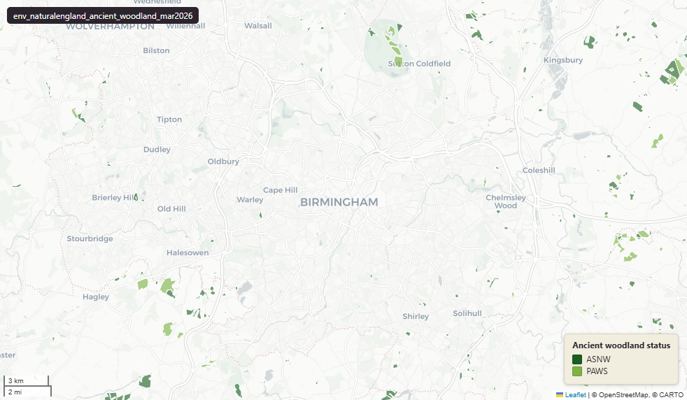

# Natural England Ancient Woodland Inventory (England), March 2026

Ancient Woodland

`env_naturalengland_ancient_woodland_mar2026`

**SOURCE**

- Natural England, via the NE Open Data Hub. Ancient Woodland (England) dataset.

**DOCUMENTATION**

- NE Open Data Hub          : https://naturalengland-defra.opendata.arcgis.com/
- Ancient woodland guidance : https://www.gov.uk/guidance/ancient-woodland-and-veteran-trees-protection-surveys-licences

**DEFINITIONS**

- "Ancient woodland is an area that has been wooded continuously since at least 1600AD." (data.gov.uk, Ancient Woodland (England), Natural England)

**SCOPE**

- England. 64,639 rows.

**CRS**

- EPSG:27700 (OSGB 1936 / British National Grid). Geometry type MultiPolygon.

**LICENCE**

- Open Government Licence v3.0. © Natural England.

**DATA QUALITY CAVEATS**

- The row count counts split pieces, not source features: this layer was split by Middle Layer Super Output Area, so it holds one row per feature per MSOA piece, plus whole and remainder rows to keep 100% of the source geometry. 64,639 rows represent 55,647 source features, measured 28 July 2026. `source_fid` identifies the originating feature.
- Geography keys are NULL on 165 of 64,639 rows, measured 28 July 2026: 117 fall inside an England or Wales district and could carry one, so their keys are a gap rather than an absence; 47 are residual fragments left by the MSOA split, each under 100 sqm or 10 m; 1 are in Scotland or Northern Ireland, outside the England and Wales lookup.
- County and Spatial Development Strategy columns are England and Wales only; rows elsewhere carry no county or SDS. Wales and the Isles of Scilly carry a county but no SDS. Rows with no Local Authority District code are NULL in all four columns.
- Some areas overlap with Ancient Woodland - Revised (uk_baseline.env_naturalengland_ancient_woodland_revised_apr2026); the two datasets are not mutually exclusive.

**ENRICHMENT**

- `sds_name` / `sds_group` — Spatial Development Strategy area and devolution status, a Prior + Partners categorisation over Ministry of Housing, Communities and Local Government (MHCLG) English devolution policy, joined at load on the row's Local Authority District 2025 code via uk.ref_lad25_ctyua25_sds_lu_jul2026.
- Geometry split to one row per source feature per MSOA (2021).
- Each row carries that MSOA's `msoa21cd`, `msoa21nm`, `msoa21hclnm`, `lad22cd`, `lad22nm`, `lad25cd`, `lad25nm`.
- The source feature's original primary key is preserved as `source_fid`; `gid` is a fresh surrogate primary key.
- Features with no MSOA overlap (offshore or outside England & Wales) are kept whole, with NULL geography columns.

**LOADED INTO uk_baseline**

- Loaded by PNC, May 2026.

## Columns

| Column | Type | Description / unit |
|---|---|---|
| `source_fid` | `bigint` | Primary key of the source feature in the pre-split layer uk.env_naturalengland_ancient_woodland_mar2026__preswap_jul03 (non-unique here: a feature spanning N MSOAs has N rows). |
| `fid_original` | `integer` | Original source feature identifier, preserved at load. |
| `name` | `character varying` | Source field `name`; wood name where recorded (often blank). |
| `theme` | `character varying` | Source field `theme`; dataset theme (always "ancient woodland"). |
| `themname` | `character varying` | Source field `themname`; ancient woodland category — "Ancient & Semi-Natural Woodland", "Ancient Replanted Woodland" or "Ancient Wood Pasture". |
| `themid` | `double precision` | Source field `themid`; numeric theme identifier from the source. |
| `status` | `character varying` | Source field `status`; category code, matching `themname`: "ASNW" (Ancient & Semi-Natural Woodland), "PAWS" (Ancient Replanted Woodland), "AWP" (Ancient Wood Pasture). |
| `perimeter` | `double precision` | Source field `perimeter`; feature perimeter as recorded in the source. Unit: metres. |
| `area` | `double precision` | Source field `area`; area of the whole source feature in hectares (repeated across its per-MSOA split rows). |
| `x_coord` | `integer` | Source field `x_coord`; feature centroid easting. Unit: metres (British National Grid). |
| `y_coord` | `integer` | Source field `y_coord`; feature centroid northing. Unit: metres (British National Grid). |
| `globalid` | `character varying` | Source field `GlobalID`; Esri global identifier of the source feature. |
| `area_ha` | `double precision` | Area of this row's geometry in hectares. |
| `rgn22cd` | `text` | Region 2022 GSS code (nine English regions), assigned via the ONS Region lookup. Open Government Licence v3.0. |
| `rgn22nm` | `text` | Region 2022 name, assigned via the ONS Region lookup. Open Government Licence v3.0. |
| `layer` | `character(100)` | Source field `layer`; source layer name (always "Ancient Woodland"). |
| `msoa21cd` | `character varying` | Middle Layer Super Output Area (MSOA) 2021 code of this piece. Open Government Licence v3.0. |
| `msoa21nm` | `character varying` | Official ONS MSOA 2021 name of this piece. Open Government Licence v3.0. |
| `msoa21hclnm` | `text` | House of Commons Library readable MSOA name of this piece. Open Parliament Licence. |
| `lad22cd` | `text` | Local Authority District 2022 code (2021 LAD geography, anchored to the MSOA 2021 name scoping), best-fit from this piece's msoa21cd. Open Government Licence v3.0. |
| `lad22nm` | `text` | Local Authority District 2022 name (2021 LAD geography), best-fit from this piece's msoa21cd. Open Government Licence v3.0. |
| `lad25cd` | `text` | Local Authority District 2025 code (current administering authority), best-fit from this piece's msoa21cd. Open Government Licence v3.0. |
| `lad25nm` | `text` | Local Authority District 2025 name (current administering authority), best-fit from this piece's msoa21cd. Open Government Licence v3.0. |
| `geom` | `geometry(MultiPolygon,27700)` | Ancient woodland polygon geometry in EPSG:27700 (British National Grid); one part per MSOA (2021) after the split. |
| `gid` | `bigint` | Surrogate primary key, added at the MSOA split (see ENRICHMENT). |
| `ctyua25cd` | `text` | County or unitary authority code at 1 April 2025. Joined at load via uk.ref_lad25_ctyua25_sds_lu_jul2026 on the row's Local Authority District 2025 code. Open Government Licence v3.0. |
| `ctyua25nm` | `text` | County or unitary authority name at 1 April 2025. Joined at load via uk.ref_lad25_ctyua25_sds_lu_jul2026 on the row's Local Authority District 2025 code. Open Government Licence v3.0. |
| `sds_name` | `text` | Spatial Development Strategy (SDS) area, a Prior + Partners categorisation over Ministry of Housing, Communities and Local Government (MHCLG) English devolution policy. Joined at load via uk.ref_lad25_ctyua25_sds_lu_jul2026 on the row's Local Authority District 2025 code. Open Government Licence v3.0. |
| `sds_group` | `text` | Devolution status of the Spatial Development Strategy area: Existing Devolution Footprints, Devolution Priority Programme, Other Proposed Geographies or Remaining Areas. Joined at load via uk.ref_lad25_ctyua25_sds_lu_jul2026 on the row's Local Authority District 2025 code. Open Government Licence v3.0. |
