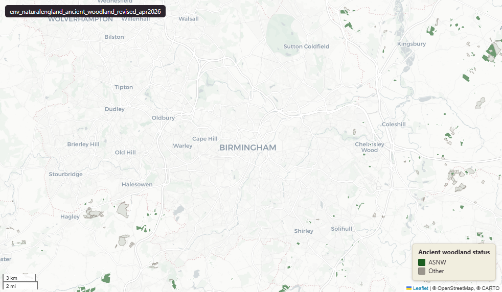

# Natural England Ancient Woodland Revised Inventory (England), April 2026

Ancient Woodland - Revised

`env_naturalengland_ancient_woodland_revised_apr2026`

**SOURCE**

- Natural England, via the NE Open Data Hub. Ancient Woodland - Revised (England) - Completed Counties dataset.

**DOCUMENTATION**

- NE Open Data Hub          : https://naturalengland-defra.opendata.arcgis.com/
- Ancient woodland guidance : https://www.gov.uk/guidance/ancient-woodland-and-veteran-trees-protection-surveys-licences

**DEFINITIONS**

- "Ancient woodland is an area that has been wooded continuously since at least 1600AD." (data.gov.uk, Ancient Woodland (England), Natural England)
- "The update revises the inventory to address problems and gaps in the previous iteration. Technological advances mean that small ancient woodlands (0.25-2ha) are being represented within the inventory for the first time as well as wood pasture and parkland being represented as its own category." (data.gov.uk, Ancient Woodland - Revised (England) - Completed Counties, Natural England)

**SCOPE**

- England. 46,860 rows. Published as "completed counties" coverage — not yet national.

**CRS**

- EPSG:27700 (OSGB 1936 / British National Grid). Geometry type MultiPolygon.

**LICENCE**

- Open Government Licence v3.0. © Natural England.

**DATA QUALITY CAVEATS**

- Some areas overlap with Ancient Woodland (uk_baseline.env_naturalengland_ancient_woodland_mar2026); the two datasets are not mutually exclusive.

**ENRICHMENT**

- Geometry split to one row per source feature per MSOA (2021).
- Each row carries that MSOA's `msoa21cd`, `msoa21nm`, `msoa21hclnm`, `lad22cd`, `lad22nm`, `lad25cd`, `lad25nm`.
- The source feature's original primary key is preserved as `source_fid`; `gid` is a fresh surrogate primary key.
- Features with no MSOA overlap (offshore or outside England & Wales) are kept whole, with NULL geography columns.

**LOADED INTO uk_baseline**

- Loaded by PNC, May 2026.

## Columns

| Column | Type | Description / unit |
|---|---|---|
| `source_fid` | `bigint` | Primary key of the source feature in the pre-split layer uk.env_naturalengland_ancient_woodland_revised_apr2026__preswap_ju (non-unique here: a feature spanning N MSOAs has N rows). |
| `fid_original` | `integer` | Original source feature identifier, preserved at load. |
| `name` | `character varying` | Source field `name`; wood name where recorded (e.g. "Oak Hill Park"). |
| `theme` | `character varying` | Source field `theme`; dataset theme (always "ancient woodland"). |
| `themename` | `character varying` | Source field `themename`; ancient woodland category — "Ancient & Semi-Natural Woodland", "Ancient Replanted Woodland", "Ancient Wood Pasture" or "Infilled Ancient Wood Pasture". |
| `status` | `character varying` | Source field `status`; category code, matching `themename`: "ASNW" (Ancient & Semi-Natural Woodland), "ARW" (Ancient Replanted Woodland), "AWPP" (Ancient Wood Pasture), "IAWPP" (Infilled Ancient Wood Pasture). |
| `x_coord` | `integer` | Source field `x_coord`; feature centroid easting. Unit: metres (British National Grid). |
| `y_coord` | `integer` | Source field `y_coord`; feature centroid northing. Unit: metres (British National Grid). |
| `themeid` | `character varying` | Source field `themeid`; source theme identifier (county-prefixed, e.g. "GLON_3211"). |
| `area` | `double precision` | Source field `area`; feature area. Unit: hectares. |
| `perimeter` | `double precision` | Source field `perimeter`; feature perimeter as recorded in the source. |
| `globalid` | `character varying` | Source field `GlobalID`; Esri global identifier of the source feature. |
| `area_ha` | `double precision` | Area of this row's geometry in hectares. |
| `rgn22cd` | `text` | Region 2022 GSS code (nine English regions), assigned via the ONS Region lookup. Open Government Licence v3.0. |
| `rgn22nm` | `text` | Region 2022 name, assigned via the ONS Region lookup. Open Government Licence v3.0. |
| `sds_boundary` | `text` | Spatial Development Strategy (SDS) area the feature falls in. NULL outside any SDS area. |
| `msoa21cd` | `character varying` | Middle Layer Super Output Area (MSOA) 2021 code of this piece. Open Government Licence v3.0. |
| `msoa21nm` | `character varying` | Official ONS MSOA 2021 name of this piece. Open Government Licence v3.0. |
| `msoa21hclnm` | `text` | House of Commons Library readable MSOA name of this piece. Open Parliament Licence. |
| `lad22cd` | `text` | Local Authority District 2022 code (2021 LAD geography, anchored to the MSOA 2021 name scoping), best-fit from this piece's msoa21cd. Open Government Licence v3.0. |
| `lad22nm` | `text` | Local Authority District 2022 name (2021 LAD geography), best-fit from this piece's msoa21cd. Open Government Licence v3.0. |
| `lad25cd` | `text` | Local Authority District 2025 code (current administering authority), best-fit from this piece's msoa21cd. Open Government Licence v3.0. |
| `lad25nm` | `text` | Local Authority District 2025 name (current administering authority), best-fit from this piece's msoa21cd. Open Government Licence v3.0. |
| `geom` | `geometry(MultiPolygon,27700)` | Ancient woodland (revised) polygon geometry in EPSG:27700 (British National Grid); one part per MSOA (2021) after the split. |
| `gid` | `bigint` | Surrogate primary key, added at the MSOA split (see ENRICHMENT). |
