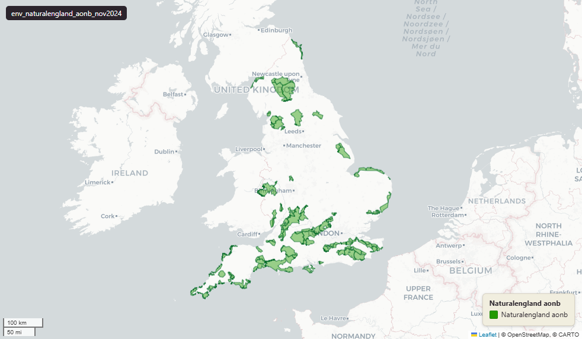

# Natural England Areas of Outstanding Natural Beauty (AONB) for England, November 2024

AONB

`env_naturalengland_aonb_nov2024`

AONBs are now known as National Landscapes (non-statutory rebrand, 2023).

**SOURCE**

- Natural England, via the NE Open Data Hub. Areas of Outstanding Natural Beauty (England) dataset.

**DOCUMENTATION**

- NE Open Data Hub : https://naturalengland-defra.opendata.arcgis.com/
- AONB designation : https://www.gov.uk/guidance/areas-of-outstanding-natural-beauty-aonbs-designation-and-management

**DEFINITIONS**

- "An area of outstanding natural beauty (AONB) is land protected by the Countryside and Rights of Way Act 2000 (CROW Act). It protects the land to conserve and enhance its natural beauty." (gov.uk, AONB designation and management)
- "'National Landscapes' is the rebranded name for areas of outstanding natural beauty (AONBs). This name change is not statutory." (gov.uk, Protected Landscapes Duty guidance)

**SCOPE**

- England. 140 rows (multiple polygon rows per AONB; 33 named AONBs).

**CRS**

- EPSG:27700 (OSGB 1936 / British National Grid). Geometry type MultiPolygon.

**LICENCE**

- Open Government Licence v3.0. © Natural England.

**LOADED INTO uk_baseline**

- Loaded by PNC, May 2026.

MSOA SPLIT (added 3 July 2026)

- Geometry split to one row per (source feature x MSOA 2021). Each row carries that MSOA's msoa21cd / msoa21nm / msoa21hclnm and best-fit lad22 / lad25. The source feature's original primary key is preserved as `source_fid`; `gid` is a fresh surrogate primary key. Features with no MSOA overlap (offshore or outside England & Wales) are kept whole with NULL geography columns.
- Keep-everything (3 July 2026): geometry outside every MSOA — offshore, estuarine, or beyond the generalised coastline — is retained as rows with NULL geography columns (source_fid links the parts), so the layer holds the complete source geometry.

## Columns

| Column | Type | Description / unit |
|---|---|---|
| `source_fid` | `bigint` | Primary key of the source feature in the pre-split layer uk.env_naturalengland_aonb_nov2024__preswap_jul03 (non-unique here: a feature spanning N MSOAs has N rows). |
| `fid_original` | `integer` |  |
| `code` | `character varying` |  |
| `name` | `character varying` |  |
| `desig_date` | `character varying` |  |
| `hotlink` | `character varying` |  |
| `stat_area` | `double precision` |  |
| `globalid` | `character varying` |  |
| `area_ha` | `double precision` |  |
| `rgn22cd` | `text` |  |
| `rgn22nm` | `text` |  |
| `sds_boundary` | `text` |  |
| `layer` | `character(100)` |  |
| `msoa21cd` | `character varying` | Middle Layer Super Output Area (MSOA) 2021 code of this piece. Open Government Licence v3.0. |
| `msoa21nm` | `character varying` | Official ONS MSOA 2021 name of this piece. Open Government Licence v3.0. |
| `msoa21hclnm` | `text` | House of Commons Library readable MSOA name of this piece. Open Parliament Licence. |
| `lad22cd` | `text` | Local Authority District 2022 code (2021 LAD geography, anchored to the MSOA 2021 name scoping), best-fit from this piece's msoa21cd. Open Government Licence v3.0. |
| `lad22nm` | `text` | Local Authority District 2022 name (2021 LAD geography), best-fit from this piece's msoa21cd. Open Government Licence v3.0. |
| `lad25cd` | `text` | Local Authority District 2025 code (current administering authority), best-fit from this piece's msoa21cd. Open Government Licence v3.0. |
| `lad25nm` | `text` | Local Authority District 2025 name (current administering authority), best-fit from this piece's msoa21cd. Open Government Licence v3.0. |
| `geom` | `geometry(MultiPolygon,27700)` |  |
| `gid` | `bigint` |  |
