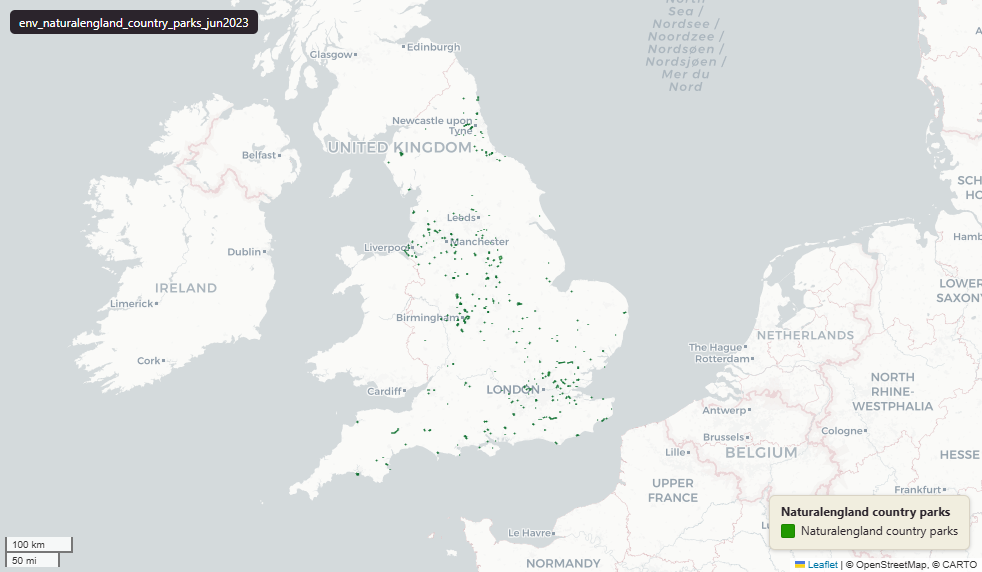

# Natural England Country Parks for England, June 2023

Country Parks

`env_naturalengland_country_parks_jun2023`

**SOURCE**

- Natural England, via the NE Open Data Hub. Country Parks (England) dataset.

**DOCUMENTATION**

- NE Open Data Hub : https://naturalengland-defra.opendata.arcgis.com/

**DEFINITIONS**

- Country parks are "public green spaces often at the edge of urban areas which provide places to enjoy the outdoors and experience nature in an informal semi-rural park setting." (data.gov.uk, Country Parks (England), Natural England)

**SCOPE**

- England. 1,292 rows.

**CRS**

- EPSG:27700 (OSGB 1936 / British National Grid). Geometry type MultiPolygon.

**LICENCE**

- Open Government Licence v3.0. © Natural England.

**ENRICHMENT**

- Geometry split to one row per source feature per MSOA (2021).
- Each row carries that MSOA's `msoa21cd`, `msoa21nm`, `msoa21hclnm`, `lad22cd`, `lad22nm`, `lad25cd`, `lad25nm`.
- The source feature's original primary key is preserved as `source_fid`; `gid` is a fresh surrogate primary key.
- Geometry outside every MSOA (offshore, estuarine, or beyond the coastline) is kept as rows with NULL geography columns, so the layer holds the complete source geometry.

**LOADED INTO uk_baseline**

- Loaded by PNC, May 2026.

## Columns

| Column | Type | Description / unit |
|---|---|---|
| `source_fid` | `bigint` | Primary key of the source feature in the pre-split layer uk.env_naturalengland_country_parks_jun2023__preswap_jul03 (non-unique here: a feature spanning N MSOAs has N rows). |
| `fid_original` | `integer` | Original source feature identifier, preserved at load. |
| `ref_code` | `double precision` | Source field `ref_code`; numeric reference identifier from the source. |
| `theme` | `character varying` | Source field `theme`; dataset theme. |
| `name` | `character varying` | Source field `name`; country park name (e.g. "RIVER LEE", "WOODGATE VALLEY"). |
| `status` | `character varying` | Source field `status`; accreditation status — "Known as a Country Park" or "Accredited". |
| `measure` | `double precision` | Source field `measure`; area as recorded in the source. Unit: hectares. |
| `gridref` | `character varying` | Source field `gridref`; Ordnance Survey National Grid reference of the park (e.g. "TL377036"). |
| `label` | `character varying` | Source field `label`; display label. |
| `hyperlink` | `character varying` | Source field `hyperlink`; source reference / GreenSpace identifier (often blank). |
| `globalid` | `character varying` | Source field `GlobalID`; Esri global identifier of the source feature. |
| `area_ha` | `double precision` | Area of this row's geometry in hectares. |
| `rgn22cd` | `text` | Region 2022 GSS code (nine English regions), assigned via the ONS Region lookup. Open Government Licence v3.0. |
| `rgn22nm` | `text` | Region 2022 name, assigned via the ONS Region lookup. Open Government Licence v3.0. |
| `sds_boundary` | `text` | Spatial Development Strategy (SDS) area the feature falls in. NULL outside any SDS area. |
| `msoa21cd` | `character varying` | Middle Layer Super Output Area (MSOA) 2021 code of this piece. Open Government Licence v3.0. |
| `msoa21nm` | `character varying` | Official ONS MSOA 2021 name of this piece. Open Government Licence v3.0. |
| `msoa21hclnm` | `text` | House of Commons Library readable MSOA name of this piece. Open Parliament Licence. |
| `lad22cd` | `text` | Local Authority District 2022 code (2021 LAD geography, anchored to the MSOA 2021 name scoping), best-fit from this piece's msoa21cd. Open Government Licence v3.0. |
| `lad22nm` | `text` | Local Authority District 2022 name (2021 LAD geography), best-fit from this piece's msoa21cd. Open Government Licence v3.0. |
| `lad25cd` | `text` | Local Authority District 2025 code (current administering authority), best-fit from this piece's msoa21cd. Open Government Licence v3.0. |
| `lad25nm` | `text` | Local Authority District 2025 name (current administering authority), best-fit from this piece's msoa21cd. Open Government Licence v3.0. |
| `geom` | `geometry(MultiPolygon,27700)` | Country park polygon geometry in EPSG:27700 (British National Grid); one part per MSOA (2021) after the split. |
| `gid` | `bigint` | Surrogate primary key, added at the MSOA split (see ENRICHMENT). |
