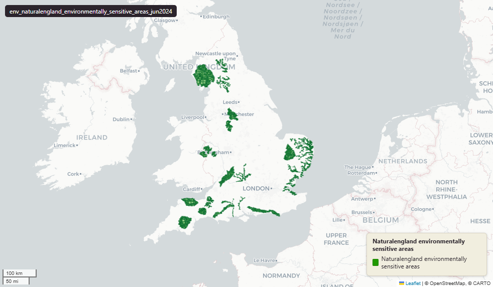

# Natural England Environmentally Sensitive Areas (ESA) for England, June 2024

Environmentally Sensitive Areas

`env_naturalengland_environmentally_sensitive_areas_jun2024`

**SOURCE**

- Natural England, via the NE Open Data Hub. Environmentally Sensitive Areas (England) dataset.

**DOCUMENTATION**

- NE Open Data Hub : https://naturalengland-defra.opendata.arcgis.com/

**DEFINITIONS**

- Environmentally Sensitive Areas (ESAs) are areas of particularly high landscape, wildlife or historic value where, from 1987, farmers were offered incentive payments to adopt agricultural practices that safeguard and enhance them. The scheme is now closed to new applicants. (data.gov.uk, Environmentally Sensitive Areas (England), Natural England)

**SCOPE**

- England. 12,669 rows (multiple polygon rows per ESA).

**CRS**

- EPSG:27700 (OSGB 1936 / British National Grid). Geometry type Polygon.

**LICENCE**

- Open Government Licence v3.0. © Natural England.

**ENRICHMENT**

- Geometry split to one row per source feature per MSOA (2021).
- Each row carries that MSOA's `msoa21cd`, `msoa21nm`, `msoa21hclnm`, `lad22cd`, `lad22nm`, `lad25cd`, `lad25nm`.
- The source feature's original primary key is preserved as `source_fid`; `gid` is a fresh surrogate primary key.
- Geometry outside every MSOA (offshore, estuarine, or beyond the coastline) is kept as rows with NULL geography columns, so the layer holds the complete source geometry.

**LOADED INTO uk_baseline**

- Loaded by PNC, May 2026.

## Columns

| Column | Type | Description / unit |
|---|---|---|
| `source_fid` | `bigint` | Primary key of the source feature in the pre-split layer uk.env_naturalengland_environmentally_sensitive_areas_jun2024__pre (non-unique here: a feature spanning N MSOAs has N rows). |
| `objectid` | `bigint` | Source feature identifier (Esri OBJECTID), repeated across a feature's per-MSOA split rows (matches `fid_original`). Not a domain key — use `gid`. |
| `ref_code` | `character varying` | Source field `ref_code`; ESA short code — e.g. "BR" (Broads), "SR" (Suffolk River Valleys), "LD" (Lake District). |
| `name` | `character varying` | Source field `name`; Environmentally Sensitive Area name (e.g. "BROADS", "LAKE DISTRICT"). |
| `measure` | `double precision` | Source field `measure`; area as recorded in the source. Unit: hectares. |
| `desig_date` | `character varying` | Source field `desig_date`; designation year (e.g. "1987"). |
| `hotlink` | `character varying` | Source field `hotlink`; URL of the (archived) Natural England ESA scheme page. |
| `fid_original` | `integer` | Original source feature identifier, preserved at load (matches `objectid`). |
| `wd21nm` | `character varying` | Electoral Ward 2021 name assigned to the feature. |
| `wd21cd` | `character varying` | Electoral Ward 2021 code assigned to the feature. |
| `fid` | `bigint` | Loader surrogate row identifier. Not a stable key — use `gid`. |
| `area_ha` | `double precision` | Area of this row's geometry in hectares. |
| `msoa21cd` | `character varying` | Middle Layer Super Output Area (MSOA) 2021 code of this piece. Open Government Licence v3.0. |
| `msoa21nm` | `character varying` | Official ONS MSOA 2021 name of this piece. Open Government Licence v3.0. |
| `msoa21hclnm` | `text` | House of Commons Library readable MSOA name of this piece. Open Parliament Licence. |
| `lad22cd` | `text` | Local Authority District 2022 code (2021 LAD geography, anchored to the MSOA 2021 name scoping), best-fit from this piece's msoa21cd. Open Government Licence v3.0. |
| `lad22nm` | `text` | Local Authority District 2022 name (2021 LAD geography), best-fit from this piece's msoa21cd. Open Government Licence v3.0. |
| `lad25cd` | `text` | Local Authority District 2025 code (current administering authority), best-fit from this piece's msoa21cd. Open Government Licence v3.0. |
| `lad25nm` | `text` | Local Authority District 2025 name (current administering authority), best-fit from this piece's msoa21cd. Open Government Licence v3.0. |
| `geom` | `geometry(MultiPolygon,27700)` | Environmentally Sensitive Area polygon geometry in EPSG:27700 (British National Grid); one part per MSOA (2021) after the split. |
| `gid` | `bigint` | Surrogate primary key, added at the MSOA split (see ENRICHMENT). |
