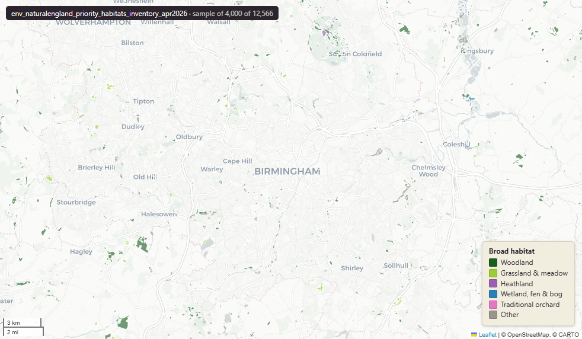

# Natural England Priority Habitats Inventory (England), April 2026

Priority Habitats Inventory

`env_naturalengland_priority_habitats_inventory_apr2026`

**SOURCE**

- Natural England, via the NE Open Data Hub. Priority Habitats Inventory (England) dataset.

**DOCUMENTATION**

- NE Open Data Hub : https://naturalengland-defra.opendata.arcgis.com/
- data.gov.uk PHI  : https://www.data.gov.uk/dataset/4b6ddab7-6c0f-4407-946e-d6499f19fcde/priority-habitats-inventory-england

**DEFINITIONS**

- "The Priority Habitat Inventory is a spatial dataset that maps priority habitats identified in the UK Biodiversity Action Plan" - habitats "listed as being of principal importance for the purpose of conserving or enhancing biodiversity, under Section 41 of the Natural Environment and Rural Communities Act (2006)." (data.gov.uk, Priority Habitats Inventory (England), Natural England)

**SCOPE**

- England. 814,471 rows.

**CRS**

- EPSG:27700 (OSGB 1936 / British National Grid). Geometry type MultiPolygon.

**LICENCE**

- Open Government Licence v3.0. © Natural England.

**LOADED INTO uk_baseline**

- Loaded by PNC, May 2026.

MSOA SPLIT (added 3 July 2026)

- Geometry split to one row per (source feature x MSOA 2021). Each row carries that MSOA's msoa21cd / msoa21nm / msoa21hclnm and best-fit lad22 / lad25. The source feature's original primary key is preserved as `source_fid`; `gid` is a fresh surrogate primary key. Features with no MSOA overlap (offshore or outside England & Wales) are kept whole with NULL geography columns.

## Columns

| Column | Type | Description / unit |
|---|---|---|
| `source_fid` | `bigint` | Primary key of the source feature in the pre-split layer uk.env_naturalengland_priority_habitats_inventory_apr2026__preswap (non-unique here: a feature spanning N MSOAs has N rows). |
| `fid_original` | `integer` |  |
| `mainhabs` | `character varying` |  |
| `habcodes` | `character varying` |  |
| `featdesc` | `character varying` |  |
| `featcodes` | `character varying` |  |
| `otherclass` | `character varying` |  |
| `addhabs` | `character varying` |  |
| `primsource` | `character varying` |  |
| `areaha` | `double precision` |  |
| `version` | `character varying` |  |
| `uid` | `character varying` |  |
| `globalid` | `character varying` |  |
| `area_ha` | `double precision` |  |
| `rgn22cd` | `text` |  |
| `rgn22nm` | `text` |  |
| `sds_boundary` | `text` |  |
| `layer` | `character(100)` |  |
| `msoa21cd` | `character varying` | Middle Layer Super Output Area (MSOA) 2021 code of this piece. Open Government Licence v3.0. |
| `msoa21nm` | `character varying` | Official ONS MSOA 2021 name of this piece. Open Government Licence v3.0. |
| `msoa21hclnm` | `text` | House of Commons Library readable MSOA name of this piece. Open Parliament Licence. |
| `lad22cd` | `text` | Local Authority District 2022 code (2021 LAD geography, anchored to the MSOA 2021 name scoping), best-fit from this piece's msoa21cd. Open Government Licence v3.0. |
| `lad22nm` | `text` | Local Authority District 2022 name (2021 LAD geography), best-fit from this piece's msoa21cd. Open Government Licence v3.0. |
| `lad25cd` | `text` | Local Authority District 2025 code (current administering authority), best-fit from this piece's msoa21cd. Open Government Licence v3.0. |
| `lad25nm` | `text` | Local Authority District 2025 name (current administering authority), best-fit from this piece's msoa21cd. Open Government Licence v3.0. |
| `geom` | `geometry(MultiPolygon,27700)` |  |
| `gid` | `bigint` |  |
