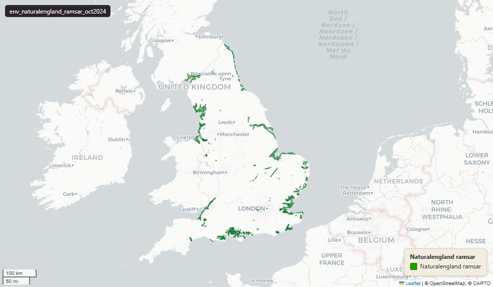

# Natural England Ramsar sites for England, October 2024

Ramsar

`env_naturalengland_ramsar_oct2024`

**SOURCE**

- Natural England, via the NE Open Data Hub (ArcGIS Online platform). Ramsar (England) dataset.

**DOCUMENTATION**

- NE Open Data Hub  : https://naturalengland-defra.opendata.arcgis.com/
- NE Ramsar dataset : https://naturalengland-defra.opendata.arcgis.com/datasets/13b5f06edc88471db479b49b4ac04a43_0/about

**DEFINITIONS**

- "A Ramsar site is the land listed as a Wetland of International Importance under the Convention on Wetlands of International Importance Especially as Waterfowl Habitat (the Ramsar Convention) 1973." (Natural England, Ramsar (England) dataset page)

**SCOPE**

- England. 1,107 rows representing 73 distinct Ramsar sites; geometry is exploded to one polygon part per row.

**CRS**

- EPSG:27700 (OSGB 1936 / British National Grid). Geometry type MultiPolygon.

**LICENCE**

- Open Government Licence v3.0. © Natural England.

**LOADED INTO uk_baseline**

- Loaded by PNC, May 2026.

MSOA SPLIT (added 3 July 2026)

- Geometry split to one row per (source feature x MSOA 2021). Each row carries that MSOA's msoa21cd / msoa21nm / msoa21hclnm and best-fit lad22 / lad25. The source feature's original primary key is preserved as `source_fid`; `gid` is a fresh surrogate primary key. Features with no MSOA overlap (offshore or outside England & Wales) are kept whole with NULL geography columns.
- Coastal note: MSOA coverage stops at the coastline (roughly Mean High Water), so split pieces retain 41.95% of the pre-split area of features that overlap an MSOA; 321 wholly estuarine or offshore sites are kept whole with NULL geography columns. The full pre-split extent is uk.env_naturalengland_ramsar_oct2024__preswap_jul03.

## Columns

| Column | Type | Description / unit |
|---|---|---|
| `source_fid` | `bigint` | Primary key of the source feature in the pre-split layer uk.env_naturalengland_ramsar_oct2024__preswap_jul03 (non-unique here: a feature spanning N MSOAs has N rows). |
| `fid_original` | `integer` |  |
| `name` | `character varying` |  |
| `code` | `character varying` |  |
| `area` | `double precision` |  |
| `grid_ref` | `character varying` |  |
| `easting` | `double precision` |  |
| `northing` | `double precision` |  |
| `latitude` | `character varying` |  |
| `longitude` | `character varying` |  |
| `name0` | `character varying` |  |
| `status` | `character varying` |  |
| `id` | `double precision` |  |
| `file_` | `character varying` |  |
| `area0` | `double precision` |  |
| `easting0` | `double precision` |  |
| `northing0` | `double precision` |  |
| `gis_date` | `character varying` |  |
| `version` | `integer` |  |
| `globalid` | `character varying` |  |
| `area_ha` | `double precision` |  |
| `rgn22cd` | `text` |  |
| `rgn22nm` | `text` |  |
| `sds_boundary` | `text` |  |
| `layer` | `character(100)` |  |
| `msoa21cd` | `character varying` | Middle Layer Super Output Area (MSOA) 2021 code of this piece. Open Government Licence v3.0. |
| `msoa21nm` | `character varying` | Official ONS MSOA 2021 name of this piece. Open Government Licence v3.0. |
| `msoa21hclnm` | `text` | House of Commons Library readable MSOA name of this piece. Open Parliament Licence. |
| `lad22cd` | `text` | Local Authority District 2022 code (2021 LAD geography, anchored to the MSOA 2021 name scoping), best-fit from this piece's msoa21cd. Open Government Licence v3.0. |
| `lad22nm` | `text` | Local Authority District 2022 name (2021 LAD geography), best-fit from this piece's msoa21cd. Open Government Licence v3.0. |
| `lad25cd` | `text` | Local Authority District 2025 code (current administering authority), best-fit from this piece's msoa21cd. Open Government Licence v3.0. |
| `lad25nm` | `text` | Local Authority District 2025 name (current administering authority), best-fit from this piece's msoa21cd. Open Government Licence v3.0. |
| `geom` | `geometry(MultiPolygon,27700)` |  |
| `gid` | `bigint` |  |
