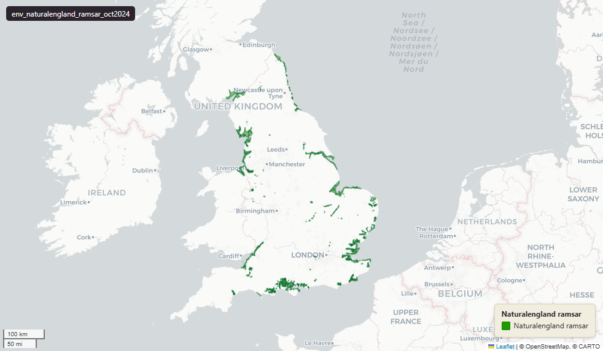

# Natural England Ramsar sites for England, October 2024

Ramsar

`env_naturalengland_ramsar_oct2024`

**SOURCE**

- Natural England, via the NE Open Data Hub (ArcGIS Online platform). Ramsar (England) dataset.

**DOCUMENTATION**

- NE Open Data Hub  : https://naturalengland-defra.opendata.arcgis.com/
- NE Ramsar dataset : https://naturalengland-defra.opendata.arcgis.com/datasets/13b5f06edc88471db479b49b4ac04a43_0/about

**DEFINITIONS**

- "A Ramsar site is the land listed as a Wetland of International Importance under the Convention on Wetlands of International Importance Especially as Waterfowl Habitat (the Ramsar Convention) 1973." (Natural England, Ramsar (England) dataset page)

**SCOPE**

- England. 2,114 rows representing 73 distinct Ramsar sites; geometry is exploded to one polygon part per row.

**CRS**

- EPSG:27700 (OSGB 1936 / British National Grid). Geometry type MultiPolygon.

**LICENCE**

- Open Government Licence v3.0. © Natural England.

**DATA QUALITY CAVEATS**

- Geography keys are NULL on 701 of 2,114 rows, measured 28 July 2026: 637 fall inside an England or Wales district and could carry one, so their keys are a gap rather than an absence; 63 are residual fragments left by the MSOA split, each under 100 sqm or 10 m; 1 are in Scotland or Northern Ireland, outside the England and Wales lookup.
- County and Spatial Development Strategy columns are England and Wales only; rows elsewhere carry no county or SDS. Wales and the Isles of Scilly carry a county but no SDS. Rows with no Local Authority District code are NULL in all four columns.

**ENRICHMENT**

- `sds_name` / `sds_group` — Spatial Development Strategy area and devolution status, a Prior + Partners categorisation over Ministry of Housing, Communities and Local Government (MHCLG) English devolution policy, joined at load on the row's Local Authority District 2025 code via uk.ref_lad25_ctyua25_sds_lu_jul2026.
- Geometry split to one row per source feature per MSOA (2021).
- Each row carries that MSOA's `msoa21cd`, `msoa21nm`, `msoa21hclnm`, `lad22cd`, `lad22nm`, `lad25cd`, `lad25nm`.
- The source feature's original primary key is preserved as `source_fid`; `gid` is a fresh surrogate primary key.
- Geometry outside every MSOA (offshore, estuarine, or beyond the coastline) is kept as rows with NULL geography columns, so the layer holds the complete source geometry.

**LOADED INTO uk_baseline**

- Loaded by PNC, May 2026.

## Columns

| Column | Type | Description / unit |
|---|---|---|
| `source_fid` | `bigint` | Primary key of the source feature in the pre-split layer uk.env_naturalengland_ramsar_oct2024__preswap_jul03 (non-unique here: a feature spanning N MSOAs has N rows). |
| `fid_original` | `integer` | Original source feature identifier, preserved at load. |
| `name` | `character varying` | Source field `name`; Ramsar site name (e.g. "Isles of Scilly"). |
| `code` | `character varying` | Source field `code`; Ramsar site code (e.g. "UK11033"). |
| `area` | `double precision` | Source field `area`; site area as recorded in the source. |
| `grid_ref` | `character varying` | Source field `grid_ref`; Ordnance Survey grid reference of the site. |
| `easting` | `double precision` | Source field `easting`; site centroid easting (British National Grid). |
| `northing` | `double precision` | Source field `northing`; site centroid northing (British National Grid). |
| `latitude` | `character varying` | Source field `latitude`; site centroid latitude. |
| `longitude` | `character varying` | Source field `longitude`; site centroid longitude. |
| `name0` | `character varying` | Source field `name0`; secondary name field (blank in this dataset). |
| `status` | `character varying` | Source field `status`; designation status ("Listed"). |
| `id` | `double precision` | Source field `id`; source numeric identifier. |
| `file_` | `character varying` | Source field `file_`; source file reference. |
| `area0` | `double precision` | Source field `area0`; secondary area field from the source. |
| `easting0` | `double precision` | Source field `easting0`; secondary easting field from the source. |
| `northing0` | `double precision` | Source field `northing0`; secondary northing field from the source. |
| `gis_date` | `character varying` | Source field `gis_date`; GIS boundary date (YYYYMMDD). |
| `version` | `integer` | Source field `version`; source version number. |
| `globalid` | `character varying` | Source field `GlobalID`; Esri global identifier of the source feature. |
| `area_ha` | `double precision` | Area of this row's geometry in hectares. |
| `rgn22cd` | `text` | Region 2022 GSS code (nine English regions), assigned via the ONS Region lookup. Open Government Licence v3.0. |
| `rgn22nm` | `text` | Region 2022 name, assigned via the ONS Region lookup. Open Government Licence v3.0. |
| `layer` | `character(100)` | Source field `layer`; source layer name. |
| `msoa21cd` | `character varying` | Middle Layer Super Output Area (MSOA) 2021 code of this piece. Open Government Licence v3.0. |
| `msoa21nm` | `character varying` | Official ONS MSOA 2021 name of this piece. Open Government Licence v3.0. |
| `msoa21hclnm` | `text` | House of Commons Library readable MSOA name of this piece. Open Parliament Licence. |
| `lad22cd` | `text` | Local Authority District 2022 code (2021 LAD geography, anchored to the MSOA 2021 name scoping), best-fit from this piece's msoa21cd. Open Government Licence v3.0. |
| `lad22nm` | `text` | Local Authority District 2022 name (2021 LAD geography), best-fit from this piece's msoa21cd. Open Government Licence v3.0. |
| `lad25cd` | `text` | Local Authority District 2025 code (current administering authority), best-fit from this piece's msoa21cd. Open Government Licence v3.0. |
| `lad25nm` | `text` | Local Authority District 2025 name (current administering authority), best-fit from this piece's msoa21cd. Open Government Licence v3.0. |
| `geom` | `geometry(MultiPolygon,27700)` | Ramsar site polygon geometry in EPSG:27700 (British National Grid); one part per MSOA (2021) after the split. |
| `gid` | `bigint` | Surrogate primary key, added at the MSOA split (see ENRICHMENT). |
| `ctyua25cd` | `text` | County or unitary authority code at 1 April 2025. Joined at load via uk.ref_lad25_ctyua25_sds_lu_jul2026 on the row's Local Authority District 2025 code. Open Government Licence v3.0. |
| `ctyua25nm` | `text` | County or unitary authority name at 1 April 2025. Joined at load via uk.ref_lad25_ctyua25_sds_lu_jul2026 on the row's Local Authority District 2025 code. Open Government Licence v3.0. |
| `sds_name` | `text` | Spatial Development Strategy (SDS) area, a Prior + Partners categorisation over Ministry of Housing, Communities and Local Government (MHCLG) English devolution policy. Joined at load via uk.ref_lad25_ctyua25_sds_lu_jul2026 on the row's Local Authority District 2025 code. Open Government Licence v3.0. |
| `sds_group` | `text` | Devolution status of the Spatial Development Strategy area: Existing Devolution Footprints, Devolution Priority Programme, Other Proposed Geographies or Remaining Areas. Joined at load via uk.ref_lad25_ctyua25_sds_lu_jul2026 on the row's Local Authority District 2025 code. Open Government Licence v3.0. |
