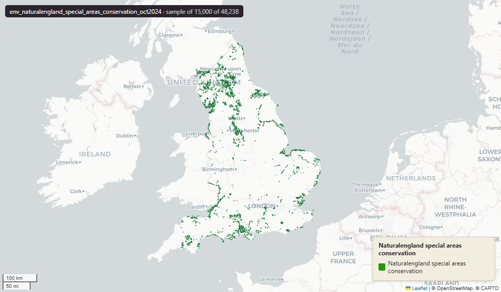

# Natural England Special Areas of Conservation (SAC) for England, October 2024

Special Areas Conservation

`env_naturalengland_special_areas_conservation_oct2024`

**SOURCE**

- Natural England, via the NE Open Data Hub (ArcGIS Online platform). Special Areas of Conservation (England) dataset. Designation authority: Joint Nature Conservation Committee (JNCC).

**DOCUMENTATION**

- NE Open Data Hub  : https://naturalengland-defra.opendata.arcgis.com/
- JNCC SAC overview : https://jncc.gov.uk/our-work/special-areas-of-conservation-overview/

**DEFINITIONS**

- "Special Areas of Conservation (SACs) are protected areas in the UK designated under" the Habitats Directive - the UK is "required to establish a network of important high-quality conservation sites that will make a significant contribution to conserving the habitats and species identified in Annexes I and II, respectively, of European Council Directive 92/43/EEC on the conservation of natural habitats and of wild fauna and flora, known as the Habitats Directive." (JNCC, Special Areas of Conservation overview)

**SCOPE**

- England. 48,238 rows representing 252 distinct SAC sites; geometry is exploded to one polygon part per row.

**CRS**

- EPSG:27700 (OSGB 1936 / British National Grid). Geometry type Polygon.

**LICENCE**

- Open Government Licence v3.0. © Natural England.

**DATA QUALITY CAVEATS**

- Marine and intertidal extent restored 3 July 2026: wholly-marine sites and offshore remainders are held as rows with NULL geography columns; the layer holds the complete source extent.
- Keep-everything (3 July 2026): geometry outside every MSOA — offshore, estuarine, or beyond the generalised coastline — is retained as rows with NULL geography columns (source_fid links the parts), so the layer holds the complete source geometry.

**LOADED INTO uk_baseline**

- Loaded by PNC, May 2026.

MSOA SPLIT (added 30 June 2026)

- Geometry split to one row per (source feature x MSOA 2021). Each row carries that MSOA's msoa21cd / msoa21nm / msoa21hclnm and best-fit lad22 / lad25. The source feature's original primary key is preserved as `source_fid`; `gid` is a fresh surrogate primary key.

## Columns

| Column | Type | Description / unit |
|---|---|---|
| `objectid` | `bigint` |  |
| `sac_name` | `character varying` |  |
| `sac_code` | `character varying` |  |
| `sac_area` | `double precision` |  |
| `grid_ref` | `character varying` |  |
| `easting` | `double precision` |  |
| `northing` | `double precision` |  |
| `latitude` | `character varying` |  |
| `longitude` | `character varying` |  |
| `name` | `character varying` |  |
| `status` | `character varying` |  |
| `id` | `bigint` |  |
| `file_` | `character varying` |  |
| `area` | `double precision` |  |
| `easting0` | `double precision` |  |
| `northing0` | `double precision` |  |
| `gis_date` | `character varying` |  |
| `version` | `bigint` |  |
| `globalid` | `character varying` |  |
| `fid_original` | `integer` |  |
| `wd21nm` | `character varying` |  |
| `wd21cd` | `character varying` |  |
| `fid` | `bigint` |  |
| `area_ha` | `double precision` |  |
| `msoa21cd` | `character varying` | Middle Layer Super Output Area (MSOA) 2021 code of this piece. Open Government Licence v3.0. |
| `msoa21nm` | `character varying` | Official ONS MSOA 2021 name of this piece. Open Government Licence v3.0. |
| `msoa21hclnm` | `text` | House of Commons Library readable MSOA name of this piece. Open Parliament Licence. |
| `lad22cd` | `text` | Local Authority District 2022 code (2021 LAD geography, anchored to the MSOA 2021 name scoping), best-fit from this piece's msoa21cd. Open Government Licence v3.0. |
| `lad22nm` | `text` | Local Authority District 2022 name (2021 LAD geography), best-fit from this piece's msoa21cd. Open Government Licence v3.0. |
| `lad25cd` | `text` | Local Authority District 2025 code (current administering authority), best-fit from this piece's msoa21cd. Open Government Licence v3.0. |
| `lad25nm` | `text` | Local Authority District 2025 name (current administering authority), best-fit from this piece's msoa21cd. Open Government Licence v3.0. |
| `geom` | `geometry(MultiPolygon,27700)` |  |
| `source_fid` | `bigint` | Primary key of the source feature in the pre-split layer uk.env_naturalengland_special_areas_conservation_oct2024__preswap_jun30 (non-unique here: a feature spanning N MSOAs has N rows). |
| `gid` | `bigint` |  |
