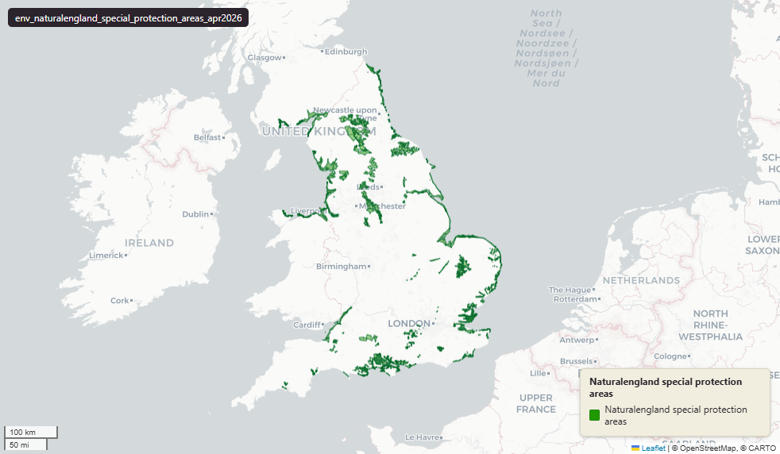

# Natural England Special Protection Areas (SPA) for England, April 2026

Special Protection Areas

`env_naturalengland_special_protection_areas_apr2026`

**SOURCE**

- Natural England, via the NE Open Data Hub (ArcGIS Online platform). Special Protection Areas (England) dataset. Designation authority: Joint Nature Conservation Committee (JNCC).

**DOCUMENTATION**

- NE Open Data Hub  : https://naturalengland-defra.opendata.arcgis.com/
- JNCC SPA overview : https://jncc.gov.uk/our-work/special-protection-areas-overview/

**DEFINITIONS**

- "Special Protection Areas (SPAs) are protected areas for birds in the UK classified under" the relevant regulations, for species "listed in Annex I of the Birds Directive (79/409/EEC as amended)." (JNCC, Special Protection Areas overview)

**SCOPE**

- England. 2,718 rows representing 88 distinct SPA sites; geometry is exploded to one polygon part per row.

**CRS**

- EPSG:27700 (OSGB 1936 / British National Grid). Geometry type MultiPolygon.

**LICENCE**

- Open Government Licence v3.0. © Natural England.

**ENRICHMENT**

- Geometry split to one row per source feature per MSOA (2021).
- Each row carries that MSOA's `msoa21cd`, `msoa21nm`, `msoa21hclnm`, `lad22cd`, `lad22nm`, `lad25cd`, `lad25nm`.
- The source feature's original primary key is preserved as `source_fid`; `gid` is a fresh surrogate primary key.
- Geometry outside every MSOA (offshore, estuarine, or beyond the coastline) is kept as rows with NULL geography columns, so the layer holds the complete source geometry.

**LOADED INTO uk_baseline**

- Loaded by PNC, May 2026.

## Columns

| Column | Type | Description / unit |
|---|---|---|
| `source_fid` | `bigint` | Primary key of the source feature in the pre-split layer uk.env_naturalengland_special_protection_areas_apr2026__preswap_ju (non-unique here: a feature spanning N MSOAs has N rows). |
| `fid_original` | `integer` | Original source feature identifier, preserved at load. |
| `spa_name` | `character varying` | Source field `spa_name`; Special Protection Area name. |
| `spa_code` | `character varying` | Source field `spa_code`; SPA code (e.g. "UK9010101"). |
| `spa_area` | `double precision` | Source field `spa_area`; SPA area as recorded in the source. |
| `grid_ref` | `character varying` | Source field `grid_ref`; Ordnance Survey grid reference of the site. |
| `easting` | `double precision` | Source field `easting`; site centroid easting (British National Grid). |
| `northing` | `double precision` | Source field `northing`; site centroid northing (British National Grid). |
| `latitude` | `character varying` | Source field `latitude`; site centroid latitude. |
| `longitude` | `character varying` | Source field `longitude`; site centroid longitude. |
| `name` | `character varying` | Source field `name`; secondary name field (blank in this dataset). |
| `status` | `character varying` | Source field `status`; designation status ("Classified"). |
| `id` | `double precision` | Source field `id`; source numeric identifier. |
| `file_` | `character varying` | Source field `file_`; source file reference. |
| `area` | `double precision` | Source field `area`; secondary area field from the source. |
| `easting0` | `double precision` | Source field `easting0`; secondary easting field from the source. |
| `northing0` | `double precision` | Source field `northing0`; secondary northing field from the source. |
| `gis_date` | `character varying` | Source field `gis_date`; GIS boundary date (YYYYMMDD). |
| `version` | `integer` | Source field `version`; source version number. |
| `globalid` | `character varying` | Source field `GlobalID`; Esri global identifier of the source feature. |
| `area_ha` | `double precision` | Area of this row's geometry in hectares. |
| `rgn22cd` | `text` | Region 2022 GSS code (nine English regions), assigned via the ONS Region lookup. Open Government Licence v3.0. |
| `rgn22nm` | `text` | Region 2022 name, assigned via the ONS Region lookup. Open Government Licence v3.0. |
| `sds_boundary` | `text` | Spatial Development Strategy (SDS) area the feature falls in. NULL outside any SDS area. |
| `msoa21cd` | `character varying` | Middle Layer Super Output Area (MSOA) 2021 code of this piece. Open Government Licence v3.0. |
| `msoa21nm` | `character varying` | Official ONS MSOA 2021 name of this piece. Open Government Licence v3.0. |
| `msoa21hclnm` | `text` | House of Commons Library readable MSOA name of this piece. Open Parliament Licence. |
| `lad22cd` | `text` | Local Authority District 2022 code (2021 LAD geography, anchored to the MSOA 2021 name scoping), best-fit from this piece's msoa21cd. Open Government Licence v3.0. |
| `lad22nm` | `text` | Local Authority District 2022 name (2021 LAD geography), best-fit from this piece's msoa21cd. Open Government Licence v3.0. |
| `lad25cd` | `text` | Local Authority District 2025 code (current administering authority), best-fit from this piece's msoa21cd. Open Government Licence v3.0. |
| `lad25nm` | `text` | Local Authority District 2025 name (current administering authority), best-fit from this piece's msoa21cd. Open Government Licence v3.0. |
| `geom` | `geometry(MultiPolygon,27700)` | Special Protection Area polygon geometry in EPSG:27700 (British National Grid); one part per MSOA (2021) after the split. |
| `gid` | `bigint` | Surrogate primary key, added at the MSOA split (see ENRICHMENT). |
