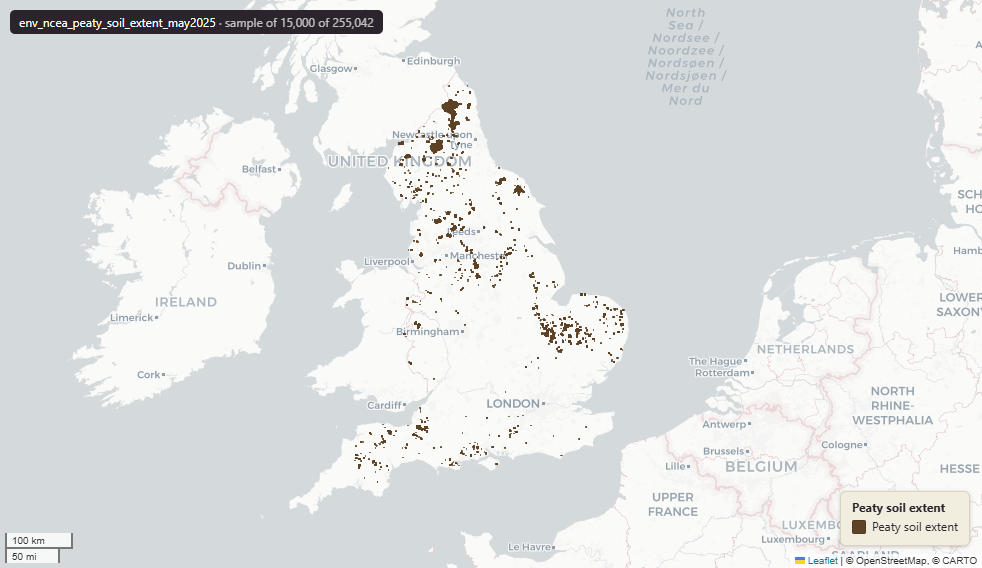

# Natural England's England Peat Map — modelled extent of peaty soil in England, May 2025

England Peat Map - Peaty Soil Extent

`env_ncea_peaty_soil_extent_may2025`

**SOURCE**

- Natural England. Produced under the England Peat Map project, funded by the Department for Environment, Food and Rural Affairs (Defra) Natural Capital and Ecosystem Assessment (NCEA) programme and the Nature for Climate Fund.

**DOCUMENTATION**

- Dataset record : https://environment.data.gov.uk/dataset/ab92bc06-bd99-47c4-89a3-b93aa9c0db4d
- Project report : England Peat Map (NERR149), https://publications.naturalengland.org.uk/publication/5075614867128320

**DEFINITIONS**

- "Peaty soil is defined as soil with an organic content of 20% or more. This layer maps the extent of this, as modelled by the England Peat Map project, where the probability of occurrence is above 50%." (Natural England)

**SCOPE**

- England. 254,732 rows (after the MSOA split; see ENRICHMENT).

**CRS**

- EPSG:27700 (British National Grid).

**LICENCE**

- Open Government Licence v3.0.

**DATA QUALITY CAVEATS**

- Modelled, not surveyed. The extent is predicted by machine-learning and deep-learning models trained on Natural England and third-party field-survey data, using satellite imagery, LiDAR topography, geology and historic land use as predictors. Natural England report an overall accuracy above 95% for peaty-soil extent, but present the map as a national decision-making aid, not a regulatory tool — site-level decisions need local evidence and first-hand verification.
- Presence-only extent. Polygons cover only where the modelled probability of peaty soil is above 50%; the absence of a polygon is not evidence that no peat is present.

**ENRICHMENT**

- Geometry split to one row per source feature per MSOA (2021).
- Each row carries that MSOA's `msoa21cd`, `msoa21nm`, `msoa21hclnm`, `lad22cd`, `lad22nm`, `lad25cd`, `lad25nm`.
- The source feature's original primary key is preserved as `source_fid`; `gid` is a fresh surrogate primary key.
- Features with no MSOA overlap (offshore or outside England & Wales) are kept whole, with NULL geography columns.

**NOT IN THIS DATASET**

- The England Peat Map also publishes separate peat depth, peatland vegetation and land cover, and upland peat erosion and drainage layers; only the peaty-soil extent is held here.

## Columns

| Column | Type | Description / unit |
|---|---|---|
| `source_fid` | `integer` | Primary key of the source feature in the pre-split layer uk.env_ncea_peaty_soil_extent_may2025__preswap_jul03 (non-unique here: a feature spanning N MSOAs has N rows). |
| `component_` | `double precision` | Source field `component_`; soil component identifier from the source. |
| `dn` | `double precision` | Source field `dn`; raster class value (DN, digital number) carried through the raster-to-vector conversion. |
| `msoa21cd` | `character varying` | Middle Layer Super Output Area (MSOA) 2021 code of this piece. Open Government Licence v3.0. |
| `msoa21nm` | `character varying` | Official ONS MSOA 2021 name of this piece. Open Government Licence v3.0. |
| `msoa21hclnm` | `text` | House of Commons Library readable MSOA name of this piece. Open Parliament Licence. |
| `lad22cd` | `text` | Local Authority District 2022 code (2021 LAD geography, anchored to the MSOA 2021 name scoping), best-fit from this piece's msoa21cd. Open Government Licence v3.0. |
| `lad22nm` | `text` | Local Authority District 2022 name (2021 LAD geography), best-fit from this piece's msoa21cd. Open Government Licence v3.0. |
| `lad25cd` | `text` | Local Authority District 2025 code (current administering authority), best-fit from this piece's msoa21cd. Open Government Licence v3.0. |
| `lad25nm` | `text` | Local Authority District 2025 name (current administering authority), best-fit from this piece's msoa21cd. Open Government Licence v3.0. |
| `geom` | `geometry(MultiPolygon,27700)` | Peaty soil extent polygon geometry in EPSG:27700 (British National Grid); one part per MSOA (2021) after the split. |
| `gid` | `bigint` | Surrogate primary key, added at the MSOA split (see ENRICHMENT). |
