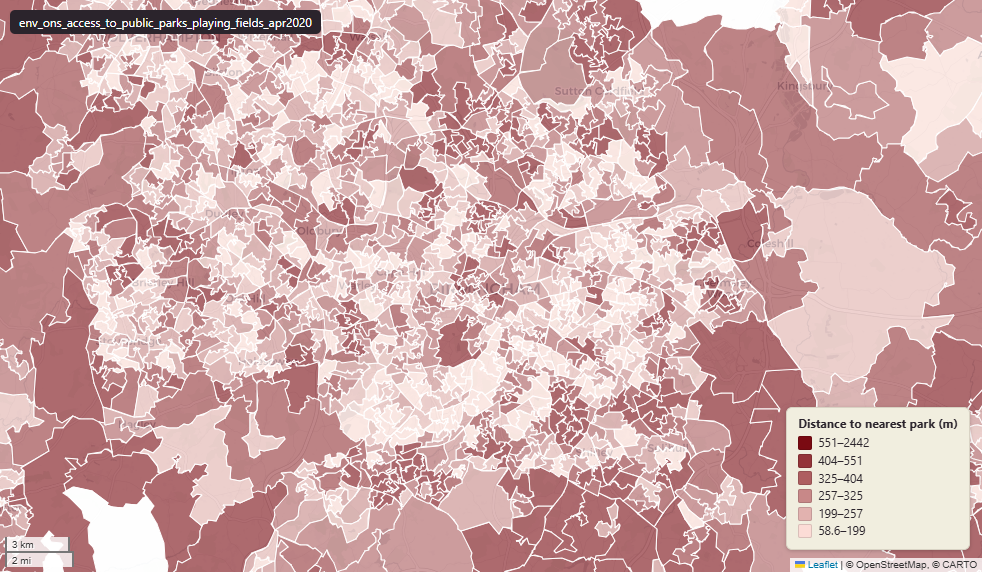

# ONS Access to public parks and playing fields, Great Britain, April 2020

Access to public parks and playing fields

`env_ons_access_to_public_parks_playing_fields_apr2020`

**SOURCE**

- Office for National Statistics (ONS). "Access to public parks and playing fields, Great Britain, April 2020", part of the dataset "Access to gardens and public green space in Great Britain". Values are the LSOA-level figures from the reference workbook (file ospublicgreenspacereferencetables.xlsx, sheet "LSOA Parks and Playing Fields"). Underlying source: Ordnance Survey greenspace data.

**DOCUMENTATION**

- ONS dataset page : https://www.ons.gov.uk/economy/environmentalaccounts/datasets/accesstogardensandpublicgreenspaceingreatbritain

**DEFINITIONS**

- "Analysis of Ordnance Survey (OS) data on access to private gardens, public parks and playing fields in Great Britain, available by country, region, Local Authority and Middle Layer Super Output Area." (ONS, Access to gardens and public green space in Great Britain)

**SCOPE**

- Great Britain (LSOA level). 34,753 rows. Carries both LSOA 2011 and LSOA 2021 codes.

**CRS**

- EPSG:27700 (OSGB 1936 / British National Grid). Geometry type MultiPolygon.

**LICENCE**

- Open Government Licence v3.0.

**DATA QUALITY CAVEATS**

- Published on 2011 LSOA boundaries. Each row's msoa21cd, msoa21nm, msoa21hclnm and lad22/lad25 codes are best-fit onto 2021 geography — the 2021 MSOA the row's 2011 LSOA overlaps most by area (uk.ref_lsoa11_msoa21_bestfit_lu). LSOAs that straddle a 2011-to-2021 boundary change are assigned to their largest-overlap MSOA, so for those a small share of the LSOA area lies outside the assigned MSOA.
- ONS states its source "cannot distinguish public and private playing fields so some of these areas may not be publicly accessible." (ONS, Access to gardens and public green space in Great Britain)

**ENRICHMENT**

- `msoa21hclnm` — House of Commons Library readable MSOA name, best-fit assigned at load from the row's 2011 LSOA by largest-area-overlap 2021 MSOA (uk.ref_lsoa11_msoa21_bestfit_lu). Open Parliament Licence.

**LOADED INTO uk_baseline**

- Loaded by PNC, May 2026.

## Columns

| Column | Type | Description / unit |
|---|---|---|
| `fid` | `integer` | Loader surrogate row identifier. |
| `geom` | `geometry(MultiPolygon,27700)` | MultiPolygon in EPSG:27700. LSOA boundary geometry. |
| `lsoa11cd` | `character varying(9)` | Source field "LSOA code"; ONS GSS 9-character LSOA 2011 code. |
| `lsoa11nm` | `character varying(33)` | Source field "LSOA name"; LSOA 2011 name. |
| `lsoa21cd` | `character varying` | Joined at load from ONS LSOA 2011->2021 lookup; 2021 LSOA GSS code. |
| `lsoa21nm` | `character varying` | Joined at load from ONS LSOA 2011->2021 lookup; 2021 LSOA name. |
| `lad22cd` | `character varying` | Local Authority District 2022 code (2021 LAD geography, anchored to the MSOA 2021 name scoping), best-fit assigned from this row's Lower Layer Super Output Area (LSOA) 2011 by largest area overlap with the 2021 MSOA boundaries, joined at load on lsoa11cd via uk.ref_lsoa11_msoa21_bestfit_lu, then that MSOA's 2022 district. Open Government Licence v3.0. |
| `lad22nm` | `character varying` | Local Authority District 2022 name (2021 LAD geography), best-fit assigned from this row's Lower Layer Super Output Area (LSOA) 2011 by largest area overlap with the 2021 MSOA boundaries, joined at load on lsoa11cd via uk.ref_lsoa11_msoa21_bestfit_lu, then that MSOA's 2022 district. Open Government Licence v3.0. |
| `rgn22cd` | `character varying` | Joined at load from ONS LAD->Region lookup; 2022 Region GSS code. |
| `rgn22nm` | `character varying` | Joined at load from ONS LAD->Region lookup; 2022 Region name. |
| `average_distance_to_nearest_park_public_garden_or_playing_field` | `double precision` | Source field; average distance to the nearest park, public garden or playing field. Unit: metres. |
| `average_size_of_nearest_park_public_garden_or_playing_field` | `double precision` | Source field; average size of the nearest park, public garden or playing field. |
| `average_number_of_parks_public_gardens_or_playing_fields_1km` | `double precision` | Source field; average number of parks, public gardens or playing fields within 1 km. |
| `average_combined_size_of_parks_public_gardens_or_playing_fields` | `double precision` | Source field; average combined size of parks, public gardens or playing fields. |
| `msoa21cd` | `text` | Middle Layer Super Output Area (MSOA) 2021 code, best-fit assigned from this row's Lower Layer Super Output Area (LSOA) 2011 by largest area overlap with the 2021 MSOA boundaries, joined at load on lsoa11cd via uk.ref_lsoa11_msoa21_bestfit_lu. Open Government Licence v3.0. |
| `msoa21nm` | `text` | Official Office for National Statistics MSOA 2021 name, best-fit assigned from this row's Lower Layer Super Output Area (LSOA) 2011 by largest area overlap with the 2021 MSOA boundaries, joined at load on lsoa11cd via uk.ref_lsoa11_msoa21_bestfit_lu. Open Government Licence v3.0. |
| `msoa21hclnm` | `text` | House of Commons Library readable MSOA name, best-fit assigned from this row's Lower Layer Super Output Area (LSOA) 2011 by largest area overlap with the 2021 MSOA boundaries, joined at load on lsoa11cd via uk.ref_lsoa11_msoa21_bestfit_lu. Open Parliament Licence. |
| `lad25cd` | `text` | Local Authority District 2025 code (current administering authority), best-fit assigned from this row's Lower Layer Super Output Area (LSOA) 2011 by largest area overlap with the 2021 MSOA boundaries, joined at load on lsoa11cd via uk.ref_lsoa11_msoa21_bestfit_lu, then that MSOA's 2025 district. Open Government Licence v3.0. |
| `lad25nm` | `text` | Local Authority District 2025 name (current administering authority), best-fit assigned from this row's Lower Layer Super Output Area (LSOA) 2011 by largest area overlap with the 2021 MSOA boundaries, joined at load on lsoa11cd via uk.ref_lsoa11_msoa21_bestfit_lu, then that MSOA's 2025 district. Open Government Licence v3.0. |
