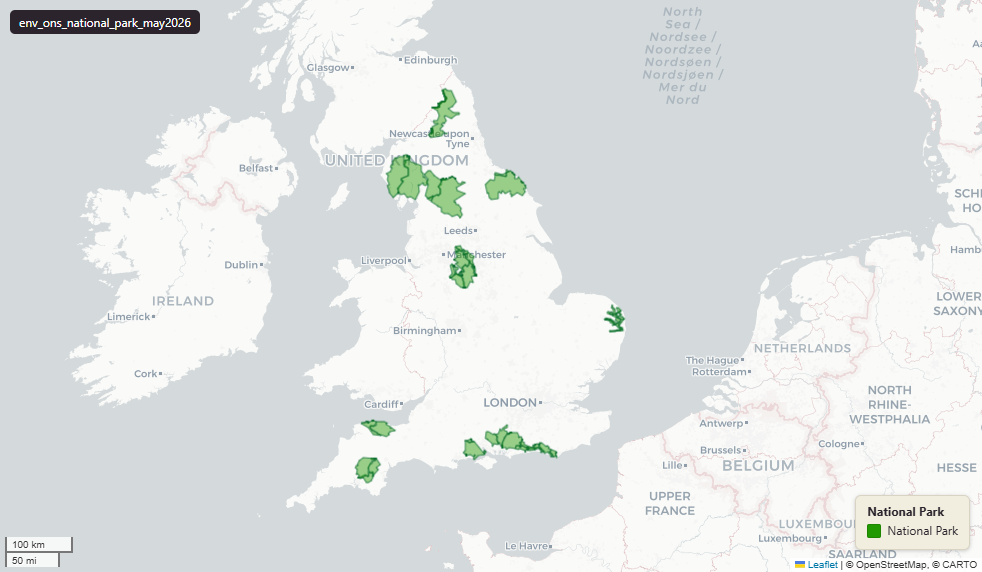

# ONS National Parks (England), May 2026

`env_ons_national_park_may2026`

<a href="http://localhost:7800/?layer=uk_baseline.env_ons_national_park_may2026" target="_blank" rel="noopener">Open in the Dashboard &#8599;</a> (start your local Dashboard first)

Published via planning.data.gov.uk (digital-land).

**SOURCE**

- Office for National Statistics (ONS); distributed via planning.data.gov.uk (digital-land).

**DOCUMENTATION**

- planning.data.gov.uk national-park : https://www.planning.data.gov.uk/dataset/national-park

**DEFINITIONS**

- "The administrative boundaries of national park authorities in England as provided by the ONS for the purposes of producing statistics." (planning.data.gov.uk, national-park dataset Summary)

**SCOPE**

- England. 56 rows.

**CRS**

- EPSG:27700 (OSGB 1936 / British National Grid). Geometry type MultiPolygon.

**LICENCE**

- Open Government Licence v3.0.

**LOADED INTO uk_baseline**

- Loaded by PNC, May 2026.

## Columns

| Column | Type | Description / unit |
|---|---|---|
| `fid_original` | `integer` | Original feature id preserved at load. |
| `dataset` | `character varying` | Source field "dataset"; digital-land dataset slug. Observed value: "national-park". |
| `end_date` | `character varying` | Source field "end-date"; entity end date (blank where current). |
| `entity` | `character varying` | Source field "entity"; digital-land national entity identifier. |
| `entry_date` | `date` | Source field "entry-date"; date the record entered the digital-land collection. |
| `name` | `character varying` | Source field "name"; national park name (e.g. "Dartmoor", "Exmoor"). |
| `organisation_entity` | `character varying` | Source field "organisation-entity"; digital-land entity id of the publishing organisation. |
| `prefix` | `character varying` | Source field "prefix"; digital-land dataset prefix. |
| `quality` | `character varying` | Source field "quality"; digital-land data-quality field. |
| `reference` | `character varying` | Source field "reference"; the publishing organisation's own reference. |
| `start_date` | `character varying` | Source field "start-date"; entity start date. |
| `typology` | `character varying` | Source field "typology"; digital-land typology. Observed value: "geography". |
| `lad25cd` | `character varying` | Joined at load from ONS LAD 2025 lookup; 2025 LAD GSS code. |
| `lad25nm` | `character varying` | Joined at load from ONS LAD 2025 lookup; 2025 LAD name. |
| `geom` | `geometry(MultiPolygon,27700)` | MultiPolygon in EPSG:27700. National park authority boundary geometry. |
| `area_ha` | `double precision` | Area in hectares, computed at load from the geometry. Stale if the geometry is later edited. |
| `fid` | `bigint` |  |
| `rgn22cd` | `text` | Joined at load from ONS LAD->Region lookup; 2022 Region GSS code. |
| `rgn22nm` | `text` | Joined at load from ONS LAD->Region lookup; 2022 Region name. |
| `sds_boundary` | `text` | Internal categorisation: Spatial Development Strategy (SDS) area where the feature falls. Blank or NULL where outside any SDS area. |
