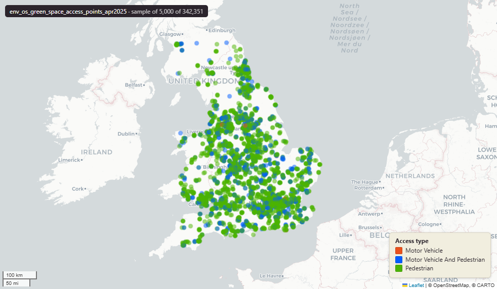

# Ordnance Survey OS Open Greenspace — Access Points for Great Britain, April 2025

Open Greenspace access points

`env_os_green_space_access_points_apr2025`

**SOURCE**

- Ordnance Survey (OS), OS Open Greenspace product (Access Points layer).

**DOCUMENTATION**

- OS Open Greenspace : https://www.ordnancesurvey.co.uk/products/os-open-greenspace

**DEFINITIONS**

- "access points for entering and exiting urban and rural green spaces." (OS Open Greenspace product page)

**SCOPE**

- Great Britain. 342,351 rows.

**CRS**

- EPSG:27700 (OSGB 1936 / British National Grid). Geometry type Point.

**LICENCE**

- OS OpenData Licence (incorporates Open Government Licence v3.0; attribution "Contains OS data © Crown copyright and database right" required).

**LOADED INTO uk_baseline**

- Loaded by PNC, May 2026.

## Columns

| Column | Type | Description / unit |
|---|---|---|
| `id` | `character varying` | Source field "id"; OS source feature identifier. |
| `accesstype` | `character varying` | Source field "accesstype"; access type. Observed values: "Pedestrian", "Motor Vehicle And Pedestrian", "Motor Vehicle". |
| `reftogsite` | `character varying` | Source field "reftogsite"; reference to the parent greenspace site id. |
| `fid_original` | `integer` | Original feature id preserved at load. |
| `lad22nm` | `character varying` | Local Authority District 2022 name (2021 LAD geography). Assigned at load by point-in-polygon location against uk_baseline.adm_ons_lad_boundary_may2022. Open Government Licence v3.0. |
| `lad22cd` | `character varying` | Local Authority District 2022 code (2021 LAD geography, anchored to the MSOA 2021 name scoping). Assigned at load by point-in-polygon location against uk_baseline.adm_ons_lad_boundary_may2022. Open Government Licence v3.0. |
| `wd21nm` | `character varying` | Joined at load from ONS Ward 2021 lookup; 2021 Ward name. |
| `wd21cd` | `character varying` | Joined at load from ONS Ward 2021 lookup; 2021 Ward GSS code. |
| `geom` | `geometry(Point,27700)` | Point in EPSG:27700. Greenspace access point. |
| `fid` | `bigint` | Loader surrogate row identifier. |
| `msoa21cd` | `text` | Middle Layer Super Output Area (MSOA) 2021 code. Assigned at load by point-in-polygon location against uk_baseline.adm_ons_msoa_boundary_2021. Open Government Licence v3.0. |
| `msoa21nm` | `text` | Official ONS Middle Layer Super Output Area 2021 name. Assigned at load via the point's 2021 MSOA (point-in-polygon against uk_baseline.adm_ons_msoa_boundary_2021). Open Government Licence v3.0. |
| `msoa21hclnm` | `text` | House of Commons Library readable MSOA name. Assigned at load via the point's 2021 MSOA (point-in-polygon against uk_baseline.adm_ons_msoa_boundary_2021, which carries the House of Commons Library name). Open Parliament Licence. |
| `lad25cd` | `text` | Local Authority District 2025 code (current administering authority). Assigned at load by point-in-polygon location against uk_baseline.adm_ons_lad_boundary_may2025. Open Government Licence v3.0. |
| `lad25nm` | `text` | Local Authority District 2025 name (current administering authority). Assigned at load by point-in-polygon location against uk_baseline.adm_ons_lad_boundary_may2025. Open Government Licence v3.0. |
