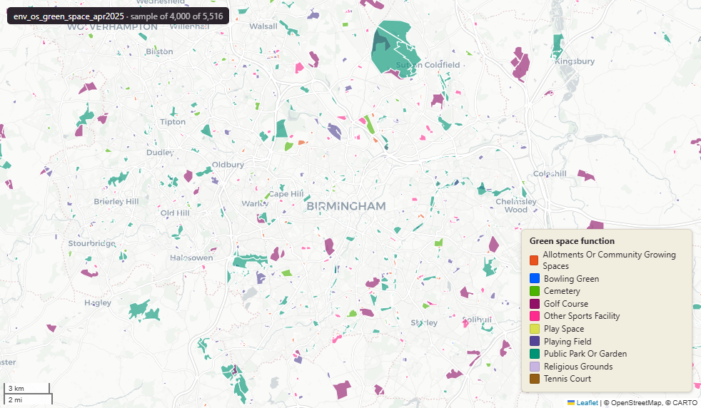

# Ordnance Survey OS Open Greenspace for Great Britain, April 2025

`env_os_green_space_apr2025`

**SOURCE**

- Ordnance Survey (OS), OS Open Greenspace product.

**DOCUMENTATION**

- OS Open Greenspace : https://www.ordnancesurvey.co.uk/products/os-open-greenspace

**DEFINITIONS**

- "Information about publicly accessible urban green spaces across Great Britain. It includes parks, sports facilities and other recreational areas." (OS Open Greenspace product page)

**SCOPE**

- Great Britain. 196,619 rows.

**CRS**

- EPSG:27700 (OSGB 1936 / British National Grid). Geometry type MultiPolygon.

**LICENCE**

- OS OpenData Licence (incorporates Open Government Licence v3.0; attribution "Contains OS data © Crown copyright and database right" required).

**ENRICHMENT**

- Geometry split to one row per source feature per MSOA (2021).
- Each row carries that MSOA's `msoa21cd`, `msoa21nm`, `msoa21hclnm`, `lad22cd`, `lad22nm`, `lad25cd`, `lad25nm`.
- The source feature's original primary key is preserved as `source_fid`; `gid` is a fresh surrogate primary key.
- Features with no MSOA overlap (offshore or outside England & Wales) are kept whole, with NULL geography columns.

**LOADED INTO uk_baseline**

- Loaded by PNC, May 2026.

## Columns

| Column | Type | Description / unit |
|---|---|---|
| `source_fid` | `bigint` | Primary key of the source feature in the pre-split layer uk.env_os_green_space_apr2025__preswap_jul03 (non-unique here: a feature spanning N MSOAs has N rows). |
| `id` | `character varying` | Source field `id`; OS feature identifier (TOID). |
| `function` | `character varying` | Source field `function`; OS Open Greenspace function (site type). |
| `distname1` | `character varying` | Source field `distname1`; distinctive name 1 (site name; "None" where unnamed). |
| `distname2` | `character varying` | Source field `distname2`; distinctive name 2 (secondary name; "None" where none). |
| `distname3` | `character varying` | Source field `distname3`; distinctive name 3 (rarely populated). |
| `distname4` | `character varying` | Source field `distname4`; distinctive name 4 (rarely populated). |
| `fid_original` | `bigint` | Original source feature identifier, preserved at load. |
| `rgn22cd` | `character varying` | Region 2022 GSS code (nine English regions), assigned via the ONS Region lookup. Open Government Licence v3.0. |
| `rgn22nm` | `character varying` | Region 2022 name, assigned via the ONS Region lookup. Open Government Licence v3.0. |
| `sds_boundary` | `character varying` | Spatial Development Strategy (SDS) area the feature falls in. NULL outside any SDS area. |
| `area_ha` | `double precision` | Area of this row's geometry in hectares. |
| `msoa21cd` | `character varying` | Middle Layer Super Output Area (MSOA) 2021 code of this piece. Open Government Licence v3.0. |
| `msoa21nm` | `character varying` | Official ONS MSOA 2021 name of this piece. Open Government Licence v3.0. |
| `msoa21hclnm` | `text` | House of Commons Library readable MSOA name of this piece. Open Parliament Licence. |
| `lad22cd` | `text` | Local Authority District 2022 code (2021 LAD geography, anchored to the MSOA 2021 name scoping), best-fit from this piece's msoa21cd. Open Government Licence v3.0. |
| `lad22nm` | `text` | Local Authority District 2022 name (2021 LAD geography), best-fit from this piece's msoa21cd. Open Government Licence v3.0. |
| `lad25cd` | `text` | Local Authority District 2025 code (current administering authority), best-fit from this piece's msoa21cd. Open Government Licence v3.0. |
| `lad25nm` | `text` | Local Authority District 2025 name (current administering authority), best-fit from this piece's msoa21cd. Open Government Licence v3.0. |
| `geom` | `geometry(MultiPolygon,27700)` | OS Open Greenspace polygon geometry in EPSG:27700 (British National Grid); one part per MSOA (2021) after the split. |
| `gid` | `bigint` | Surrogate primary key, added at the MSOA split (see ENRICHMENT). |
