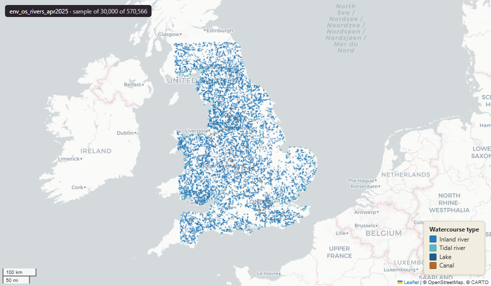

# Ordnance Survey OS Open Rivers — watercourse network for Great Britain, April 2025

Open Rivers

`env_os_rivers_apr2025`

**SOURCE**

- Ordnance Survey (OS), OS Open Rivers product.

**DOCUMENTATION**

- OS Open Rivers : https://www.ordnancesurvey.co.uk/products/os-open-rivers

**DEFINITIONS**

- "An open dataset of the high-level view of watercourses in Great Britain." (OS Open Rivers product page)

**SCOPE**

- Great Britain. 570,566 rows.

**CRS**

- EPSG:27700 (OSGB 1936 / British National Grid). Geometry type LineString.

**LICENCE**

- OS OpenData Licence (incorporates Open Government Licence v3.0; attribution "Contains OS data © Crown copyright and database right" required).

**ENRICHMENT**

- Geometry split to one row per source feature per MSOA (2021).
- Each row carries that MSOA's `msoa21cd`, `msoa21nm`, `msoa21hclnm`, `lad22cd`, `lad22nm`, `lad25cd`, `lad25nm`.
- The source feature's original primary key is preserved as `source_fid`; `gid` is a fresh surrogate primary key.
- Features with no MSOA overlap (offshore or outside England & Wales) are kept whole, with NULL geography columns.

**LOADED INTO uk_baseline**

- Loaded by PNC, May 2026.

## Columns

| Column | Type | Description / unit |
|---|---|---|
| `source_fid` | `bigint` | Primary key of the source feature in the pre-split layer uk.env_os_rivers_apr2025__preswap_jul04 (non-unique here: a feature spanning N MSOAs has N rows). |
| `name1` | `character varying` | Source field `name1`; watercourse name (e.g. "River Avon"; "None" where unnamed). |
| `identifier` | `character varying` | Source field `identifier`; OS feature identifier (TOID). |
| `startnode` | `character varying` | Source field `startnode`; identifier of the start node of the reach. |
| `endnode` | `character varying` | Source field `endnode`; identifier of the end node of the reach. |
| `form` | `character varying` | Source field `form`; watercourse form (e.g. inland river, tidal river, canal). |
| `flow` | `character varying` | Source field `flow`; direction of flow along the reach. |
| `fictitious` | `character varying` | Source field `fictitious`; flag for fictitious (non-physical) links that complete the network. |
| `length` | `bigint` | Source field `length`; reach length as recorded in the source. Unit: metres. |
| `name2` | `character varying` | Source field `name2`; alternative / Welsh name (e.g. "Afon Hafren"; "None" where none). |
| `fid_original` | `integer` | Original source feature identifier, preserved at load. |
| `wd21nm` | `character varying` | Electoral Ward 2021 name assigned to the feature. |
| `wd21cd` | `character varying` | Electoral Ward 2021 code assigned to the feature. |
| `length_m` | `double precision` | Length of this row's line geometry in metres. |
| `msoa21cd` | `character varying` | Middle Layer Super Output Area (MSOA) 2021 code of this piece. Open Government Licence v3.0. |
| `msoa21nm` | `character varying` | Official ONS MSOA 2021 name of this piece. Open Government Licence v3.0. |
| `msoa21hclnm` | `text` | House of Commons Library readable MSOA name of this piece. Open Parliament Licence. |
| `lad22cd` | `text` | Local Authority District 2022 code (2021 LAD geography, anchored to the MSOA 2021 name scoping), best-fit from this piece's msoa21cd. Open Government Licence v3.0. |
| `lad22nm` | `text` | Local Authority District 2022 name (2021 LAD geography), best-fit from this piece's msoa21cd. Open Government Licence v3.0. |
| `lad25cd` | `text` | Local Authority District 2025 code (current administering authority), best-fit from this piece's msoa21cd. Open Government Licence v3.0. |
| `lad25nm` | `text` | Local Authority District 2025 name (current administering authority), best-fit from this piece's msoa21cd. Open Government Licence v3.0. |
| `geom` | `geometry(MultiLineString,27700)` | OS Open Rivers watercourse line geometry in EPSG:27700 (British National Grid); one part per MSOA (2021) after the split. |
| `gid` | `bigint` | Surrogate primary key, added at the MSOA split (see ENRICHMENT). |
