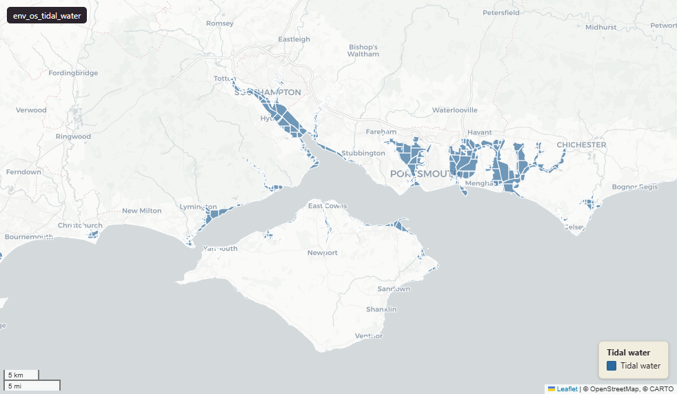

# Ordnance Survey OS OpenMap Local — Tidal Water for Great Britain

Tidal Water

`env_os_tidal_water`

**SOURCE**

- Ordnance Survey (OS), OS OpenMap Local product.

**DOCUMENTATION**

- OS OpenMap Local      : https://www.ordnancesurvey.co.uk/products/os-open-map-local
- TidalWater feature spec : https://docs.os.uk/os-downloads/products/maps-and-imagery-portfolio/os-openmap-local/os-openmap-local-technical-specification/feature-types/tidalwater

**DEFINITIONS**

- "Polygons defining the extents of tidal water, up to the High Water Mark defined by the TidalBoundaries and the Normal Tidal Limit of rivers. Tidal water is not included under bridges." (OS OpenMap Local Technical Specification, TidalWater)

**SCOPE**

- Great Britain. 71,457 rows.

**CRS**

- EPSG:27700 (OSGB 1936 / British National Grid). Geometry type Polygon.

**LICENCE**

- OS OpenData Licence (incorporates Open Government Licence v3.0; attribution "Contains OS data © Crown copyright and database right" required).

**ENRICHMENT**

- Geometry split to one row per source feature per MSOA (2021).
- Each row carries that MSOA's `msoa21cd`, `msoa21nm`, `msoa21hclnm`, `lad22cd`, `lad22nm`, `lad25cd`, `lad25nm`.
- The source feature's original primary key is preserved as `source_fid`; `gid` is a fresh surrogate primary key.
- Geometry outside every MSOA (offshore, estuarine, or beyond the coastline) is kept as rows with NULL geography columns, so the layer holds the complete source geometry.

**LOADED INTO uk_baseline**

- Loaded by PNC, May 2026.

## Columns

| Column | Type | Description / unit |
|---|---|---|
| `source_fid` | `bigint` | Primary key of the source feature in the pre-split layer uk.env_os_tidal_water__preswap_jul03 (non-unique here: a feature spanning N MSOAs has N rows). |
| `id` | `character varying` | Source field `id`; OS feature identifier (TOID). |
| `feature_code` | `bigint` | Source field `feature_code`; OS OpenMap Local feature code (15608 = tidal water). |
| `fid_original` | `integer` | Original source feature identifier, preserved at load. |
| `wd21nm` | `character varying` | Electoral Ward 2021 name assigned to the feature. |
| `wd21cd` | `character varying` | Electoral Ward 2021 code assigned to the feature. |
| `area_ha` | `double precision` | Area of this row's geometry in hectares. |
| `fid` | `bigint` | Loader surrogate row identifier. Not a stable key — use `gid`. |
| `msoa21cd` | `character varying` | Middle Layer Super Output Area (MSOA) 2021 code of this piece. Open Government Licence v3.0. |
| `msoa21nm` | `character varying` | Official ONS MSOA 2021 name of this piece. Open Government Licence v3.0. |
| `msoa21hclnm` | `text` | House of Commons Library readable MSOA name of this piece. Open Parliament Licence. |
| `lad22cd` | `text` | Local Authority District 2022 code (2021 LAD geography, anchored to the MSOA 2021 name scoping), best-fit from this piece's msoa21cd. Open Government Licence v3.0. |
| `lad22nm` | `text` | Local Authority District 2022 name (2021 LAD geography), best-fit from this piece's msoa21cd. Open Government Licence v3.0. |
| `lad25cd` | `text` | Local Authority District 2025 code (current administering authority), best-fit from this piece's msoa21cd. Open Government Licence v3.0. |
| `lad25nm` | `text` | Local Authority District 2025 name (current administering authority), best-fit from this piece's msoa21cd. Open Government Licence v3.0. |
| `geom` | `geometry(MultiPolygon,27700)` | OS tidal water polygon geometry in EPSG:27700 (British National Grid); one part per MSOA (2021) after the split. |
| `gid` | `bigint` | Surrogate primary key, added at the MSOA split (see ENRICHMENT). |
