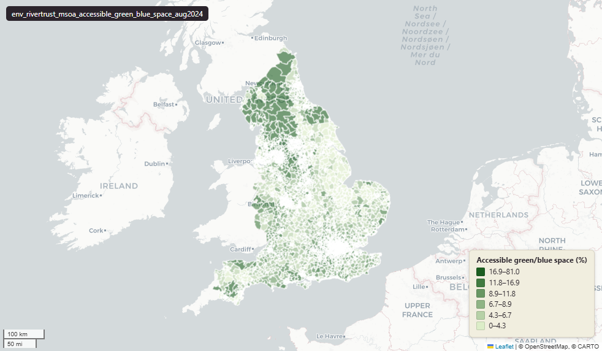

# The Rivers Trust — accessible green and blue space per 1,000 population at Middle-layer Super Output Area (MSOA), August 2024

Accessible Green Blue Space

`env_rivertrust_msoa_accessible_green_blue_space_aug2024`

**SOURCE**

- The Rivers Trust, produced with Natural England, the Department for Environment, Food and Rural Affairs (Defra), and the University of Manchester. Distributed via the Catchment Based Approach (CaBA) Data Hub.

**DOCUMENTATION**

- CaBA Data Hub : https://data.catchmentbasedapproach.org/datasets/theriverstrust::area-of-accessible-green-and-blue-space-per-1000-population-england/about

**SCOPE**

- England. 6,791 rows (MSOA level).

**CRS**

- EPSG:27700 (OSGB 1936 / British National Grid). Geometry type MultiPolygon.

**LICENCE**

- Open Government Licence v3.0 (confirm with The Rivers Trust before re-publication).

**DATA QUALITY CAVEATS**

- This table is published on 2011 MSOA boundaries and its values are 2011-vintage; `msoa21hclnm` is a readable label for the corresponding 2021 MSOA and does not re-aggregate any value onto 2021 geography. For MSOAs unchanged in 2021 the name is exact. For the small number of 2011 MSOAs that were split, the column lists every successor name separated by a semicolon, so those rows carry more than one name and cannot be joined to a single msoa21cd. No 2021 geography codes are recorded on this table.

**ENRICHMENT**

- `msoa21hclnm` — House of Commons Library readable MSOA name for the 2021 MSOA corresponding to this row's 2011 MSOA, joined at load via uk.ref_msoa11_msoa21_name_lu. Open Parliament Licence.

**LOADED INTO uk_baseline**

- Loaded by PNC, May 2026.

## Columns

| Column | Type | Description / unit |
|---|---|---|
| `msoa_km2` | `double precision` | Source field "msoa_km2"; MSOA area in square kilometres. |
| `msoa_code` | `character varying` | Source field "msoa_code"; MSOA code. |
| `msoa_name` | `character varying` | Source field "msoa_name"; MSOA name. |
| `msoa_ha` | `double precision` | Source field "msoa_ha"; MSOA area in hectares. |
| `areaname` | `character varying` | Source field "areaname"; area label. |
| `la_code20` | `character varying` | Source field "la_code20"; Local Authority code (2020). |
| `la_name20` | `character varying` | Source field "la_name20"; Local Authority name (2020). |
| `reg_code` | `character varying` | Source field "reg_code"; region code. |
| `reg_name` | `character varying` | Source field "reg_name"; region name. |
| `all_ages` | `bigint` | Source field "all_ages"; all-ages population (denominator). |
| `gb_sp_ha` | `double precision` | Source field "gb_sp_ha"; accessible green and blue space. Unit: hectares. |
| `gb_sp_perc` | `double precision` | Source field "gb_sp_perc"; accessible green and blue space as a percentage of the MSOA area. |
| `gb_sp_1000` | `double precision` | Source field "gb_sp_1000"; accessible green and blue space per 1,000 population. Unit: hectares per 1,000 people. |
| `noprowdata` | `character varying` | Source field "noprowdata"; flag for MSOAs where Public Rights of Way data was unavailable for the calculation. |
| `geom` | `geometry(MultiPolygon,27700)` | MultiPolygon in EPSG:27700. MSOA boundary geometry. |
| `wd22cd` | `character varying` | Joined at load from ONS Ward 2022 lookup; 2022 Ward GSS code. |
| `wd22nm` | `character varying` | Joined at load from ONS Ward 2022 lookup; 2022 Ward name. |
| `lad22cd` | `character varying` | Joined at load from ONS LAD 2022 lookup; 2022 LAD GSS code. |
| `lad22nm` | `character varying` | Joined at load from ONS LAD 2022 lookup; 2022 LAD name. |
| `fid` | `bigint` | Loader surrogate row identifier. |
| `msoa21hclnm` | `text` | House of Commons Library readable MSOA name for the 2021 MSOA corresponding to this row's 2011 MSOA, joined at load on the 2011 code via uk.ref_msoa11_msoa21_name_lu. Where the MSOA is unchanged in 2021 (the great majority) the name is exact. Where a 2011 MSOA was split into several 2021 MSOAs this records all successor names, separated by a semicolon. Where a 2011 MSOA was merged into a larger 2021 MSOA, or its code was reissued, it records that single successor name. Open Parliament Licence. |
