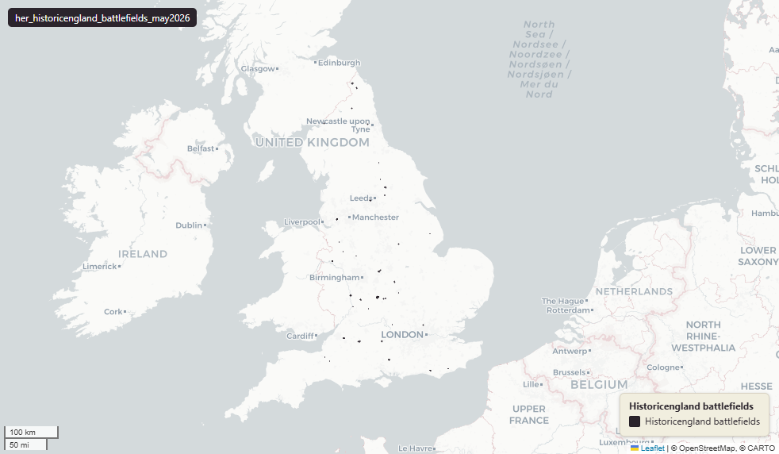

# Historic England Register of Historic Battlefields (England), May 2026

`her_historicengland_battlefields_may2026`

<a href="http://localhost:7800/?layer=uk_baseline.her_historicengland_battlefields_may2026" target="_blank" rel="noopener">Open in the Dashboard &#8599;</a> (start your local Dashboard first)

**SOURCE**

- Historic England, National Heritage List for England (NHLE), Battlefields dataset.

**DOCUMENTATION**

- NHLE              : https://historicengland.org.uk/listing/the-list/
- HE data downloads : https://historicengland.org.uk/listing/the-list/data-downloads/
- Registered Battlefields : https://historicengland.org.uk/listing/what-is-designation/registered-battlefields/

**DEFINITIONS**

- "Registered battlefields are sites where significant battles took place. They include sites with archaeological remains as well as those where the events are well documented but no physical traces survive." (Historic England, Registered Battlefields)
- The National Heritage List for England (NHLE) is the official, up-to-date register of all nationally protected historic buildings and sites in England. (Historic England)

**SCOPE**

- England. 97 rows.

**CRS**

- EPSG:27700 (OSGB 1936 / British National Grid). Geometry type MultiPolygon.

**LICENCE**

- Open Government Licence v3.0. © Historic England.

**LOADED INTO uk_baseline**

- Loaded by PNC, May 2026.

## Columns

| Column | Type | Description / unit |
|---|---|---|
| `fid_original` | `integer` | ArcGIS source identifier preserved at load; not stable across Historic England re-publications. |
| `listentry` | `integer` | Source field "ListEntry"; National Heritage List for England (NHLE) List Entry Number — the canonical national identifier for the heritage asset. |
| `name` | `character varying` | Source field "Name"; heritage asset name as published on the NHLE. |
| `regdate` | `timestamp with time zone` | Source field "RegDate"; date the battlefield was registered. |
| `amenddate` | `timestamp with time zone` | Source field "AmendDate"; date of the most recent amendment to the listing. |
| `capturescale` | `character varying` | Source field "CaptureScale"; cartographic scale at which the geometry was captured (e.g. "1:1250"). |
| `hyperlink` | `character varying` | Source field "Hyperlink"; URL of the listing page on the Historic England website. |
| `ngr` | `character varying` | Source field "NGR"; alphanumeric National Grid Reference (e.g. "SP 12345 67890"). |
| `easting` | `double precision` | Source field "Easting"; British National Grid easting. Unit: metres (EPSG:27700). |
| `northing` | `double precision` | Source field "Northing"; British National Grid northing. Unit: metres (EPSG:27700). |
| `wd25cd` | `character varying` | Joined at load from ONS Ward 2025 lookup; 2025 Ward GSS code. |
| `wd25nm` | `character varying` | Joined at load from ONS Ward 2025 lookup; 2025 Ward name. |
| `lad25cd` | `character varying` | Joined at load from ONS LAD 2025 lookup; 2025 LAD GSS code. |
| `lad25nm` | `character varying` | Joined at load from ONS LAD 2025 lookup; 2025 LAD name. |
| `geom` | `geometry(MultiPolygon,27700)` | MultiPolygon in EPSG:27700. Registered battlefield boundary. |
| `area_ha` | `double precision` | Area in hectares, computed at load from the geometry. Stale if the geometry is later edited. |
| `fid` | `bigint` |  |
| `rgn22cd` | `text` | Joined at load from ONS LAD->Region lookup; 2022 Region GSS code. |
| `rgn22nm` | `text` | Joined at load from ONS LAD->Region lookup; 2022 Region name. |
| `sds_boundary` | `text` | Internal categorisation: Spatial Development Strategy (SDS) area where the geometry falls. Blank or NULL where outside any SDS area. |
