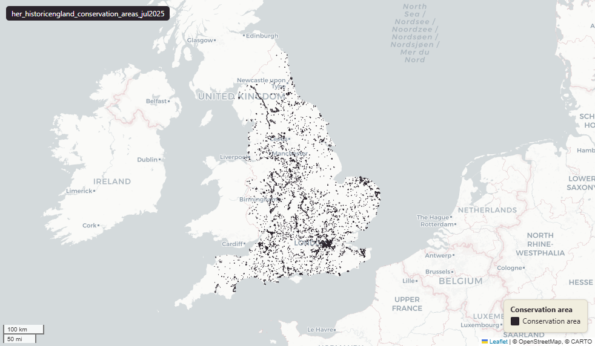

# Historic England Conservation Areas (England), July 2025

Conservation Areas

`her_historicengland_conservation_areas_jul2025`

**SOURCE**

- Historic England (compiler). Conservation areas are designated by Local Planning Authorities (LPAs) under the Planning (Listed Buildings and Conservation Areas) Act 1990.

**DOCUMENTATION**

- HE data downloads  : https://historicengland.org.uk/listing/the-list/data-downloads/
- Conservation Areas : https://historicengland.org.uk/advice/your-home/owning-historic-property/conservation-area/

**DEFINITIONS**

- Conservation areas protect the special architectural and historic interest of a place — the features that make it unique and distinctive. (Historic England, Conservation Areas)

**SCOPE**

- England. 14,017 rows.

**CRS**

- EPSG:27700 (OSGB 1936 / British National Grid). Geometry type MultiPolygon.

**LICENCE**

- Open Government Licence v3.0. © Historic England.

**DATA QUALITY CAVEATS**

- Compiled from Local Planning Authority sources; completeness and boundary precision vary by LPA.

**LOADED INTO uk_baseline**

- Loaded by PNC, May 2026.

MSOA SPLIT (added 3 July 2026)

- Geometry split to one row per (source feature x MSOA 2021). Each row carries that MSOA's msoa21cd / msoa21nm / msoa21hclnm and best-fit lad22 / lad25. The source feature's original primary key is preserved as `source_fid`; `gid` is a fresh surrogate primary key. Features with no MSOA overlap (offshore or outside England & Wales) are kept whole with NULL geography columns.

## Columns

| Column | Type | Description / unit |
|---|---|---|
| `source_fid` | `bigint` | Primary key of the source feature in the pre-split layer uk.her_historicengland_conservation_areas_jul2025__preswap_jul03 (non-unique here: a feature spanning N MSOAs has N rows). |
| `fid_original` | `integer` |  |
| `uid` | `double precision` |  |
| `name` | `character varying` |  |
| `date_of_de` | `character varying` |  |
| `date_updat` | `character varying` |  |
| `lpa` | `character varying` |  |
| `capture_sc` | `character varying` |  |
| `x` | `integer` |  |
| `y` | `integer` |  |
| `wd25cd` | `character varying` |  |
| `wd25nm` | `character varying` |  |
| `area_ha` | `double precision` |  |
| `rgn22cd` | `text` |  |
| `rgn22nm` | `text` |  |
| `sds_boundary` | `text` |  |
| `msoa21cd` | `character varying` | Middle Layer Super Output Area (MSOA) 2021 code of this piece. Open Government Licence v3.0. |
| `msoa21nm` | `character varying` | Official ONS MSOA 2021 name of this piece. Open Government Licence v3.0. |
| `msoa21hclnm` | `text` | House of Commons Library readable MSOA name of this piece. Open Parliament Licence. |
| `lad22cd` | `text` | Local Authority District 2022 code (2021 LAD geography, anchored to the MSOA 2021 name scoping), best-fit from this piece's msoa21cd. Open Government Licence v3.0. |
| `lad22nm` | `text` | Local Authority District 2022 name (2021 LAD geography), best-fit from this piece's msoa21cd. Open Government Licence v3.0. |
| `lad25cd` | `text` | Local Authority District 2025 code (current administering authority), best-fit from this piece's msoa21cd. Open Government Licence v3.0. |
| `lad25nm` | `text` | Local Authority District 2025 name (current administering authority), best-fit from this piece's msoa21cd. Open Government Licence v3.0. |
| `geom` | `geometry(MultiPolygon,27700)` |  |
| `gid` | `bigint` |  |
