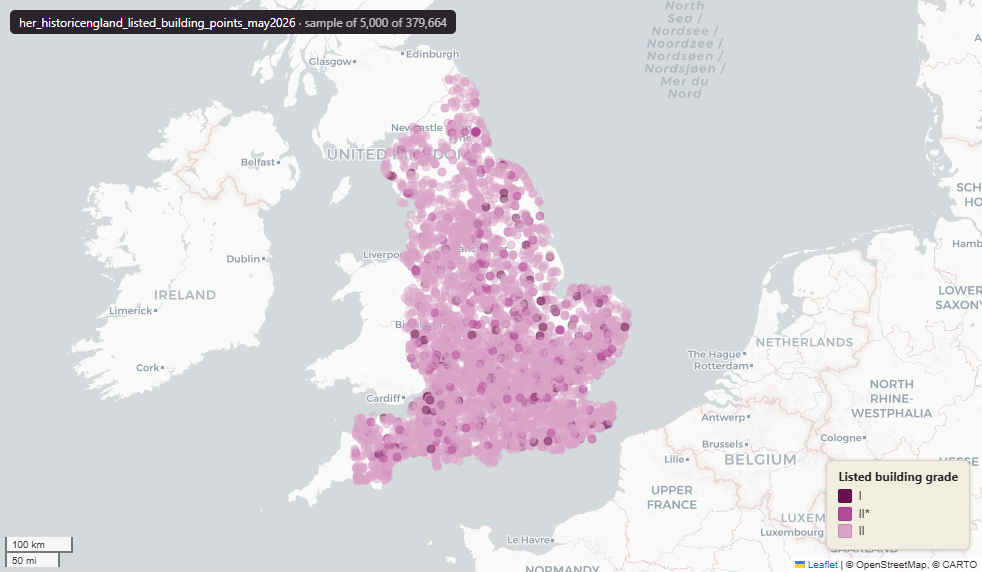

# Historic England Listed Buildings (England) — point geometry, May 2026

Listed Building Points

`her_historicengland_listed_building_points_may2026`

**SOURCE**

- Historic England, National Heritage List for England (NHLE), Listed Buildings dataset (point geometry).

**DOCUMENTATION**

- NHLE              : https://historicengland.org.uk/listing/the-list/
- HE data downloads : https://historicengland.org.uk/listing/the-list/data-downloads/
- Listed Buildings : https://historicengland.org.uk/listing/what-is-designation/listed-buildings/

**DEFINITIONS**

- "Listed buildings are buildings of special architectural or historic interest with legal protection." (Historic England, Listed Buildings)
- Listing grades: Grade I — buildings of exceptional interest; Grade II* — particularly important buildings of more than special interest; Grade II — buildings of special interest. (Historic England, Listed Buildings)

**SCOPE**

- England. 379,664 rows.

**CRS**

- EPSG:27700 (OSGB 1936 / British National Grid). Geometry type MultiPoint.

**LICENCE**

- Open Government Licence v3.0. © Historic England.

**DATA QUALITY CAVEATS**

- 417 coastal and offshore listed structures (0.11% of the layer) lie outside every MSOA polygon and so carry NULL msoa21cd, msoa21nm and msoa21hclnm.

**ENRICHMENT**

- `msoa21hclnm` — House of Commons Library readable MSOA name, assigned at load from the listed-building point in its 2021 MSOA (uk_baseline.adm_ons_msoa_boundary_2021). Open Parliament Licence.

**LOADED INTO uk_baseline**

- Loaded by PNC, May 2026.

## Columns

| Column | Type | Description / unit |
|---|---|---|
| `fid_original` | `integer` | ArcGIS source identifier preserved at load; not stable across Historic England re-publications. |
| `listentry` | `integer` | Source field "ListEntry"; National Heritage List for England (NHLE) List Entry Number — the canonical national identifier for the heritage asset. |
| `name` | `character varying` | Source field "Name"; heritage asset name as published on the NHLE. |
| `grade` | `character varying` | Source field "Grade"; statutory listing grade. Observed values: "I", "II*", "II". |
| `listdate` | `timestamp with time zone` | Source field "ListDate"; date first listed. |
| `amenddate` | `timestamp with time zone` | Source field "AmendDate"; date of the most recent amendment to the listing. |
| `capturescale` | `character varying` | Source field "CaptureScale"; cartographic scale at which the geometry was captured (e.g. "1:1250"). |
| `hyperlink` | `character varying` | Source field "Hyperlink"; URL of the listing page on the Historic England website. |
| `ngr` | `character varying` | Source field "NGR"; alphanumeric National Grid Reference (e.g. "SP 12345 67890"). |
| `easting` | `double precision` | Source field "Easting"; British National Grid easting. Unit: metres (EPSG:27700). |
| `northing` | `double precision` | Source field "Northing"; British National Grid northing. Unit: metres (EPSG:27700). |
| `wd25cd` | `character varying` | Joined at load from ONS Ward 2025 lookup; 2025 Ward GSS code. |
| `wd25nm` | `character varying` | Joined at load from ONS Ward 2025 lookup; 2025 Ward name. |
| `lad25cd` | `character varying` | Joined at load from ONS LAD 2025 lookup; 2025 LAD GSS code. |
| `lad25nm` | `character varying` | Joined at load from ONS LAD 2025 lookup; 2025 LAD name. |
| `geom` | `geometry(MultiPoint,27700)` | MultiPoint in EPSG:27700. Listed building point. |
| `fid` | `bigint` |  |
| `rgn22cd` | `text` | Joined at load from ONS LAD->Region lookup; 2022 Region GSS code. |
| `rgn22nm` | `text` | Joined at load from ONS LAD->Region lookup; 2022 Region name. |
| `sds_boundary` | `text` | Internal categorisation: Spatial Development Strategy (SDS) area where the geometry falls. Blank or NULL where outside any SDS area. |
| `msoa21cd` | `text` | Middle Layer Super Output Area (MSOA) 2021 code. Assigned at load from the listed-building point (representative point of the MULTIPOINT geometry) located in uk_baseline.adm_ons_msoa_boundary_2021. Open Government Licence v3.0. |
| `msoa21nm` | `text` | Official Office for National Statistics MSOA 2021 name. Assigned at load from the listed-building point located in uk_baseline.adm_ons_msoa_boundary_2021. Open Government Licence v3.0. |
| `msoa21hclnm` | `text` | House of Commons Library readable MSOA name. Assigned at load from the listed-building point located in its 2021 MSOA (uk_baseline.adm_ons_msoa_boundary_2021, which carries the House of Commons Library name). Open Parliament Licence. |
| `lad22cd` | `text` | Local Authority District 2022 code (2021 LAD geography). Assigned at load from the listed-building point located in uk_baseline.adm_ons_lad_boundary_may2022. Open Government Licence v3.0. |
| `lad22nm` | `text` | Local Authority District 2022 name (2021 LAD geography). Assigned at load from the listed-building point located in uk_baseline.adm_ons_lad_boundary_may2022. Open Government Licence v3.0. |
