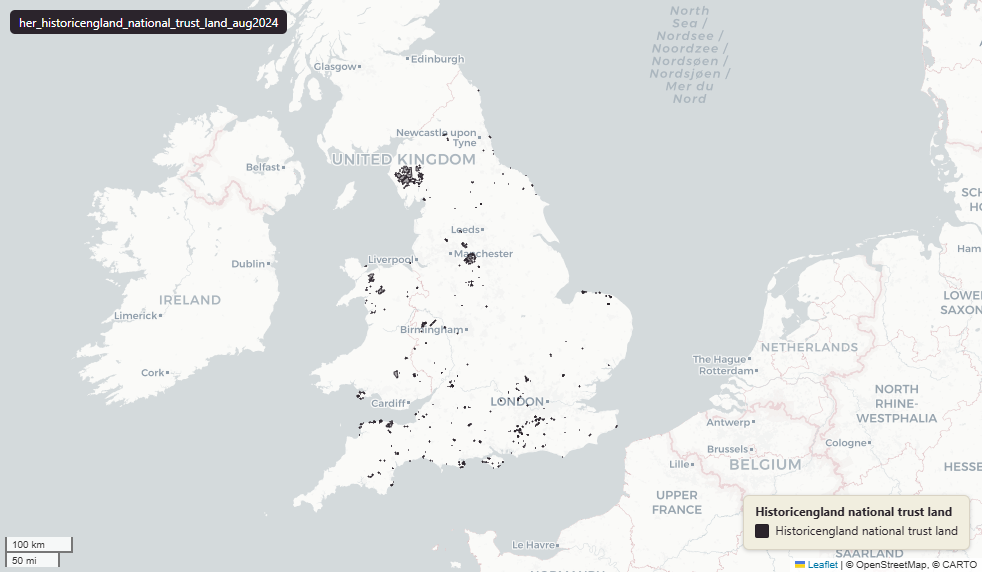

# National Trust Land (England & Wales), August 2024

National Trust Land

`her_historicengland_national_trust_land_aug2024`

One row per National Trust land parcel.

**SOURCE**

- The National Trust. National Trust open data — land.

**DOCUMENTATION**

- National Trust : https://www.nationaltrust.org.uk/

**SCOPE**

- 2,785 rows.

**CRS**

- EPSG:27700 (OSGB 1936 / British National Grid). Geometry type MultiPolygon.

**LICENCE**

- Open Government Licence v3.0 (confirm with the National Trust before re-publication).

**LOADED INTO uk_baseline**

- Loaded August 2024.

MSOA SPLIT (added 30 June 2026)

- Geometry split to one row per (source feature x MSOA 2021). Each row carries that MSOA's msoa21cd / msoa21nm / msoa21hclnm and best-fit lad22 / lad25. The source feature's original primary key is preserved as `source_fid`; `gid` is a fresh surrogate primary key.

## Columns

| Column | Type | Description / unit |
|---|---|---|
| `objectid` | `bigint` |  |
| `id` | `double precision` |  |
| `name` | `character varying` |  |
| `lastupdated` | `character varying` |  |
| `fid_original` | `integer` |  |
| `wd21nm` | `character varying` |  |
| `wd21cd` | `character varying` |  |
| `area_ha` | `double precision` |  |
| `msoa21cd` | `character varying` | Middle Layer Super Output Area (MSOA) 2021 code of this piece. Open Government Licence v3.0. |
| `msoa21nm` | `character varying` | Official ONS MSOA 2021 name of this piece. Open Government Licence v3.0. |
| `msoa21hclnm` | `text` | House of Commons Library readable MSOA name of this piece. Open Parliament Licence. |
| `lad22cd` | `text` | Local Authority District 2022 code (2021 LAD geography, anchored to the MSOA 2021 name scoping), best-fit from this piece's msoa21cd. Open Government Licence v3.0. |
| `lad22nm` | `text` | Local Authority District 2022 name (2021 LAD geography), best-fit from this piece's msoa21cd. Open Government Licence v3.0. |
| `lad25cd` | `text` | Local Authority District 2025 code (current administering authority), best-fit from this piece's msoa21cd. Open Government Licence v3.0. |
| `lad25nm` | `text` | Local Authority District 2025 name (current administering authority), best-fit from this piece's msoa21cd. Open Government Licence v3.0. |
| `geom` | `geometry(MultiPolygon,27700)` |  |
| `source_fid` | `bigint` | Primary key of the source feature in the pre-split layer uk.her_historicengland_national_trust_land_aug2024__preswap_jun30 (non-unique here: a feature spanning N MSOAs has N rows). |
| `gid` | `bigint` |  |
