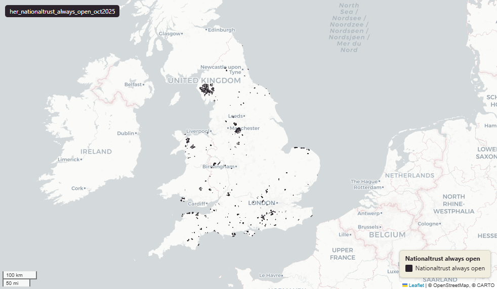

# National Trust Land — Always Open (England & Wales), October 2025

Always Open

`her_nationaltrust_always_open_oct2025`

**SOURCE**

- The National Trust. National Trust Open Data — Land, Always Open.

**DOCUMENTATION**

- National Trust Always Open (data.gov.uk) : https://www.data.gov.uk/dataset/171dcad3-ed21-4afe-966d-e3f255987d57/national-trust-open-data-land-always-open

**DEFINITIONS**

- "This is National Trust land to which the public has access on foot only - either by right (in the case of designated 'Access Land' under the Countryside (Rights of Way) Act 2000 (CRoW)) or by permission from the National Trust." (National Trust Open Data, Land Always Open)

**SCOPE**

- 1,514 rows.

**CRS**

- EPSG:27700 (OSGB 1936 / British National Grid). Geometry type MultiPolygon.

**LICENCE**

- Open Government Licence v3.0 (confirm with the National Trust before re-publication).

**LOADED INTO uk_baseline**

- Loaded by PNC, May 2026.

## Columns

| Column | Type | Description / unit |
|---|---|---|
| `fid_original` | `integer` | ArcGIS source identifier preserved at load. |
| `id` | `double precision` | Source field "id"; source feature identifier. |
| `name` | `character varying` | Source field "name"; property name. |
| `lastupdated` | `timestamp with time zone` | Source field "lastupdated"; date the source record was last updated. |
| `wd25cd` | `character varying` | Joined at load from ONS Ward 2025 lookup; 2025 Ward GSS code. |
| `wd25nm` | `character varying` | Joined at load from ONS Ward 2025 lookup; 2025 Ward name. |
| `lad25cd` | `character varying` | Joined at load from ONS LAD 2025 lookup; 2025 LAD GSS code. |
| `lad25nm` | `character varying` | Joined at load from ONS LAD 2025 lookup; 2025 LAD name. |
| `geom` | `geometry(MultiPolygon,27700)` | MultiPolygon in EPSG:27700. National Trust land parcel. |
| `area_ha` | `double precision` | Area in hectares, computed at load from the geometry. Stale if the geometry is later edited. |
| `fid` | `bigint` |  |
| `rgn22cd` | `text` | Joined at load from ONS LAD->Region lookup; 2022 Region GSS code. |
| `rgn22nm` | `text` | Joined at load from ONS LAD->Region lookup; 2022 Region name. |
| `sds_boundary` | `text` | Internal categorisation: Spatial Development Strategy (SDS) area where the geometry falls. Blank or NULL where outside any SDS area. |
