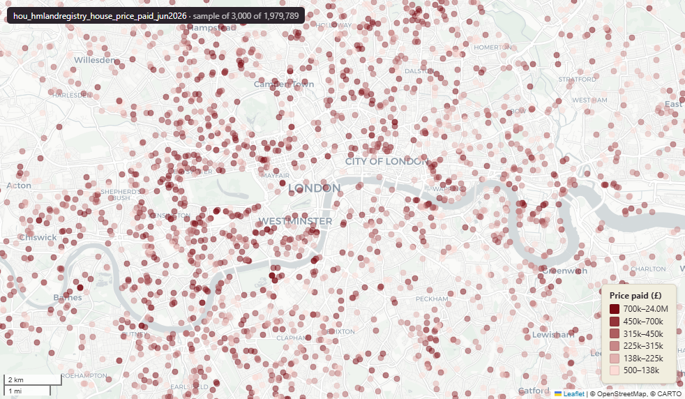

# HM Land Registry Price Paid Data (PPD), England & Wales, residential property transactions, January 1995 to 2026-04-30

`hou_hmlandregistry_house_price_paid_jun2026`

**SOURCE**

- HM Land Registry (HMLR). Complete Price Paid Data file (pp-complete.csv).

**DOCUMENTATION**

- Downloads : https://www.gov.uk/government/statistical-data-sets/price-paid-data-downloads
- About PPD : https://www.gov.uk/guidance/about-the-price-paid-data

**DEFINITIONS**

- "Price Paid Data includes information on all property sales in England and Wales that are sold for value and are lodged with us for registration." (HM Land Registry, About the Price Paid Data)
- One row per registered transaction (transaction unique identifier).

**SCOPE**

- England & Wales. 31,270,275 transactions, January 1995 to 2026-04-30.
- Includes PPD Category A (standard residential sales) and Category B (repossessions, buy-to-lets identifiable by a mortgage, transfers to non-private individuals, and 'Other' property types).

**CRS**

- EPSG:27700 (OSGB36 British National Grid). `geom` derived at load from the postcode via the postcode-centroid lookup; populated for 31,218,814 of 31,270,275 rows (99.8%). NULL where the postcode is blank or could not be matched.

**LICENCE**

- Open Government Licence v3.0; attribution to HM Land Registry required. Address fields are processed against Royal Mail data and carry Royal Mail / Ordnance Survey usage restrictions for non-personal or commercial use.

**DATA QUALITY CAVEATS**

- Category B entries are included; filter on `ppd_category_type` = 'A' for standard residential sales only.
- `geom` is postcode-centroid precision, not exact address location; postcodes may have been reallocated since the sale.

**ENRICHMENT**

- `msoa21hclnm` — House of Commons Library readable MSOA name, assigned at load from the transaction's postcode MSOA (via uk_baseline.adm_ons_postcode_centroid_feb2026). Open Parliament Licence.

**LOADED INTO uk_baseline**

- Loaded by PNC, 1 June 2026.

## Columns

| Column | Type | Description / unit |
|---|---|---|
| `transaction_id` | `text` |  |
| `price` | `bigint` |  |
| `transfer_date` | `date` |  |
| `postcode` | `text` |  |
| `property_type` | `text` |  |
| `old_new` | `text` |  |
| `duration` | `text` |  |
| `paon` | `text` |  |
| `saon` | `text` |  |
| `street` | `text` |  |
| `locality` | `text` |  |
| `town_city` | `text` |  |
| `district` | `text` |  |
| `county` | `text` |  |
| `ppd_category_type` | `text` |  |
| `record_status` | `text` |  |
| `geom` | `geometry(Point,27700)` |  |
| `msoa21cd` | `text` | Middle Layer Super Output Area (MSOA) 2021 code. Assigned at load from the transaction's postcode via uk_baseline.adm_ons_postcode_centroid_feb2026 (pcds). Open Government Licence v3.0. |
| `msoa21nm` | `text` | Official ONS MSOA 2021 name for the postcode's MSOA (via uk_baseline.adm_ons_postcode_centroid_feb2026). Open Government Licence v3.0. |
| `msoa21hclnm` | `text` | House of Commons Library readable MSOA name for the postcode's MSOA (via uk_baseline.adm_ons_postcode_centroid_feb2026, which carries the House of Commons Library name). Open Parliament Licence. |
| `lad22cd` | `text` | Local Authority District 2022 code (2021 LAD geography, anchored to the MSOA 2021 name scoping), best-fit from the postcode's msoa21cd. Joined at load from the ONS MSOA (2021) to LAD (2022) best-fit lookup. Open Government Licence v3.0. |
| `lad22nm` | `text` | Local Authority District 2022 name (2021 LAD geography), best-fit from the postcode's msoa21cd. Joined at load from the ONS MSOA (2021) to LAD (2022) best-fit lookup. Open Government Licence v3.0. |
| `lad25cd` | `text` | Local Authority District 2025 code (current administering authority) for the postcode, from uk_baseline.adm_ons_postcode_centroid_feb2026. Open Government Licence v3.0. |
| `lad25nm` | `character varying(100)` | Local Authority District 2025 name for the postcode's lad25cd, from uk_baseline.adm_ons_lad_boundary_may2025. Open Government Licence v3.0. |
