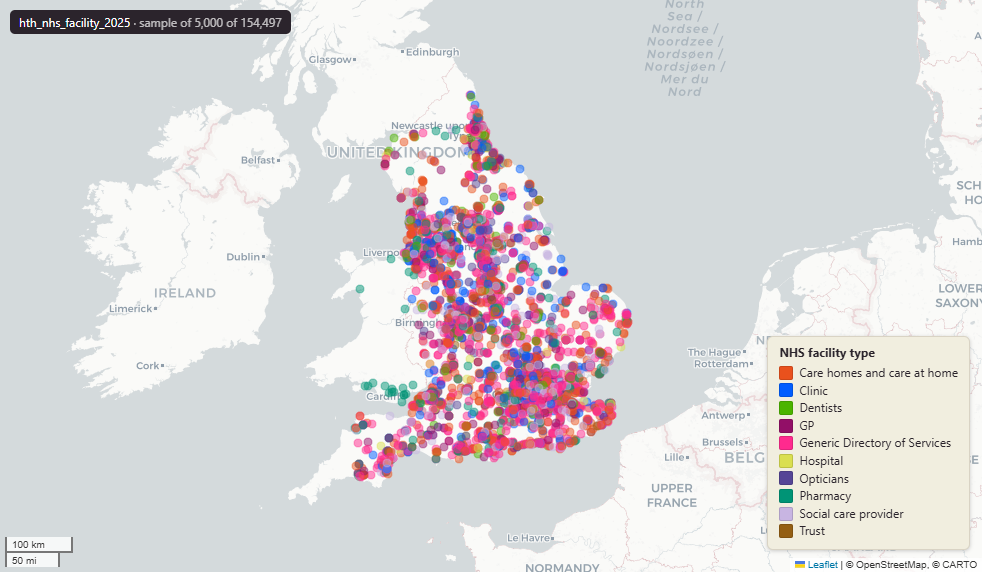

# NHS health and care facility directory for England, November 2025

Facility

`hth_nhs_facility_2025`

**SOURCE**

- NHS England (formerly NHS Digital). Organisation Data Service (ODS) / organisations directory, harvested by Prior + Partners from the NHS Digital API (fetch time in fetched_at).

**DOCUMENTATION**

- NHS Organisation Data Service : https://digital.nhs.uk/services/organisation-data-service

**DEFINITIONS**

- "The Organisation Data Service (ODS) is a national service for managing reference information about organisations that are involved in health and social care in England and beyond." (NHS England, Organisation Data Service)

**SCOPE**

- England. 154,497 rows.

**CRS**

- EPSG:27700 (OSGB 1936 / British National Grid). Geometry type Point.

**LICENCE**

- Open Government Licence v3.0 (confirm before re-publication).

**DATA QUALITY CAVEATS**

- raw_json column present but not populated in this load; the raw API response (including ODS codes and organisation subtypes) was therefore not retained. Available fields are limited to organisation_id (the NHS Service Search internal identifier, not the ODS code), organisation_name, organisation_type, organisation_type_id, postcode, latitude, longitude, geom, last_updated_utc and fetched_at. Rows cannot be joined to other NHS datasets by ODS code.

**LOADED INTO uk_baseline**

- Loaded by PNC, 7 November 2025.

## Columns

| Column | Type | Description / unit |
|---|---|---|
| `fid` | `integer` |  |
| `geom` | `geometry(Point,27700)` | Point in EPSG:27700. Facility location. |
| `organisation_id` | `character varying` | Source field; NHS organisation identifier (ODS code). |
| `organisation_name` | `character varying` | Source field; organisation / facility name. |
| `organisation_type` | `character varying` | Source field; organisation type. Observed values include "Generic Directory of Services", "Care homes and care at home", "Social care provider", "Clinic", "Pharmacy", "GP", "Dentists", "Opticians", "Hospital", "Trust", "Area Team". |
| `organisation_type_id` | `character varying` | Source field; organisation-type identifier. |
| `postcode` | `character varying` | Source field; facility postcode. |
| `last_updated_utc` | `timestamp without time zone` | Source field; last-updated timestamp from the source (UTC). |
| `latitude` | `double precision` | Source field; facility latitude (WGS84 degrees). |
| `longitude` | `double precision` | Source field; facility longitude (WGS84 degrees). |
| `raw_json` | `jsonb` | Full source API response retained at harvest (JSON). |
| `fetched_at` | `timestamp without time zone` | Timestamp the record was harvested from the NHS Digital API. |
| `msoa21cd` | `text` | Middle Layer Super Output Area (MSOA) 2021 code. Assigned at load by point-in-polygon location against uk_baseline.adm_ons_msoa_boundary_2021. Open Government Licence v3.0. |
| `msoa21nm` | `text` | Official ONS Middle Layer Super Output Area 2021 name. Assigned at load via the point's 2021 MSOA (point-in-polygon against uk_baseline.adm_ons_msoa_boundary_2021). Open Government Licence v3.0. |
| `msoa21hclnm` | `text` | House of Commons Library readable MSOA name. Assigned at load via the point's 2021 MSOA (point-in-polygon against uk_baseline.adm_ons_msoa_boundary_2021, which carries the House of Commons Library name). Open Parliament Licence. |
| `lad22cd` | `text` | Local Authority District 2022 code (2021 LAD geography, anchored to the MSOA 2021 name scoping). Assigned at load by point-in-polygon location against uk_baseline.adm_ons_lad_boundary_may2022. Open Government Licence v3.0. |
| `lad22nm` | `text` | Local Authority District 2022 name (2021 LAD geography). Assigned at load by point-in-polygon location against uk_baseline.adm_ons_lad_boundary_may2022. Open Government Licence v3.0. |
| `lad25cd` | `text` | Local Authority District 2025 code (current administering authority). Assigned at load by point-in-polygon location against uk_baseline.adm_ons_lad_boundary_may2025. Open Government Licence v3.0. |
| `lad25nm` | `text` | Local Authority District 2025 name (current administering authority). Assigned at load by point-in-polygon location against uk_baseline.adm_ons_lad_boundary_may2025. Open Government Licence v3.0. |
