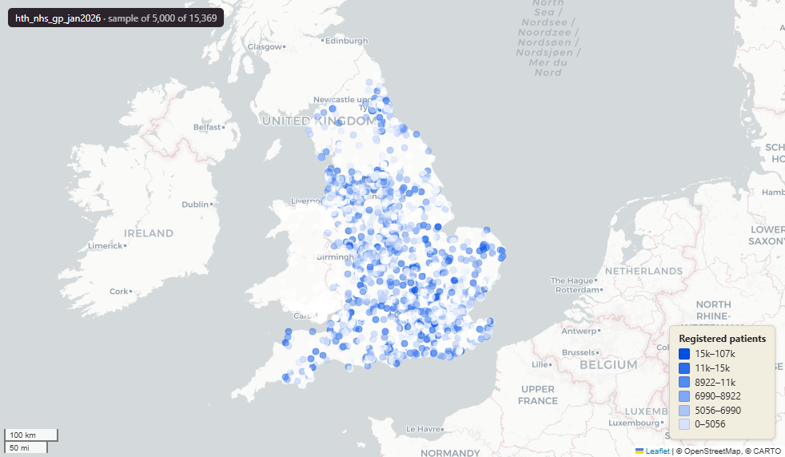

# NHS general practice (GP) directory for England, January 2026

Gp

`hth_nhs_gp_jan2026`

**SOURCE**

- NHS England (formerly NHS Digital). GP practice register (Organisation Data Service), Patients Registered at a GP Practice, and General Practice Workforce. Compiled by Prior + Partners.

**DOCUMENTATION**

- NHS Organisation Data Service          : https://digital.nhs.uk/services/organisation-data-service
- Patients registered at a GP practice   : https://digital.nhs.uk/data-and-information/publications/statistical/patients-registered-at-a-gp-practice
- General Practice Workforce             : https://digital.nhs.uk/data-and-information/publications/statistical/general-and-personal-medical-services

**DEFINITIONS**

- Patients Registered at a GP Practice is "The number of patients registered at a GP on the first day of each month." (NHS England)
- The General Practice Workforce data gives "full-time equivalent (FTE) and headcount figures by four staff groups, (GPs, Nurses, Direct Patient Care (DPC) and administrative staff)." (NHS England)

**SCOPE**

- England. 15,369 rows.

**CRS**

- EPSG:27700 (OSGB 1936 / British National Grid). Geometry type Point.

**LICENCE**

- Open Government Licence v3.0 (confirm before re-publication).

**LOADED INTO uk_baseline**

- Loaded by PNC, January 2026.

## Columns

| Column | Type | Description / unit |
|---|---|---|
| `id` | `integer` | Surrogate row identifier. |
| `geom` | `geometry(Point,27700)` | Point in EPSG:27700. GP practice location. |
| `practice_code` | `character varying` | Source field; GP practice code (ODS). |
| `practice_name` | `character varying` | Source field; GP practice name. |
| `postcode` | `character varying` | Source field; GP practice postcode. |
| `status` | `character varying` | Source field; practice status. Observed values: "ACTIVE", "INACTIVE", "DORMANT". |
| `prac_code` | `character varying` | Source field; practice code from the General Practice Workforce source. |
| `prac_name` | `character varying` | Source field; practice name from the General Practice Workforce source. |
| `pcn_name` | `character varying` | Source field; Primary Care Network (PCN) name. |
| `sub_icb_code` | `character varying` | Source field; Sub-Integrated Care Board (Sub-ICB) code. |
| `sub_icb_name` | `character varying` | Source field; Sub-Integrated Care Board (Sub-ICB) name. |
| `icb_name` | `character varying` | Source field; Integrated Care Board (ICB) name. |
| `region_name` | `character varying` | Source field; NHS region name. |
| `total_patients` | `integer` | Registered patients at the practice. |
| `gp_source` | `character varying` | Estimate-quality flag for the GP FTE figures. Observed values include "Includes FTE Estimates", "Fully estimated - no valid or current data". |
| `nurse_source` | `character varying` | Estimate-quality flag for the nurse FTE figures. |
| `dpc_source` | `character varying` | Estimate-quality flag for the Direct Patient Care FTE figures. |
| `admin_source` | `character varying` | Estimate-quality flag for the administrative-staff figures. |
| `total_gp_fte` | `numeric` | Total GP full-time equivalent (FTE). |
| `total_nurses_fte` | `numeric` | Total nurse full-time equivalent (FTE). |
| `total_dpc_fte` | `numeric` | Total Direct Patient Care (DPC) staff full-time equivalent (FTE). |
| `east1m` | `integer` | Practice easting. Unit: metres (EPSG:27700). |
| `north1m` | `integer` | Practice northing. Unit: metres (EPSG:27700). |
| `msoa21cd` | `text` | Middle Layer Super Output Area (MSOA) 2021 code. Assigned at load by point-in-polygon location against uk_baseline.adm_ons_msoa_boundary_2021. Open Government Licence v3.0. |
| `msoa21nm` | `text` | Official ONS Middle Layer Super Output Area 2021 name. Assigned at load via the point's 2021 MSOA (point-in-polygon against uk_baseline.adm_ons_msoa_boundary_2021). Open Government Licence v3.0. |
| `msoa21hclnm` | `text` | House of Commons Library readable MSOA name. Assigned at load via the point's 2021 MSOA (point-in-polygon against uk_baseline.adm_ons_msoa_boundary_2021, which carries the House of Commons Library name). Open Parliament Licence. |
| `lad22cd` | `text` | Local Authority District 2022 code (2021 LAD geography, anchored to the MSOA 2021 name scoping). Assigned at load by point-in-polygon location against uk_baseline.adm_ons_lad_boundary_may2022. Open Government Licence v3.0. |
| `lad22nm` | `text` | Local Authority District 2022 name (2021 LAD geography). Assigned at load by point-in-polygon location against uk_baseline.adm_ons_lad_boundary_may2022. Open Government Licence v3.0. |
| `lad25cd` | `text` | Local Authority District 2025 code (current administering authority). Assigned at load by point-in-polygon location against uk_baseline.adm_ons_lad_boundary_may2025. Open Government Licence v3.0. |
| `lad25nm` | `text` | Local Authority District 2025 name (current administering authority). Assigned at load by point-in-polygon location against uk_baseline.adm_ons_lad_boundary_may2025. Open Government Licence v3.0. |
