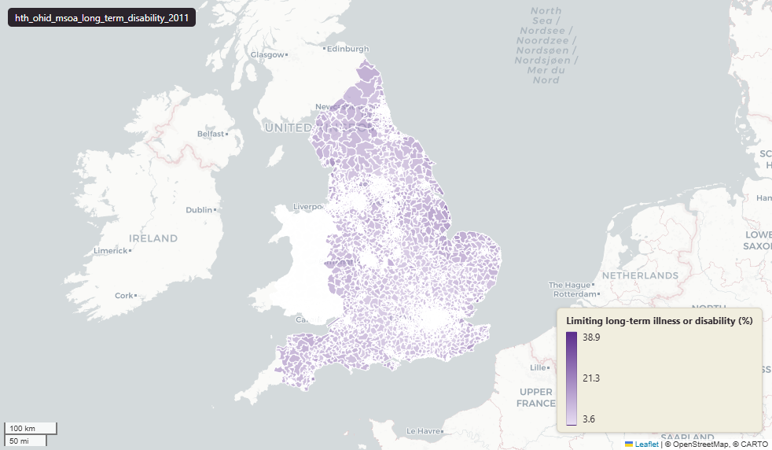

# Office for Health Improvement and Disparities (OHID) limiting long-term illness or disability at Middle-layer Super Output Area (MSOA) 2011, 2011 Census

Long term disability

`hth_ohid_msoa_long_term_disability_2011`

**SOURCE**

- Office for Health Improvement and Disparities (OHID), via the Fingertips public health data platform. Underlying source: 2011 Census (Office for National Statistics).

**DOCUMENTATION**

- Fingertips : https://fingertips.phe.org.uk/

**DEFINITIONS**

- "'Day-to-day activities limited' covers any health problem or disability (including problems related to old age) which has lasted or is expected to last for at least 12 months." (Office for National Statistics, 2011 Census)

**SCOPE**

- England. 7,283 rows (MSOA 2011 level).

**CRS**

- EPSG:27700 (OSGB 1936 / British National Grid). Geometry type MultiPolygon.

**LICENCE**

- Open Government Licence v3.0.

**DATA QUALITY CAVEATS**

- This table is published on 2011 MSOA boundaries and its values are 2011-vintage; `msoa21hclnm` is a readable label for the corresponding 2021 MSOA and does not re-aggregate any value onto 2021 geography. For MSOAs unchanged in 2021 the name is exact. For the small number of 2011 MSOAs that were split, the column lists every successor name separated by a semicolon, so those rows carry more than one name and cannot be joined to a single msoa21cd. No 2021 geography codes are recorded on this table.

**ENRICHMENT**

- `msoa21hclnm` — House of Commons Library readable MSOA name for the 2021 MSOA corresponding to this row's 2011 MSOA, joined at load via uk.ref_msoa11_msoa21_name_lu. Open Parliament Licence.

## Columns

| Column | Type | Description / unit |
|---|---|---|
| `msoa11cd` | `text` | Source field "MSOA11CD"; ONS GSS 9-character MSOA 2011 code. |
| `msoa11nm` | `text` | Source field "MSOA11NM"; MSOA 2011 name. |
| `geom` | `geometry(MultiPolygon,27700)` | MultiPolygon in EPSG:27700. MSOA 2011 boundary geometry. |
| `lad22cd` | `text` | Joined at load from ONS MSOA->LAD 2022 lookup; 2022 LAD GSS code. |
| `lad22nm` | `text` | Joined at load from ONS MSOA->LAD 2022 lookup; 2022 LAD name. |
| `rgn22cd` | `text` | Joined at load from ONS LAD->Region lookup; 2022 Region GSS code. |
| `rgn22nm` | `text` | Joined at load from ONS LAD->Region lookup; 2022 Region name. |
| `data_source` | `text` | Fixed-string annotation added during an earlier Prior + Partners loading pass; same value every row. Value: "Office for Health Improvement & Disparities". |
| `data_resolution` | `text` | Fixed-string annotation (Prior + Partners load); same value every row. Value: "MSOA 2011". |
| `data_time_period` | `text` | Fixed-string annotation (Prior + Partners load); reporting period for this dataset, same value every row. |
| `data_web_link` | `text` | Fixed-string annotation (Prior + Partners load); source platform URL, same value every row. Value: "https://fingertips.phe.org.uk/". |
| `area_ha` | `double precision` | Area in hectares, computed at load from the geometry. Stale if the geometry is later edited. |
| `limiting_long_term_illness_or_disability_perc` | `double precision` | Percentage of "limiting long term illness or disability" in the MSOA. Unit: "percent (0 to 100)". |
| `limiting_long_term_illness_or_disability_count` | `double precision` | Count of "limiting long term illness or disability" in the MSOA. |
| `limiting_long_term_illness_or_disability_denominator` | `double precision` | Denominator (population base) for "limiting long term illness or disability". |
| `wd22cd` | `character varying` | Joined at load from ONS Ward 2022 lookup; 2022 Ward GSS code. |
| `wd22nm` | `character varying` | Joined at load from ONS Ward 2022 lookup; 2022 Ward name. |
| `fid` | `bigint` |  |
| `msoa21hclnm` | `text` | House of Commons Library readable MSOA name for the 2021 MSOA corresponding to this row's 2011 MSOA, joined at load on the 2011 code via uk.ref_msoa11_msoa21_name_lu. Where the MSOA is unchanged in 2021 (the great majority) the name is exact. Where a 2011 MSOA was split into several 2021 MSOAs this records all successor names, separated by a semicolon. Where a 2011 MSOA was merged into a larger 2021 MSOA, or its code was reissued, it records that single successor name. Open Parliament Licence. |
