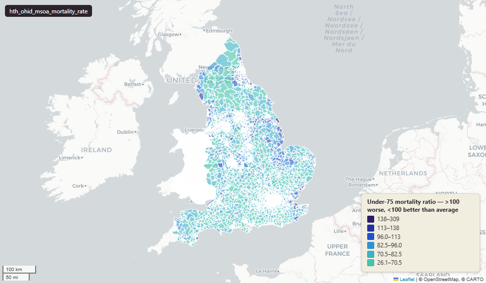

# Office for Health Improvement and Disparities (OHID) mortality rates at Middle-layer Super Output Area (MSOA) 2011, period 2016-2020

Mortality Rate

`hth_ohid_msoa_mortality_rate`

Via the Fingertips platform.

**SOURCE**

- Office for Health Improvement and Disparities (OHID), via the Fingertips public health data platform.

**DOCUMENTATION**

- Fingertips : https://fingertips.phe.org.uk/

**DEFINITIONS**

- "Preventable mortality refers to causes of death that can be mainly avoided through effective public health and primary prevention interventions." (Office for National Statistics)

**SCOPE**

- England. 7,283 rows (MSOA 2011 grain).

**CRS**

- EPSG:27700 (OSGB 1936 / British National Grid). Geometry type MultiPolygon.

**LICENCE**

- Open Government Licence v3.0.

## Columns

| Column | Type | Description / unit |
|---|---|---|
| `msoa11cd` | `text` | Source field "MSOA11CD"; ONS GSS 9-character MSOA 2011 code. |
| `msoa11nm` | `text` | Source field "MSOA11NM"; MSOA 2011 name. |
| `geom` | `geometry(MultiPolygon,27700)` | MultiPolygon in EPSG:27700. MSOA 2011 boundary geometry. |
| `lad22cd` | `text` | Joined at load from ONS MSOA->LAD 2022 lookup; 2022 LAD GSS code. |
| `lad22nm` | `text` | Joined at load from ONS MSOA->LAD 2022 lookup; 2022 LAD name. |
| `rgn22cd` | `text` | Joined at load from ONS LAD->Region lookup; 2022 Region GSS code. |
| `rgn22nm` | `text` | Joined at load from ONS LAD->Region lookup; 2022 Region name. |
| `data_source` | `text` | Fixed-string annotation added during an earlier Prior + Partners loading pass; same value every row. Value: "Office for Health Improvement & Disparities". |
| `data_resolution` | `text` | Fixed-string annotation (Prior + Partners load); same value every row. Value: "MSOA 2011". |
| `data_time_period` | `text` | Fixed-string annotation (Prior + Partners load); reporting period for this dataset, same value every row. |
| `data_web_link` | `text` | Fixed-string annotation (Prior + Partners load); source platform URL, same value every row. Value: "https://fingertips.phe.org.uk/". |
| `area_ha` | `double precision` | Area in hectares, computed at load from the geometry. Stale if the geometry is later edited. |
| `deaths_from_all_causes_all_ages_perc` | `double precision` | Percentage of "deaths from all causes all ages" in the MSOA. Unit: "percent (0 to 100)". |
| `deaths_from_all_causes_all_ages_count` | `double precision` | Count of "deaths from all causes all ages" in the MSOA. |
| `deaths_from_all_causes_all_ages_denominator` | `double precision` | Denominator (population base) for "deaths from all causes all ages". |
| `deaths_from_all_causes_all_ages_under_75_years_perc` | `double precision` | Percentage of "deaths from all causes all ages under 75 years" in the MSOA. Unit: "percent (0 to 100)". |
| `deaths_from_all_causes_all_ages_under_75_years_count` | `double precision` | Count of "deaths from all causes all ages under 75 years" in the MSOA. |
| `deaths_from_all_causes_all_ages_under_75_years_denominator` | `double precision` | Denominator (population base) for "deaths from all causes all ages under 75 years". |
| `deaths_from_causes_considered_preventable_under_75_years_perc` | `double precision` | Percentage of "deaths from causes considered preventable under 75 years" in the MSOA. Unit: "percent (0 to 100)". |
| `deaths_from_causes_considered_preventable_under_75_years_count` | `double precision` | Count of "deaths from causes considered preventable under 75 years" in the MSOA. |
| `deaths_from_causes_considered_preventable_under_75_years_denomi` | `double precision` | Denominator (population base) for the percentage (column name truncated from the source). |
| `deaths_from_all_cancer_all_ages_perc` | `double precision` | Percentage of "deaths from all cancer all ages" in the MSOA. Unit: "percent (0 to 100)". |
| `deaths_from_all_cancer_all_ages_count` | `double precision` | Count of "deaths from all cancer all ages" in the MSOA. |
| `deaths_from_all_cancer_all_ages_denominator` | `double precision` | Denominator (population base) for "deaths from all cancer all ages". |
| `deaths_from_all_cancer_under_75_years_perc` | `double precision` | Percentage of "deaths from all cancer under 75 years" in the MSOA. Unit: "percent (0 to 100)". |
| `deaths_from_all_cancer_under_75_years_count` | `double precision` | Count of "deaths from all cancer under 75 years" in the MSOA. |
| `deaths_from_all_cancer_under_75_years_denominator` | `double precision` | Denominator (population base) for "deaths from all cancer under 75 years". |
| `deaths_from_circulatory_disease_all_ages_perc` | `double precision` | Percentage of "deaths from circulatory disease all ages" in the MSOA. Unit: "percent (0 to 100)". |
| `deaths_from_circulatory_disease_all_ages_count` | `double precision` | Count of "deaths from circulatory disease all ages" in the MSOA. |
| `deaths_from_circulatory_disease_all_ages_denominator` | `double precision` | Denominator (population base) for "deaths from circulatory disease all ages". |
| `deaths_from_circulatory_disease_all_ages_under_75_years_perc` | `double precision` | Percentage of "deaths from circulatory disease all ages under 75 years" in the MSOA. Unit: "percent (0 to 100)". |
| `deaths_from_circulatory_disease_all_ages_under_75_years_count` | `double precision` | Count of "deaths from circulatory disease all ages under 75 years" in the MSOA. |
| `deaths_from_circulatory_disease_all_ages_under_75_years_denomin` | `double precision` | Denominator (population base) for the percentage (column name truncated from the source). |
| `deaths_from_coronary_heart_disease_all_ages_perc` | `double precision` | Percentage of "deaths from coronary heart disease all ages" in the MSOA. Unit: "percent (0 to 100)". |
| `deaths_from_coronary_heart_disease_all_ages_count` | `double precision` | Count of "deaths from coronary heart disease all ages" in the MSOA. |
| `deaths_from_coronary_heart_disease_all_ages_denominator` | `double precision` | Denominator (population base) for "deaths from coronary heart disease all ages". |
| `deaths_from_respiratory_diseases_all_ages_perc` | `double precision` | Percentage of "deaths from respiratory diseases all ages" in the MSOA. Unit: "percent (0 to 100)". |
| `deaths_from_respiratory_diseases_all_ages_count` | `double precision` | Count of "deaths from respiratory diseases all ages" in the MSOA. |
| `deaths_from_respiratory_diseases_all_ages_denominator` | `double precision` | Denominator (population base) for "deaths from respiratory diseases all ages". |
| `deaths_from_stroke_perc` | `double precision` | Percentage of "deaths from stroke" in the MSOA. Unit: "percent (0 to 100)". |
| `deaths_from_stroke_count` | `double precision` | Count of "deaths from stroke" in the MSOA. |
| `deaths_from_stroke_denominator` | `double precision` | Denominator (population base) for "deaths from stroke". |
| `wd22cd` | `character varying` | Joined at load from ONS Ward 2022 lookup; 2022 Ward GSS code. |
| `wd22nm` | `character varying` | Joined at load from ONS Ward 2022 lookup; 2022 Ward name. |
| `fid` | `bigint` |  |
