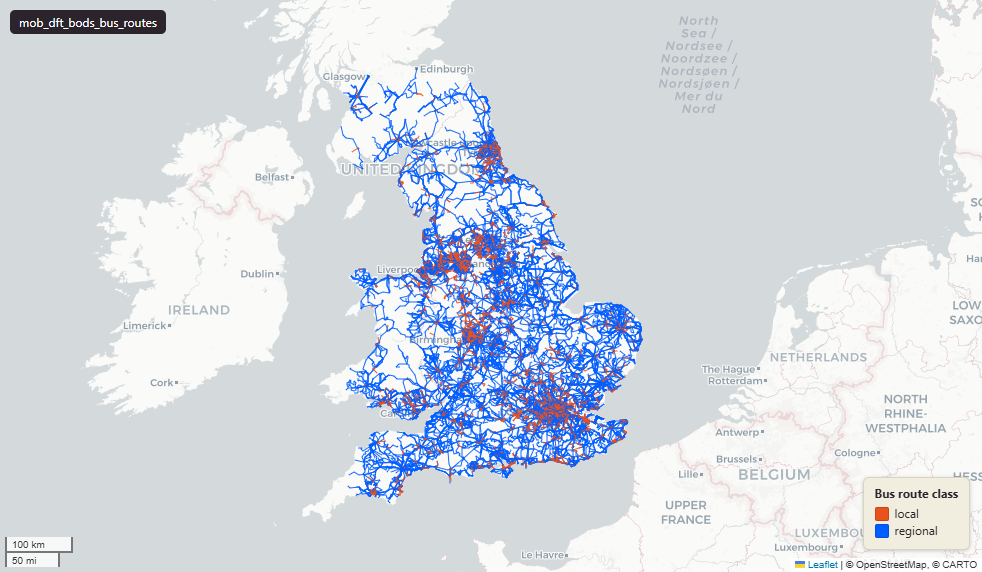

# Department for Transport (DfT) Bus Open Data Service (BODS) bus route polylines, Great Britain

`mob_dft_bods_bus_routes`

<a href="http://localhost:7800/?layer=uk_baseline.mob_dft_bods_bus_routes" target="_blank" rel="noopener">Open in the Dashboard &#8599;</a> (start your local Dashboard first)

**SOURCE**

- Bus Open Data Service (BODS), Department for Transport (DfT). Per-row provenance in feed_source: "bods_gtfs_all" (national GTFS bundle) and "txc_fallback" (per-operator TransXChange datasets).

**DOCUMENTATION**

- Bus Open Data Service      : https://www.bus-data.dft.gov.uk/
- Find and use bus open data : https://www.gov.uk/guidance/find-and-use-bus-open-data
- GTFS schedule reference    : https://gtfs.org/documentation/schedule/reference/

**DEFINITIONS**

- "The Bus Open Data Service (BODS) provides bus timetable, vehicle location and fares data for every local bus service in England." (Department for Transport, Bus Open Data Service)

**SCOPE**

- Great Britain. 13,953 rows.

**CRS**

- EPSG:27700 (OSGB 1936 / British National Grid). Geometry type LineString.

**LICENCE**

- Open Government Licence v3.0.

**LOADED INTO uk_baseline**

- Loaded by PNC, May 2026.

## Columns

| Column | Type | Description / unit |
|---|---|---|
| `id` | `integer` | Surrogate row identifier. |
| `route_id` | `character varying(100)` | Internal route identifier. |
| `gtfs_route_id` | `character varying(100)` | Source field "route_id" (GTFS); GTFS route identifier. |
| `gtfs_shape_id` | `character varying(100)` | Source field "shape_id" (GTFS); GTFS shape identifier for the route geometry. |
| `line_name` | `character varying(100)` | Source field; published line name (e.g. service number). |
| `route_long_name` | `character varying(500)` | Source field; full route name. |
| `agency_id` | `character varying(50)` | Source field "agency_id" (GTFS); operator identifier. |
| `agency_name` | `character varying(500)` | Source field "agency_name" (GTFS); operator name. |
| `agency_noc` | `character varying(20)` | Source field; operator National Operator Code (NOC). |
| `stops_served` | `jsonb` | Ordered list of stops served by the route. |
| `stop_count` | `integer` | Number of stops served by the route. |
| `geom` | `geometry(LineString,27700)` | LineString in EPSG:27700. Bus route polyline. |
| `geom_source` | `character varying(50)` | Geometry provenance. Observed values: "gtfs_shape" (published GTFS shape), "reconstructed" (built from the stop sequence). |
| `total_distance_metres` | `numeric` | Route length. Unit: metres. |
| `route_class` | `character varying(20)` | Route class. Observed values: "local", "regional", "intercity", "coach". |
| `feed_source` | `character varying(50)` | Feed provenance. Observed values: "bods_gtfs_all" (national GTFS bundle), "txc_fallback" (per-operator TransXChange). |
| `feed_loaded_at` | `timestamp without time zone` | Timestamp the source feed was loaded. |
