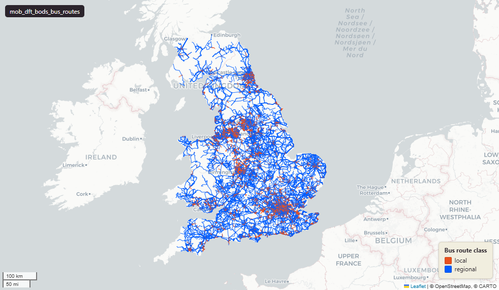

# Department for Transport (DfT) Bus Open Data Service (BODS) bus route polylines, Great Britain

`mob_dft_bods_bus_routes`

**SOURCE**

- Bus Open Data Service (BODS), Department for Transport (DfT). Per-row provenance in feed_source: "bods_gtfs_all" (national GTFS bundle) and "txc_fallback" (per-operator TransXChange datasets).

**DOCUMENTATION**

- Bus Open Data Service      : https://www.bus-data.dft.gov.uk/
- Find and use bus open data : https://www.gov.uk/guidance/find-and-use-bus-open-data
- GTFS schedule reference    : https://gtfs.org/documentation/schedule/reference/

**DEFINITIONS**

- "The Bus Open Data Service (BODS) provides bus timetable, vehicle location and fares data for every local bus service in England." (Department for Transport, Bus Open Data Service)

**SCOPE**

- Great Britain. 13,953 rows.

**CRS**

- EPSG:27700 (OSGB 1936 / British National Grid). Geometry type LineString.

**LICENCE**

- Open Government Licence v3.0.

**DATA QUALITY CAVEATS**

- The row count counts split pieces, not source features: this layer was split by Middle Layer Super Output Area, so it holds one row per feature per MSOA piece, plus whole and remainder rows to keep 100% of the source geometry. 122,148 rows represent 13,953 source features, measured 28 July 2026. `source_fid` identifies the originating feature.
- Geography keys are NULL on 3,510 of 122,148 rows, measured 28 July 2026: 1,562 fall inside an England or Wales district and could carry one, so their keys are a gap rather than an absence; 70 are residual fragments left by the MSOA split, each under 100 sqm or 10 m; 1,803 are in Scotland or Northern Ireland, outside the England and Wales lookup; 75 fall outside every district — offshore, inter-tidal, or beyond Great Britain.
- County and Spatial Development Strategy columns are England and Wales only; rows elsewhere carry no county or SDS. Wales and the Isles of Scilly carry a county but no SDS. Rows with no Local Authority District code are NULL in all four columns.

**ENRICHMENT**

- `sds_name` / `sds_group` — Spatial Development Strategy area and devolution status, a Prior + Partners categorisation over Ministry of Housing, Communities and Local Government (MHCLG) English devolution policy, joined at load on the row's Local Authority District 2025 code via uk.ref_lad25_ctyua25_sds_lu_jul2026.

**LOADED INTO uk_baseline**

- Loaded by PNC, May 2026.

MSOA SPLIT (added 4 July 2026)

- Geometry split to one row per (source feature x MSOA 2021). Each row carries that MSOA's msoa21cd / msoa21nm / msoa21hclnm and best-fit lad22 / lad25. The source feature's original primary key is preserved as `source_fid`; `gid` is a fresh surrogate primary key. Geometry outside every MSOA (offshore or outside England & Wales) is retained as rows with NULL geography columns, so the layer holds the complete source geometry.
- Route lines that traverse the same street more than once (out-and-back loops) are stored once per MSOA piece after the split: repeated linework within a route is merged by the geometric overlay, so summed piece length is about 1.4% below the pre-split total while every street a route uses remains fully represented. The pre-split encoding, with repeated traversals, is uk.mob_dft_bods_bus_routes__preswap_jul04.

## Columns

| Column | Type | Description / unit |
|---|---|---|
| `source_fid` | `integer` | Primary key of the source feature in the pre-split layer uk.mob_dft_bods_bus_routes__preswap_jul04 (non-unique here: a feature spanning N MSOAs has N rows). |
| `route_id` | `character varying(100)` |  |
| `gtfs_route_id` | `character varying(100)` |  |
| `gtfs_shape_id` | `character varying(100)` |  |
| `line_name` | `character varying(100)` |  |
| `route_long_name` | `character varying(500)` |  |
| `agency_id` | `character varying(50)` |  |
| `agency_name` | `character varying(500)` |  |
| `agency_noc` | `character varying(20)` |  |
| `stops_served` | `jsonb` |  |
| `stop_count` | `integer` |  |
| `geom_source` | `character varying(50)` |  |
| `total_distance_metres` | `numeric` |  |
| `route_class` | `character varying(20)` |  |
| `feed_source` | `character varying(50)` |  |
| `feed_loaded_at` | `timestamp without time zone` |  |
| `msoa21cd` | `character varying` | Middle Layer Super Output Area (MSOA) 2021 code of this piece. Open Government Licence v3.0. |
| `msoa21nm` | `character varying` | Official ONS MSOA 2021 name of this piece. Open Government Licence v3.0. |
| `msoa21hclnm` | `text` | House of Commons Library readable MSOA name of this piece. Open Parliament Licence. |
| `lad22cd` | `text` | Local Authority District 2022 code (2021 LAD geography, anchored to the MSOA 2021 name scoping), best-fit from this piece's msoa21cd. Open Government Licence v3.0. |
| `lad22nm` | `text` | Local Authority District 2022 name (2021 LAD geography), best-fit from this piece's msoa21cd. Open Government Licence v3.0. |
| `lad25cd` | `text` | Local Authority District 2025 code (current administering authority), best-fit from this piece's msoa21cd. Open Government Licence v3.0. |
| `lad25nm` | `text` | Local Authority District 2025 name (current administering authority), best-fit from this piece's msoa21cd. Open Government Licence v3.0. |
| `geom` | `geometry(MultiLineString,27700)` |  |
| `gid` | `bigint` |  |
| `ctyua25cd` | `text` | County or unitary authority code at 1 April 2025. Joined at load via uk.ref_lad25_ctyua25_sds_lu_jul2026 on the row's Local Authority District 2025 code. Open Government Licence v3.0. |
| `ctyua25nm` | `text` | County or unitary authority name at 1 April 2025. Joined at load via uk.ref_lad25_ctyua25_sds_lu_jul2026 on the row's Local Authority District 2025 code. Open Government Licence v3.0. |
| `sds_name` | `text` | Spatial Development Strategy (SDS) area, a Prior + Partners categorisation over Ministry of Housing, Communities and Local Government (MHCLG) English devolution policy. Joined at load via uk.ref_lad25_ctyua25_sds_lu_jul2026 on the row's Local Authority District 2025 code. Open Government Licence v3.0. |
| `sds_group` | `text` | Devolution status of the Spatial Development Strategy area: Existing Devolution Footprints, Devolution Priority Programme, Other Proposed Geographies or Remaining Areas. Joined at load via uk.ref_lad25_ctyua25_sds_lu_jul2026 on the row's Local Authority District 2025 code. Open Government Licence v3.0. |
