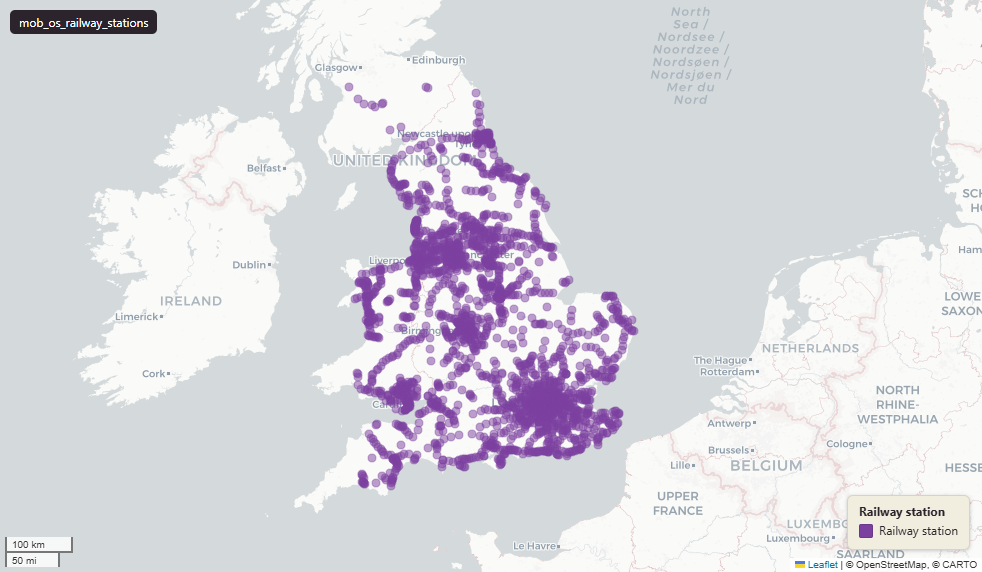

# Ordnance Survey OS OpenMap Local - Railway Stations for Great Britain

Railway Stations

`mob_os_railway_stations`

**SOURCE**

- Ordnance Survey (OS), OS OpenMap Local product.

**DOCUMENTATION**

- OS OpenMap Local    : https://www.ordnancesurvey.co.uk/products/os-open-map-local
- RailwayStation spec : https://docs.os.uk/os-downloads/products/maps-and-imagery-portfolio/os-openmap-local/os-openmap-local-technical-specification/feature-types/railwaystation

**DEFINITIONS**

- "Point feature representing the buildings and platforms by a railway line where a train may stop to pick-up or drop-off goods or passengers." (OS OpenMap Local Technical Specification, RailwayStation)

**SCOPE**

- Great Britain. 3,539 rows.

**CRS**

- EPSG:27700 (OSGB 1936 / British National Grid). Geometry type Point.

**LICENCE**

- OS OpenData Licence (incorporates Open Government Licence v3.0; attribution required).

## Columns

| Column | Type | Description / unit |
|---|---|---|
| `id` | `character varying` | Source field; OS feature identifier. |
| `classification` | `character varying` | Source field "classification"; station classification. Observed values: "Railway Station", "Light Rapid Transit Station", "London Underground Station", "Railway Station And London Underground Station", "Light Rapid Transit Station And Railway Station". |
| `distinctive_name` | `character varying` | Source field "distinctive_name"; station name. |
| `feature_code` | `bigint` | Source field "feature_code"; OS feature code (15420 / 15422 / 15423 / 15424 / 15425). |
| `fid_original` | `integer` | ArcGIS source identifier preserved at load. |
| `lad22nm` | `character varying` | Local Authority District 2022 name (2021 LAD geography). Assigned at load by point-in-polygon location against uk_baseline.adm_ons_lad_boundary_may2022. Open Government Licence v3.0. |
| `lad22cd` | `character varying` | Local Authority District 2022 code (2021 LAD geography, anchored to the MSOA 2021 name scoping). Assigned at load by point-in-polygon location against uk_baseline.adm_ons_lad_boundary_may2022. Open Government Licence v3.0. |
| `wd21nm` | `character varying` | Joined at load from ONS Ward 2021 lookup; 2021 Ward name. |
| `wd21cd` | `character varying` | Joined at load from ONS Ward 2021 lookup; 2021 Ward GSS code. |
| `geom` | `geometry(Point,27700)` | Point in EPSG:27700. Railway station point. |
| `fid` | `bigint` |  |
| `msoa21cd` | `text` | Middle Layer Super Output Area (MSOA) 2021 code. Assigned at load by point-in-polygon location against uk_baseline.adm_ons_msoa_boundary_2021. Open Government Licence v3.0. |
| `msoa21nm` | `text` | Official ONS Middle Layer Super Output Area 2021 name. Assigned at load via the point's 2021 MSOA (point-in-polygon against uk_baseline.adm_ons_msoa_boundary_2021). Open Government Licence v3.0. |
| `msoa21hclnm` | `text` | House of Commons Library readable MSOA name. Assigned at load via the point's 2021 MSOA (point-in-polygon against uk_baseline.adm_ons_msoa_boundary_2021, which carries the House of Commons Library name). Open Parliament Licence. |
| `lad25cd` | `text` | Local Authority District 2025 code (current administering authority). Assigned at load by point-in-polygon location against uk_baseline.adm_ons_lad_boundary_may2025. Open Government Licence v3.0. |
| `lad25nm` | `text` | Local Authority District 2025 name (current administering authority). Assigned at load by point-in-polygon location against uk_baseline.adm_ons_lad_boundary_may2025. Open Government Licence v3.0. |
