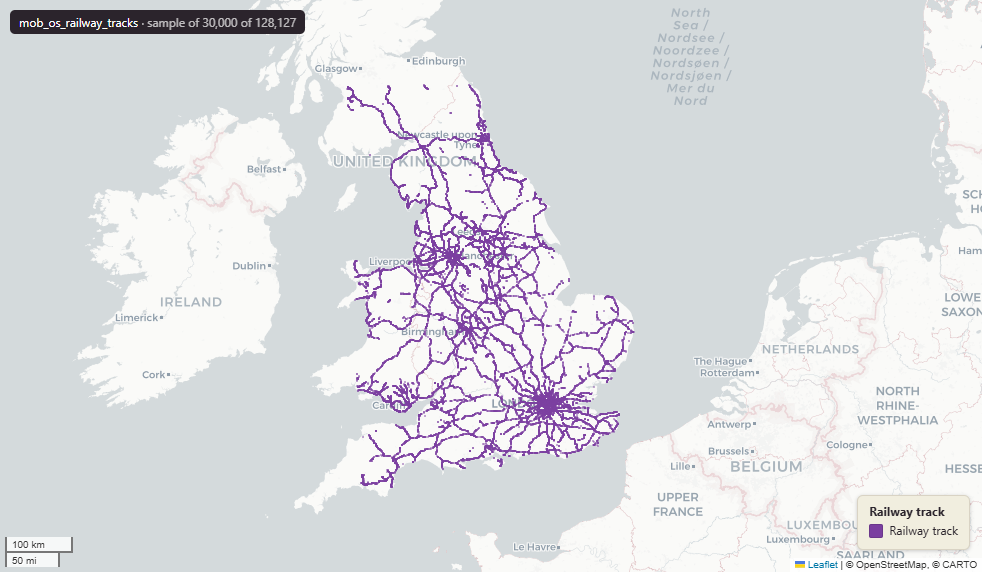

# Ordnance Survey OS OpenMap Local - Railway Tracks for Great Britain

Railway Tracks

`mob_os_railway_tracks`

**SOURCE**

- Ordnance Survey (OS), OS OpenMap Local product.

**DOCUMENTATION**

- OS OpenMap Local  : https://www.ordnancesurvey.co.uk/products/os-open-map-local
- RailwayTrack spec : https://docs.os.uk/os-downloads/products/maps-and-imagery-portfolio/os-openmap-local/os-openmap-local-technical-specification/feature-types/railwaytrack

**DEFINITIONS**

- "All railways are represented as lines and are broken where they pass under bridges, buildings or other obstructing detail. Railway sidings and the tracks of travelling structures are not included." (OS OpenMap Local Technical Specification, RailwayTrack)

**SCOPE**

- Great Britain. 128,127 rows.

**CRS**

- EPSG:27700 (OSGB 1936 / British National Grid). Geometry type LineString.

**LICENCE**

- OS OpenData Licence (incorporates Open Government Licence v3.0; attribution required).

## Columns

| Column | Type | Description / unit |
|---|---|---|
| `id` | `character varying` | Source field; OS feature identifier. |
| `classification` | `character varying` | Source field "classification"; track classification. Observed values: "Multi Track", "Single Track", "Narrow Gauge". |
| `feature_code` | `bigint` | Source field "feature_code"; OS feature code (15300 / 15301 / 15302). |
| `fid_original` | `integer` | ArcGIS source identifier preserved at load. |
| `lad22nm` | `character varying` | Joined at load from ONS LAD 2022 lookup; 2022 LAD name. |
| `lad22cd` | `character varying` | Joined at load from ONS LAD 2022 lookup; 2022 LAD GSS code. |
| `wd21nm` | `character varying` | Joined at load from ONS Ward 2021 lookup; 2021 Ward name. |
| `wd21cd` | `character varying` | Joined at load from ONS Ward 2021 lookup; 2021 Ward GSS code. |
| `geom` | `geometry(LineString,27700)` | LineString in EPSG:27700. Railway track centreline. |
| `length_m` | `double precision` | Length in metres. |
| `fid` | `bigint` |  |
