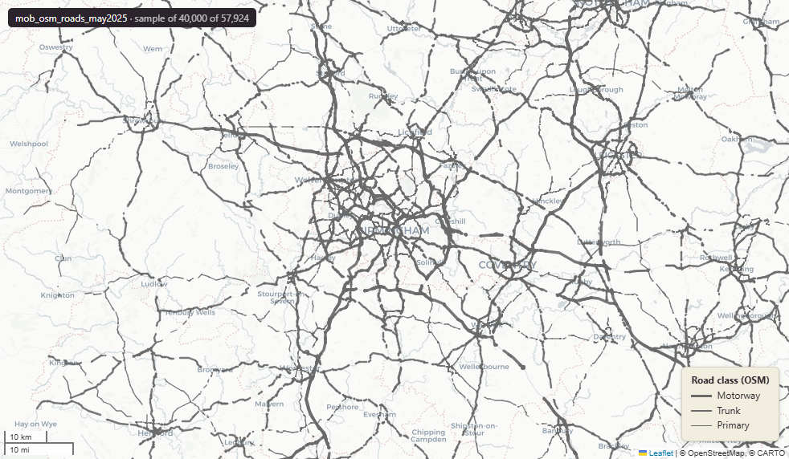

# OpenStreetMap roads for Great Britain, May 2025

`mob_osm_roads_may2025`

<a href="http://localhost:7800/?layer=uk_baseline.mob_osm_roads_may2025" target="_blank" rel="noopener">Open in the Dashboard &#8599;</a> (start your local Dashboard first)

**SOURCE**

- OpenStreetMap contributors, distributed as a roads extract (Geofabrik). The fclass road categories derive from OpenStreetMap highway tags.

**DOCUMENTATION**

- OpenStreetMap       : https://www.openstreetmap.org/about
- Geofabrik downloads : https://download.geofabrik.de/

**DEFINITIONS**

- OpenStreetMap is "the project that creates and distributes free geographic data for the world." (OpenStreetMap Wiki)

**SCOPE**

- Great Britain. 6,431,723 rows.

**CRS**

- EPSG:27700 (OSGB 1936 / British National Grid). Geometry type LineString.

**LICENCE**

- Open Database Licence (ODbL). (c) OpenStreetMap contributors.

## Columns

| Column | Type | Description / unit |
|---|---|---|
| `osm_id` | `character varying(12)` | Source field "osm_id"; OpenStreetMap feature identifier. |
| `code` | `integer` | Source field "code"; Geofabrik numeric road-class code. |
| `fclass` | `character varying(28)` | Source field "fclass"; road class derived from the OpenStreetMap highway tag. Observed values include "service", "footway", "residential", "unclassified", "track", "path", "tertiary", "cycleway", "primary", "trunk". |
| `name` | `character varying(100)` | Source field "name"; road name. |
| `ref` | `character varying(20)` | Source field "ref"; road reference number. |
| `oneway` | `character varying(1)` | Source field "oneway"; one-way indicator. |
| `maxspeed` | `integer` | Source field "maxspeed"; maximum speed as tagged in OpenStreetMap. |
| `layer` | `bigint` | Source field "layer"; relative vertical layer (OpenStreetMap layer tag). |
| `bridge` | `character varying(1)` | Source field "bridge"; bridge indicator. |
| `tunnel` | `character varying(1)` | Source field "tunnel"; tunnel indicator. |
| `id_original` | `integer` | Original feature id preserved at load. |
| `lad22nm` | `character varying` | Joined at load from ONS LAD 2022 lookup; 2022 LAD name. |
| `lad22cd` | `character varying` | Joined at load from ONS LAD 2022 lookup; 2022 LAD GSS code. |
| `wd21nm` | `character varying` | Joined at load from ONS Ward 2021 lookup; 2021 Ward name. |
| `wd21cd` | `character varying` | Joined at load from ONS Ward 2021 lookup; 2021 Ward GSS code. |
| `geom` | `geometry(LineString,27700)` | LineString in EPSG:27700. Road centreline geometry. |
| `length_m` | `double precision` | Length in metres. |
| `fid` | `bigint` |  |
