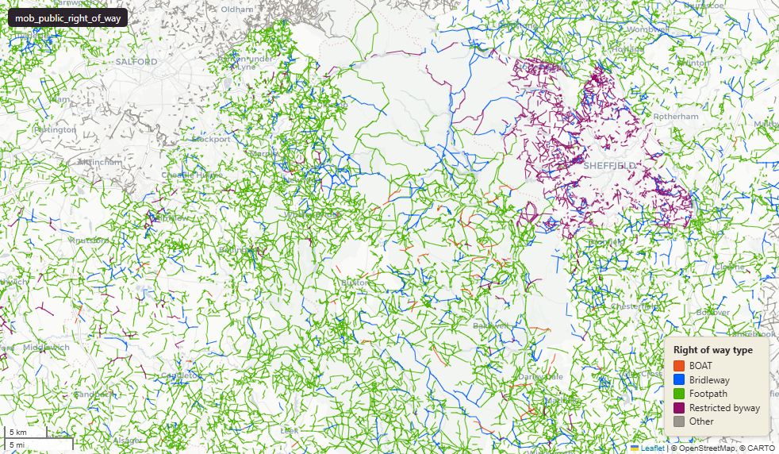

# Public Rights of Way (PRoW) for England, compiled from local surveying-authority definitive-map open data

`mob_public_right_of_way`

**SOURCE**

- Local surveying authorities (local highway authorities) of England, via their published definitive-map / PRoW open data, aggregated through the Public Rights of Way open-data project (osm.mathmos.net/prow). Per-row provenance in authority_name, source_url, source_licence and source_published_date.

**DOCUMENTATION**

- PRoW open data project        : https://osm.mathmos.net/prow/open-data/
- gov.uk Use public rights of way : https://www.gov.uk/right-of-way-open-access-land/use-public-rights-of-way

**DEFINITIONS**

- A public right of way is a highway over which the public has a right to pass and repass. Categories by permitted use (gov.uk): footpaths are "for walking, running, mobility scooters or powered wheelchairs"; bridleways are "for walking, horse riding, bicycles, mobility scooters or powered wheelchairs"; restricted byways are "for any transport without a motor and mobility scooters or powered wheelchairs"; byways open to all traffic are "for any kind of transport, including cars (but they're mainly used by walkers, cyclists and horse riders)." (gov.uk, Use public rights of way)

**SCOPE**

- England. 509,469 rows.

**CRS**

- EPSG:27700 (OSGB 1936 / British National Grid). Geometry type LineString.

**LICENCE**

- Per row - see source_licence (observed "Open Government Licence (v3)" and "OS OpenData Licence"). Confirm per authority before re-publication.

**DATA QUALITY CAVEATS**

- Compiled from many surveying authorities; completeness, attribute conventions and update dates vary by authority (see authority_name, source_published_date, update_date).

**LOADED INTO uk_baseline**

- Loaded by PNC, May 2026.

## Columns

| Column | Type | Description / unit |
|---|---|---|
| `gid` | `bigint` |  |
| `geom` | `geometry(MultiLineString,27700)` | LineString in EPSG:27700. PRoW segment geometry. |
| `authority_gss` | `text` | Source field; surveying authority ONS GSS code. |
| `authority_name` | `text` | Source field; surveying authority name (e.g. "Barnsley", "Bedford"). |
| `prow_ref` | `text` | Source field; the authority's PRoW reference for the segment. |
| `prow_type_norm` | `text` | Normalised PRoW type. Observed values: "footpath", "bridleway", "restricted_byway", "boat" (byway open to all traffic), "cycle_track", "other". |
| `prow_type_raw` | `text` | Source field; the authority's raw PRoW type value before normalisation. |
| `length_m` | `double precision` | Length in metres. |
| `source_url` | `text` | Source field; URL of the authority's source dataset for this segment. |
| `source_licence` | `text` | Source field; licence of the authority's source data. Observed values: "Open Government Licence (v3)", "OS OpenData Licence". |
| `source_published_date` | `date` | Source field; publication date of the authority's source data. |
| `source_sha256` | `text` | SHA-256 checksum of the source file the segment was loaded from. |
| `update_date` | `text` | Date the segment was loaded or last updated in uk_baseline. |
