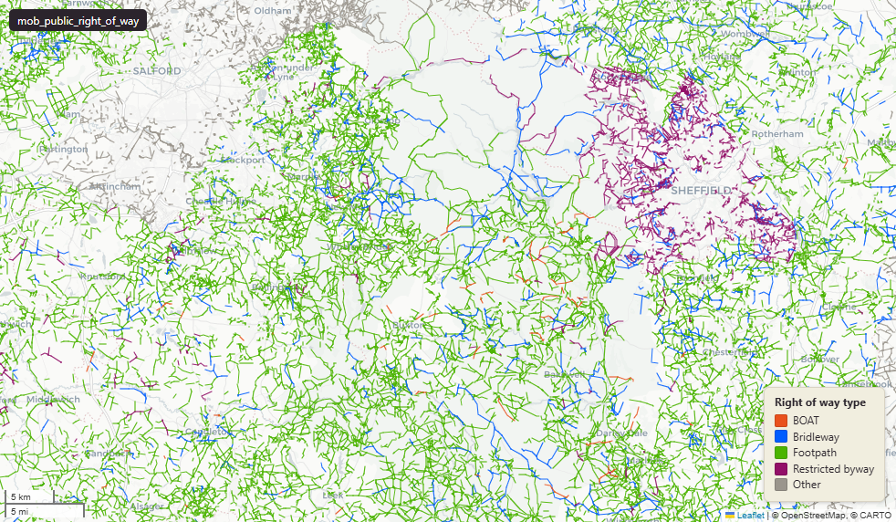

# Public Rights of Way (PRoW) for England, compiled from local surveying-authority definitive-map open data

`mob_public_right_of_way`

**SOURCE**

- Local surveying authorities (local highway authorities) of England, via their published definitive-map / PRoW open data, aggregated through the Public Rights of Way open-data project (osm.mathmos.net/prow). Per-row provenance in authority_name, source_url, source_licence and source_published_date.

**DOCUMENTATION**

- PRoW open data project        : https://osm.mathmos.net/prow/open-data/
- gov.uk Use public rights of way : https://www.gov.uk/right-of-way-open-access-land/use-public-rights-of-way

**DEFINITIONS**

- A public right of way is a highway over which the public has a right to pass and repass. Categories by permitted use (gov.uk): footpaths are "for walking, running, mobility scooters or powered wheelchairs"; bridleways are "for walking, horse riding, bicycles, mobility scooters or powered wheelchairs"; restricted byways are "for any transport without a motor and mobility scooters or powered wheelchairs"; byways open to all traffic are "for any kind of transport, including cars (but they're mainly used by walkers, cyclists and horse riders)." (gov.uk, Use public rights of way)

**SCOPE**

- England. 509,469 rows.

**CRS**

- EPSG:27700 (OSGB 1936 / British National Grid). Geometry type LineString.

**LICENCE**

- Per row - see source_licence (observed "Open Government Licence (v3)" and "OS OpenData Licence"). Confirm per authority before re-publication.

**DATA QUALITY CAVEATS**

- Geography keys are NULL on 1,804 of 554,975 rows, measured 28 July 2026: 1,258 fall inside an England or Wales district and could carry one, so their keys are a gap rather than an absence; 365 are residual fragments left by the MSOA split, each under 100 sqm or 10 m; 7 are in Scotland or Northern Ireland, outside the England and Wales lookup; 174 fall outside every district — offshore, inter-tidal, or beyond Great Britain.
- County and Spatial Development Strategy columns are England and Wales only; rows elsewhere carry no county or SDS. Wales and the Isles of Scilly carry a county but no SDS. Rows with no Local Authority District code are NULL in all four columns.
- Compiled from many surveying authorities; completeness, attribute conventions and update dates vary by authority (see authority_name, source_published_date, update_date).

**ENRICHMENT**

- `sds_name` / `sds_group` — Spatial Development Strategy area and devolution status, a Prior + Partners categorisation over Ministry of Housing, Communities and Local Government (MHCLG) English devolution policy, joined at load on the row's Local Authority District 2025 code via uk.ref_lad25_ctyua25_sds_lu_jul2026.

**LOADED INTO uk_baseline**

- Loaded by PNC, May 2026.

MSOA SPLIT (added 4 July 2026)

- Geometry split to one row per (source feature x MSOA 2021). Each row carries that MSOA's msoa21cd / msoa21nm / msoa21hclnm and best-fit lad22 / lad25. The source feature's original primary key is preserved as `source_fid`; `gid` is a fresh surrogate primary key. Geometry outside every MSOA (offshore or outside England & Wales) is retained as rows with NULL geography columns, so the layer holds the complete source geometry.

## Columns

| Column | Type | Description / unit |
|---|---|---|
| `source_fid` | `bigint` | Primary key of the source feature in the pre-split layer uk.mob_public_right_of_way__preswap_jul04 (non-unique here: a feature spanning N MSOAs has N rows). |
| `authority_gss` | `text` |  |
| `authority_name` | `text` |  |
| `prow_ref` | `text` |  |
| `prow_type_norm` | `text` |  |
| `prow_type_raw` | `text` |  |
| `length_m` | `double precision` |  |
| `source_url` | `text` |  |
| `source_licence` | `text` |  |
| `source_published_date` | `date` |  |
| `source_sha256` | `text` |  |
| `update_date` | `text` |  |
| `msoa21cd` | `character varying` | Middle Layer Super Output Area (MSOA) 2021 code of this piece. Open Government Licence v3.0. |
| `msoa21nm` | `character varying` | Official ONS MSOA 2021 name of this piece. Open Government Licence v3.0. |
| `msoa21hclnm` | `text` | House of Commons Library readable MSOA name of this piece. Open Parliament Licence. |
| `lad22cd` | `text` | Local Authority District 2022 code (2021 LAD geography, anchored to the MSOA 2021 name scoping), best-fit from this piece's msoa21cd. Open Government Licence v3.0. |
| `lad22nm` | `text` | Local Authority District 2022 name (2021 LAD geography), best-fit from this piece's msoa21cd. Open Government Licence v3.0. |
| `lad25cd` | `text` | Local Authority District 2025 code (current administering authority), best-fit from this piece's msoa21cd. Open Government Licence v3.0. |
| `lad25nm` | `text` | Local Authority District 2025 name (current administering authority), best-fit from this piece's msoa21cd. Open Government Licence v3.0. |
| `geom` | `geometry(MultiLineString,27700)` |  |
| `gid` | `bigint` |  |
| `ctyua25cd` | `text` | County or unitary authority code at 1 April 2025. Joined at load via uk.ref_lad25_ctyua25_sds_lu_jul2026 on the row's Local Authority District 2025 code. Open Government Licence v3.0. |
| `ctyua25nm` | `text` | County or unitary authority name at 1 April 2025. Joined at load via uk.ref_lad25_ctyua25_sds_lu_jul2026 on the row's Local Authority District 2025 code. Open Government Licence v3.0. |
| `sds_name` | `text` | Spatial Development Strategy (SDS) area, a Prior + Partners categorisation over Ministry of Housing, Communities and Local Government (MHCLG) English devolution policy. Joined at load via uk.ref_lad25_ctyua25_sds_lu_jul2026 on the row's Local Authority District 2025 code. Open Government Licence v3.0. |
| `sds_group` | `text` | Devolution status of the Spatial Development Strategy area: Existing Devolution Footprints, Devolution Priority Programme, Other Proposed Geographies or Remaining Areas. Joined at load via uk.ref_lad25_ctyua25_sds_lu_jul2026 on the row's Local Authority District 2025 code. Open Government Licence v3.0. |
