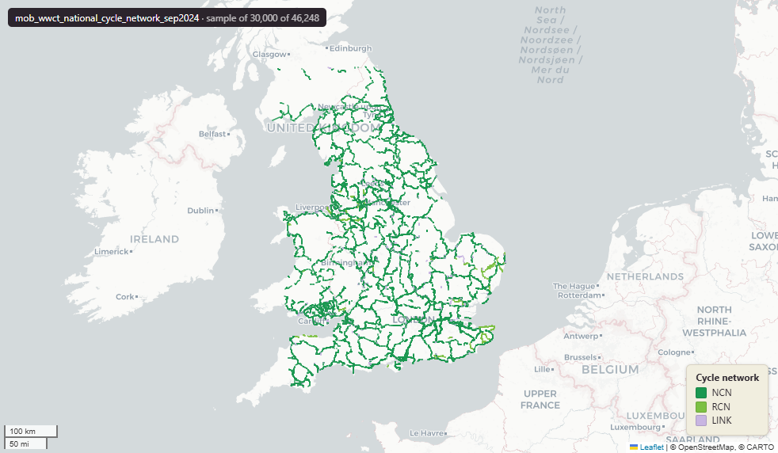

# National Cycle Network (NCN) for the United Kingdom, September 2024

National Cycle Network

`mob_wwct_national_cycle_network_sep2024`

**SOURCE**

- Sustrans (now Walk Wheel Cycle Trust). National Cycle Network dataset, distributed via the Sustrans open-data hub.

**DOCUMENTATION**

- Sustrans open data     : https://data-sustrans-uk.opendata.arcgis.com/
- National Cycle Network : https://www.walkwheelcycletrust.org.uk/national-cycle-network/

**DEFINITIONS**

- The National Cycle Network is "a UK-wide network of signed paths and routes for walking, wheeling, cycling and exploring outdoors, brought to you by Walk Wheel Cycle Trust." (Walk Wheel Cycle Trust, National Cycle Network)

**SCOPE**

- United Kingdom. 46,248 rows.

**CRS**

- EPSG:27700 (OSGB 1936 / British National Grid). Geometry type LineString.

**LICENCE**

- Open Government Licence v3.0 (confirm with Sustrans / Walk Wheel Cycle Trust before re-publication).

MSOA SPLIT (added 4 July 2026)

- Geometry split to one row per (source feature x MSOA 2021). Each row carries that MSOA's msoa21cd / msoa21nm / msoa21hclnm and best-fit lad22 / lad25. The source feature's original primary key is preserved as `source_fid`; `gid` is a fresh surrogate primary key. Geometry outside every MSOA (offshore or outside England & Wales) is retained as rows with NULL geography columns, so the layer holds the complete source geometry.

**DATA QUALITY CAVEATS**

- The row count counts split pieces, not source features: this layer was split by Middle Layer Super Output Area, so it holds one row per feature per MSOA piece, plus whole and remainder rows to keep 100% of the source geometry. 53,510 rows represent 46,248 source features, measured 28 July 2026. `source_fid` identifies the originating feature.
- Geography keys are NULL on 4,965 of 53,510 rows, measured 28 July 2026: 486 fall inside an England or Wales district and could carry one, so their keys are a gap rather than an absence; 101 are residual fragments left by the MSOA split, each under 100 sqm or 10 m; 4,373 are in Scotland or Northern Ireland, outside the England and Wales lookup; 5 fall outside every district — offshore, inter-tidal, or beyond Great Britain.
- County and Spatial Development Strategy columns are England and Wales only; rows elsewhere carry no county or SDS. Wales and the Isles of Scilly carry a county but no SDS. Rows with no Local Authority District code are NULL in all four columns.

**ENRICHMENT**

- `sds_name` / `sds_group` — Spatial Development Strategy area and devolution status, a Prior + Partners categorisation over Ministry of Housing, Communities and Local Government (MHCLG) English devolution policy, joined at load on the row's Local Authority District 2025 code via uk.ref_lad25_ctyua25_sds_lu_jul2026.

## Columns

| Column | Type | Description / unit |
|---|---|---|
| `source_fid` | `bigint` | Primary key of the source feature in the pre-split layer uk.mob_wwct_national_cycle_network_sep2024__preswap_jul04 (non-unique here: a feature spanning N MSOAs has N rows). |
| `desc_` | `character varying(200)` |  |
| `greenway` | `character varying(3)` |  |
| `routetype` | `character varying(4)` |  |
| `routeno` | `integer` |  |
| `linkno` | `integer` |  |
| `routecat` | `character varying(19)` |  |
| `openstatus` | `character varying(23)` |  |
| `surface` | `character varying(13)` |  |
| `quality` | `character varying(10)` |  |
| `lighting` | `character varying(7)` |  |
| `roadclass` | `character varying(32)` |  |
| `globalid` | `character varying(38)` |  |
| `segmentid` | `integer` |  |
| `id_original` | `integer` |  |
| `wd21nm` | `character varying` |  |
| `wd21cd` | `character varying` |  |
| `length_m` | `double precision` |  |
| `msoa21cd` | `character varying` | Middle Layer Super Output Area (MSOA) 2021 code of this piece. Open Government Licence v3.0. |
| `msoa21nm` | `character varying` | Official ONS MSOA 2021 name of this piece. Open Government Licence v3.0. |
| `msoa21hclnm` | `text` | House of Commons Library readable MSOA name of this piece. Open Parliament Licence. |
| `lad22cd` | `text` | Local Authority District 2022 code (2021 LAD geography, anchored to the MSOA 2021 name scoping), best-fit from this piece's msoa21cd. Open Government Licence v3.0. |
| `lad22nm` | `text` | Local Authority District 2022 name (2021 LAD geography), best-fit from this piece's msoa21cd. Open Government Licence v3.0. |
| `lad25cd` | `text` | Local Authority District 2025 code (current administering authority), best-fit from this piece's msoa21cd. Open Government Licence v3.0. |
| `lad25nm` | `text` | Local Authority District 2025 name (current administering authority), best-fit from this piece's msoa21cd. Open Government Licence v3.0. |
| `geom` | `geometry(MultiLineString,27700)` |  |
| `gid` | `bigint` |  |
| `ctyua25cd` | `text` | County or unitary authority code at 1 April 2025. Joined at load via uk.ref_lad25_ctyua25_sds_lu_jul2026 on the row's Local Authority District 2025 code. Open Government Licence v3.0. |
| `ctyua25nm` | `text` | County or unitary authority name at 1 April 2025. Joined at load via uk.ref_lad25_ctyua25_sds_lu_jul2026 on the row's Local Authority District 2025 code. Open Government Licence v3.0. |
| `sds_name` | `text` | Spatial Development Strategy (SDS) area, a Prior + Partners categorisation over Ministry of Housing, Communities and Local Government (MHCLG) English devolution policy. Joined at load via uk.ref_lad25_ctyua25_sds_lu_jul2026 on the row's Local Authority District 2025 code. Open Government Licence v3.0. |
| `sds_group` | `text` | Devolution status of the Spatial Development Strategy area: Existing Devolution Footprints, Devolution Priority Programme, Other Proposed Geographies or Remaining Areas. Joined at load via uk.ref_lad25_ctyua25_sds_lu_jul2026 on the row's Local Authority District 2025 code. Open Government Licence v3.0. |
